# 管理 VPS

## 查看已购的 VPS

查看已购的 VPS，支持通过地区或状态筛选。

---

### 操作步骤

1. 登录 [RakSmart 控制台](https://billing.raksmart.com/whmcs/clientarea.php?language=chinese-cn)。

2. 在控制台左侧导航**产品管理**区域，单击 **VPS**，进入**我的产品与服务**页面。

   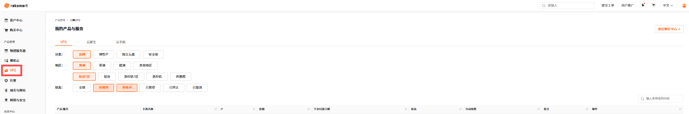

3. 若当前列表没有找到想要查看的 VPS ，可以选择地区或状态进行筛选，或者通过搜索框搜索。

   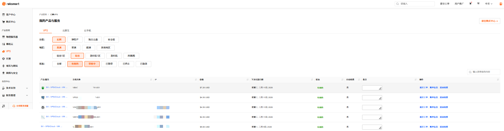

4. 可以在服务器列表，查看如下信息。

   <table width="100%">
        <tr style="text-align: left;">
          <th width="20%">参数</th>
          <th width="80%">说明</th>
        </tr>
        <tr>
          <td>产品 / 服务</td>
          <td>指用户订购的 RakSmart 具体产品类型，如独立服务器、裸机云服务器、VPS、托管服务等。</td>
        </tr>
        <tr>
          <td>主机名称</td>
          <td>用于标识单台主机的自定义或系统分配名称，便于用户管理和区分多台设备。 </td>
        </tr>
         <tr>
          <td>IP</td>
          <td>主机对应的网络互联协议地址，是主机接入网络的唯一标识。</td>
        </tr>
         <tr>
          <td>价格</td>
          <td>该主机产品的计费金额，对应订单的实际结算费用。</td>
        </tr>
         <tr>
          <td>下次付款日期</td>
          <td>按照计费周期，下一次需要支付费用的日期，到期未付款会影响主机正常使用。</td>
        </tr>
   		 <tr>
          <td>状态</td>
          <td>当前的订单状态，常见值有运行中、已过期、暂停、待开通等。</td>
        </tr>
   		 <tr>
          <td>自动续费</td>
          <td>主机的续费模式标识，取值为开启 / 关闭；开启后到期将自动从账户余额扣款续费。</td>
        </tr>
      </table>

---

### 后续操作

了解更多 VPS 的详细信息和可执行的操作可参考：

- [查看 VPS 详情信息](#查看%20VPS%20详情信息)]
- [执行 VPS 操作](#执行%20VPS%20操作)

## 查看 VPS 详情信息

支持查看 VPS 的基础信息、图表、用量、弹性 IP、独立云盘和安全组。

1. 登录 [RakSmart 控制台](https://billing.raksmart.com/whmcs/clientarea.php?language=chinese-cn)。

2. 在控制台左侧导航**产品管理**区域，单击 **VPS**，进入**我的产品与服务**页面。

   

3. （可选）若当前列表没有找到想要查看的 VPS ，支持通过地区或状态进行筛选，或者通过搜索框搜索。

   

4. 选择一台需要查看的 VPS ，单击**产品/服务**名称，进入**管理产品**页面。

   

5. 您可查看如下 VPS 的基础信息和功能操作入口。

   

   <table width="100%">
           <tr style="text-align: left;">
             <th width="20%">项目</th>
             <th width="80%">说明</th>
           </tr>
           <tr>
             <td>基础信息</td>
             <td>- 产品/服务名称：SV-VPS/Cloud-VM(Shared)，这是一台共享型 VPS 实例； 
         - 区域：SV； 
         - 硬件规格：1 核心 CPU，2G 内存； 
         - 系统盘配置：HDD50G； 
         - 操作系统镜像：CentOS7.9-x64-UEFI； 
         - 公网 IP 地址：xxx.200.39.167 	
         - SSH 登录信息：默认用户名 root、连接端口 41855。 
         - 功能模块：有开机、关机、重启等操作按钮； 
         - 当前费用：$5.56 USD； 
         - 计费周期：包含下单日期（2026-01-13）和到期日期（2026-03-13），计费模式为按月付费。</td>
           </tr>
           <tr>
             <td>功能展示页签</td>
             <td>提供了 “图表、用量、弹性 IP、独立云盘、安全组” 等功能入口，可进一步查看网络、存储、安全等扩展信息。</td>
           </tr>
         </table>

---

### 查看图表

在 VPS **管理产品**页面，单击**图表**，可查看 CUP 使用量、硬盘IO、内存用量和网卡用量。支持通过时间筛选。

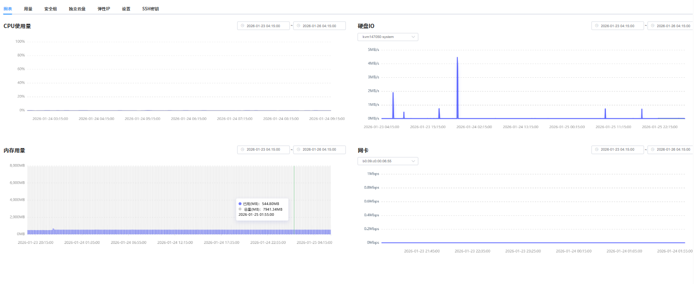

---

### 查看用量

在 VPS **管理产品**页面，单击**用量**面板，可查看 VPS 的带宽使用情况。支持通过时间筛选。

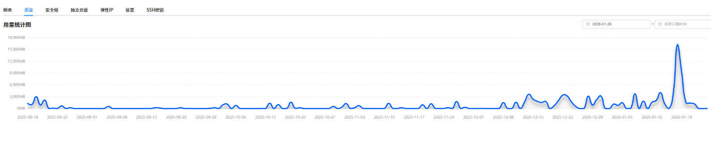

---

### 弹性 IP

在 VPS **管理产品**页面，单击**弹性IP**面板，可查看绑定在 VPS 上的弹性 IP 地址和账户名下的未绑定状态的弹性 IP 。关于弹性 IP 的详细介绍可参考[弹性 IP](#弹性%20IP)。
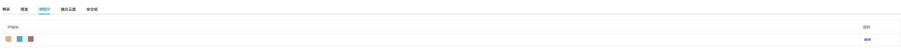

---

### 独立云盘

在 VPS **管理产品**页面，单击**独立云盘**面板，可查看VPS 上已挂载的独立云盘和账户名下的未挂载状态的独立云盘信息。关于独立云盘的详细介绍可参考[独立云盘](#独立云盘)。

---

### 安全组

在 VPS **管理产品**页面，单击**安全组**面板，可查看和管理安全组。关于安全组的详细介绍可参考[安全组](#安全组)。

## 执行 VPS 操作

VPS 支持使用 VNC、开机、关机、重启、硬关机、硬重启、重置密码、重装系统和启动救援系统操作。

---

### 开机

开机是指开启运行 VPS。

1. 在 VPS **管理产品**页面，单击**开机**。

   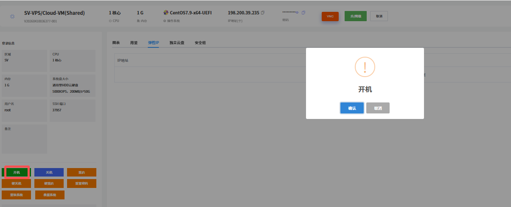

2. 单击**确认**。

---

### 关机

关机是指关闭运行中的 VPS 。建议先通过远程连接保存数据。

1. 在 VPS **管理产品**页面，单击**关机**。

   

2. 单击**确认**。

---

### 重启

重启是指将运行中的服务器关机并重新开机。适用于系统卡顿、配置生效等场景。

1. 在 VPS **管理产品**页面，单击**重启**。

   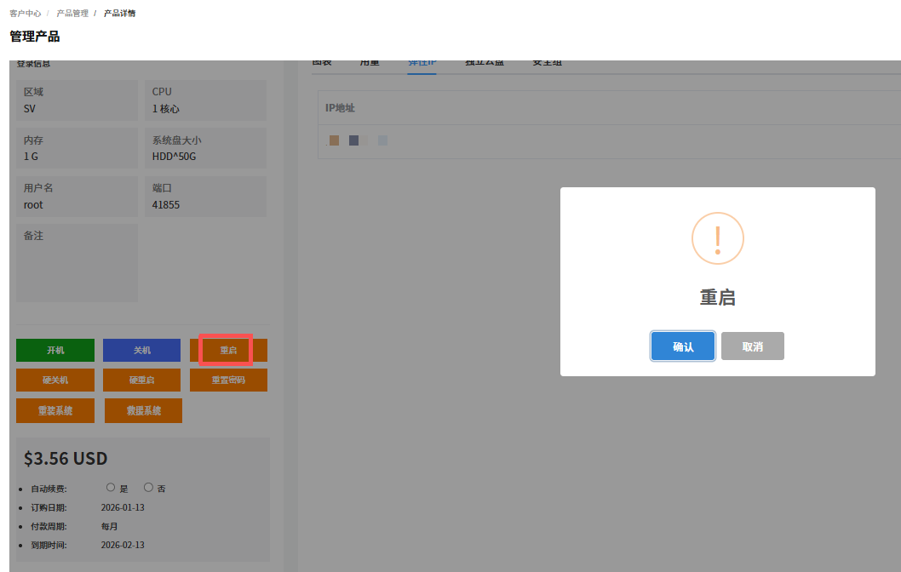

2. 单击**确认**。

---

### 硬关机

硬关机等同于 VPS 直接断电，强制切断主机供电以关闭系统。

> **注意**
>
> - 易导致未保存的业务数据丢失、文件系统损坏。
> - 仅适用于系统卡死、软关机无响应的紧急场景。
> - 操作后建议检查磁盘完整性。

1. 在 VPS **管理产品**页面，单击**硬关机**。

   

2. 单击**确认**。

---

### 硬重启

硬重启是指强制断电后立即通电重启主机，跳过系统正常关机流程，属于紧急重启方式。

1. 在 VPS **管理产品**页面，单击**硬重启**。

   

2. 单击**确认**。

---

### 重置密码

重置密码是指重置 VPS 的系统管理员密码，适用于密码遗忘或权限变更场景。

1. 在 VPS **管理产品**页面，单击**重置密码**。
   

2. 输入修改后的密码，单击**确认**。

---

### 重装系统

重装系统是指重新部署操作系统镜像，将 VPS 系统盘恢复至初始状态，常用于系统故障、更换系统版本或清理环境等场景，操作会格式化系统盘（数据盘通常不受影响，视配置而定）。

> **注意**
>
> 重装会清除系统盘数据，请提前备份。

1. 在 VPS **管理产品**页面，单击**重装系统**。

   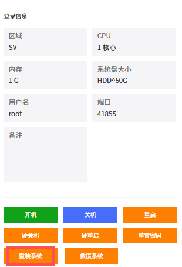

2. 根据提示完成**系统**、**登录方式**和**端口**信息的选择和输入。

   

3. 单击**确认**。

---

### 救援系统

救援系统是指启动救援模式。用于系统故障、密码找回等紧急场景。

1. 在 VPS **管理产品**页面，单击**救援系统**。

   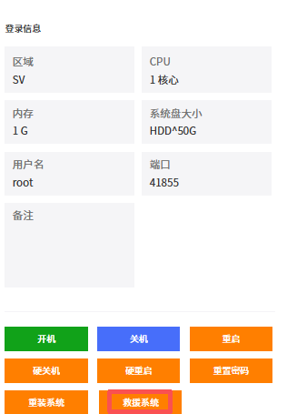

2. 根据提示完成**救援系统类型**的选择、**临时密码**的设置和保存，选择是否**强制关机**，单击**确认**。

   

## 弹性 IP

弹性 IP 是可独立申请、动态绑定 / 解绑、可保留的公网 IP 地址。可以在不同实例间灵活迁移，不随服务器的创建、释放而改变。您在下单 VPS 时可以根据业务需要选购公网 IP，如果后续您需要更多的公网 IP，可以购买和绑定弹性 IP。

- 一个弹性 IP 只能绑定到一个云资源上使用。
- 因网络架构和资源管理规则限制，弹性 IP 的可用区和线路类型 必须与 VPS 实例的可用区和线路类型保持一致才可绑定。

---

### 购买弹性 IP

本文主要介绍通过 Raksmart 控制台购买弹性 IP。

1. 登录 [Raksmart 控制台](https://billing.raksmart.com/whmcs/clientarea.php?language=chinese-cn)。

2. 单击**购买中心**，进入**购物车**页面。

   

3. 单击 **VPS** -> **弹性 IP**，进入**配置** - **购物车**页面。

   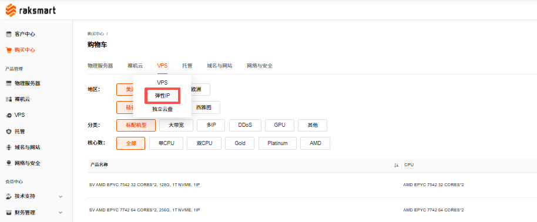

4. 根据业务需求完成区域、可用区、磁盘类型等信息配置，单击**继续**。

   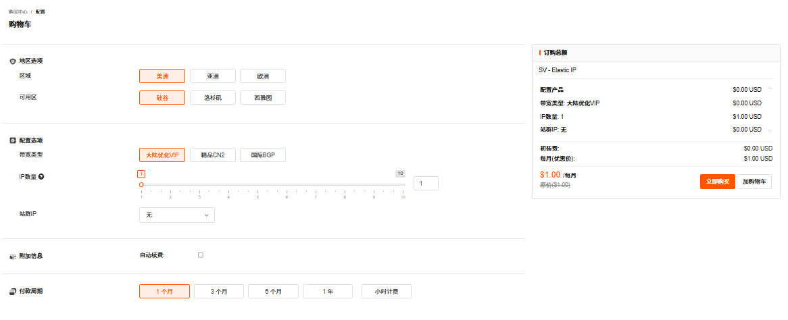

5. 完成费用结算。

   

---

### 绑定弹性 IP

本文主要介绍通过 Raksmart 控制台绑定弹性 IP。

#### 前提条件

已经购买弹性 IP，详细内容介绍可参考[购买弹性 IP](#购买弹性%20IP)。

#### 使用限制

弹性 IP 只能绑定到同一区域、同一可用区内的 VPS 实例，且线路类型需相同，无法跨区域或跨可用区绑定。

#### 操作步骤

1. 在 VPS **管理产品**页面，单击**弹性 IP** 面板。

   

2. 如果此面板下有多个弹性 IP，选择一个单击**绑定**。

   

3. 在确认提示页面，单击**提交**。

   

4. 成功绑定弹性 IP 后系统提示如下状态。

   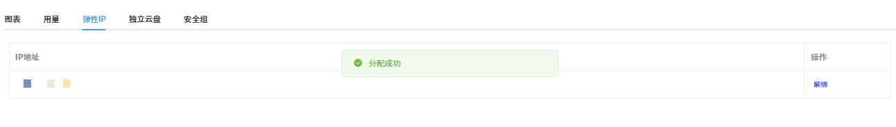

---

### 解绑弹性 IP

解绑弹性 IP 是在控制台将弹性 IP 与 VPS 解除关联。

1. 在 VPS **管理产品**页面，单击**弹性 IP** 面板。

   

2. 如果此面板下有多个弹性 IP，选择一个单击**解绑**。

   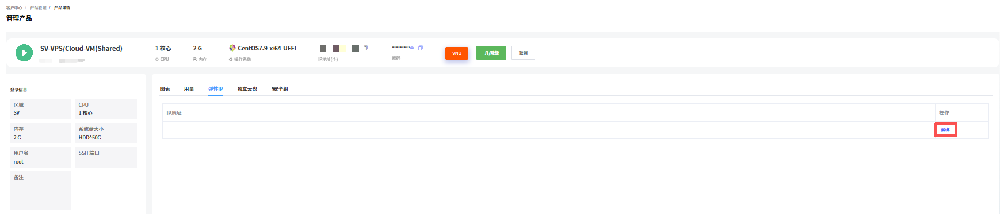

3. 在确认提示页面，单击**提交**。

   

4. 解绑后弹性 IP 转为 “绑定” 状态，可重新绑定其他资源或解绑。

   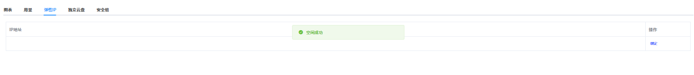

## 独立云盘

### 购买独立云盘

独立云盘可用作 VPS 的数据盘，当 VPS 的存储容量不够时，可以将已购买的独立云盘挂载到 VPS，或升级独立云盘来扩充存储容量。本文主要介绍通过 Raksmart 控制台购买全新的独立云盘。

#### 使用限制

独立云盘只能挂载到同一区域、同一可用区内的 VPS 实例，无法跨区域或跨可用区挂载。

#### 操作步骤

1. 登录 [Raksmart 控制台](https://billing.raksmart.com/whmcs/clientarea.php?language=chinese-cn)。

2. 在官网顶部导航右侧，单击**控制台**，进入控制台客户中心页面。

   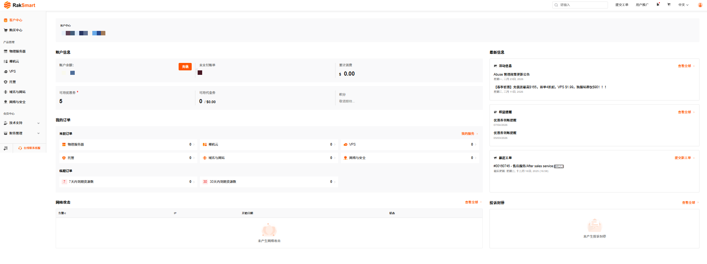

3. 单击**购买中心**，进入**购物车**页面。

   

4. 单击 **VPS** -> **独立云盘**，进入**配置** - **购物车**页面。

   

5. 根据业务需求完成配置选择，单击**继续**。

   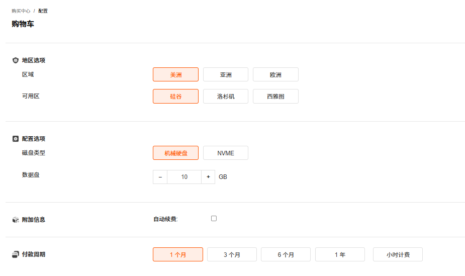

6. 完成费用结算。

   

---

### 挂载独立云盘

购买并开通独立云盘后，可挂载到指定 VPS。

#### 前提条件

已经购买独立云盘。详细内容介绍可参考[购买独立云盘](#购买独立云盘)。

#### 使用限制

独立云盘只能挂载到同一区域、同一可用区内的 VPS 实例，无法跨区域或跨可用区绑定。

#### 操作步骤

1. 在 VPS **管理产品**页面，单击**独立云盘**面板。

   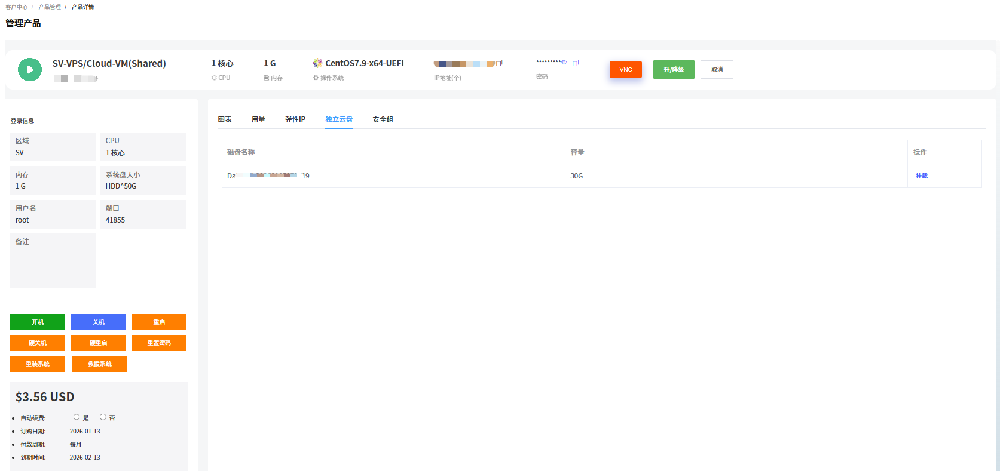

2. 选择一个独立云盘单击**挂载**。

   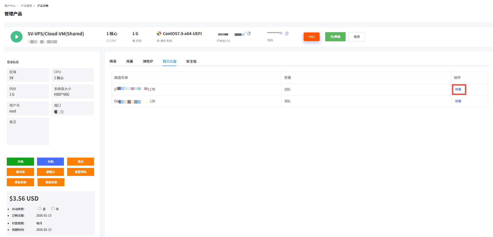

3. 在确认提示页面，单击**提交**。

   

4. 成功挂载独立云盘后，系统提示如下状态。

   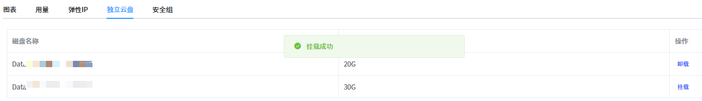

---

### 卸载独立云盘

卸载独立云盘是指在控制台将独立云盘与 VPS 解除挂载关系，卸载只是断开连接，不会删除云盘里的数据。

1. 在 VPS **管理产品**页面，单击**独立云盘**面板。

   

2. 如果此面板下有多个独立云盘，选择一个单击**卸载**。

   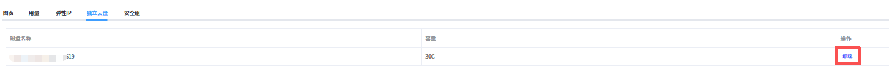

3. 在确认提示页面，单击**提交**。

   

4. 成功卸载独立云盘后，系统提示如下状态。云盘会进入 “挂载” 状态，之后可以重新挂载到同地域的其他VPS上。

   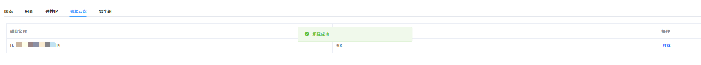

## 安全组

安全组是一种虚拟防火墙，具备数据包过滤功能，用于设置 VPS 实例的网络访问控制，是重要的网络安全隔离手段。

您在购买并开通 VPS 后，系统会自动为您创建默认安全组并关联至该实例。除了默认安全组，您还可以根据业务需求创建自定义安全组并关联至实例。

---

### 安全组管理面板

本文介绍如何在安全组管理面板对安全组进行操作。

#### 添加安全组

1. 登录 [Raksmart 控制台](https://billing.raksmart.com/whmcs/clientarea.php?language=chinese-cn)。

2. 在左侧导航单击 **VPS**，进入**我的产品与服务** - **VPS**面板。

   

3. 在**分类**选项里，单击**安全组**，进入**安全组**页面。

   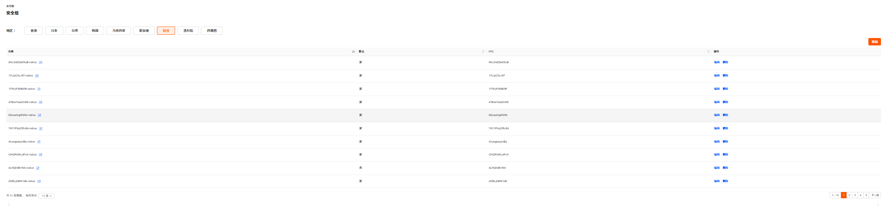

4. 单击**添加**。

   

5. 在创建新的安全组页面，自定义安全组**名称**，例如 “vps 安全组”；选择是否使用**默认**安全组。

   

6. 单击**保存**。

#### 添加安全组规则

如果需要对安全组中的安全规则进行调整，可以修改已有的安全组规则，也可以自定义安全组规则。

1. 在安全组列表中，找到已添加的安全组，例如 “vps 安全组”，单击右侧的**编辑**按钮。进入**安全组规则**页面。

   

2. 单击**添加**，进入**创建新的安全组规则**页面。也可单击右侧**编辑**按钮对现有规则进行调整。

   

3. 填写合适的**远程 IP**、**方向**、**协议**、**最小端口**和**最大端口**，并单击**保存**。

   

---

### VPS 安全组面板相关操作

本文介绍如何在 VPS 操作界面对安全组进行管理。

#### 添加安全组

您可以在 VPS 管理页面安全组面板添加新的安全组。

1. 在VPS的**管理产品**页面，单击**安全组**面板。

2. 单击**添加**按钮。

   

3. 在创建新的安全组页面，输入安全组名称和选择是否使用默认安全组。

   

4. 单击**保存**。

#### 应用安全组

安全组可以应用到 VPS 服务器上。

1. 在VPS的**管理产品**页面，单击**安全组**面板。

2. 选择目标安全组，单击**应用**。

   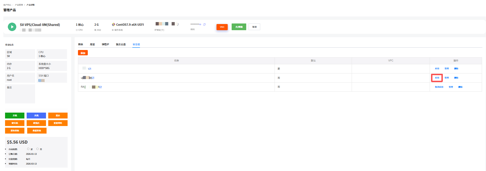

3. 在提示页面中单击**确认应用**。

   

4. 成功应用后页面提示如下信息。

   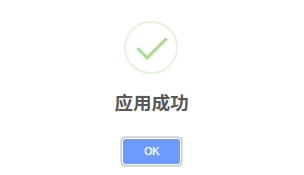

#### 取消应用安全组

当您需要更换安全组，需先取消当前安全组，再绑定新安全组。

> **注意**
>
> 取消应用安全组后，若未及时绑定新安全组，服务器的网络访问可能会受影响，建议提前准备好新的安全组配置。

1. 在**安全组**面板，单击**取消应用**。

   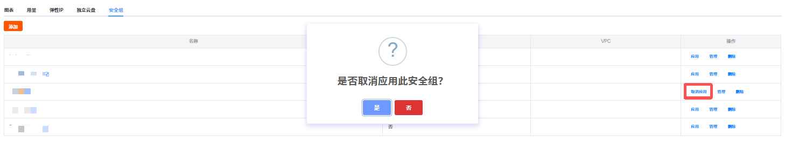

2. 在取消应用确认页面，单击**是**。

#### 编辑安全组规则

1. 在**安全组**面板，单击**管理**，进入编辑安全组页面。

   

2. 可以对该安全组下的具体安全规则进行添加、编辑和删除。详细内容可参考管理安全组。

   

#### 删除安全组

若您不再需要某个安全组，可以对其进行删除。

1. 在**安全组**面板，选择需要删除的安全组，在右侧操作列单击**删除**。

   

2. 在确认页面单击**是**。

   

## VPS 升降级

升/降级是指调整VPS的配置规格，如 CPU 核数、内存容量、硬盘大小、IP数量、带宽等。

---

### 操作步骤

1. 登录 [Raksmart 控制台](https://billing.raksmart.com/whmcs/clientarea.php?language=chinese-cn)。

2. 在左侧导航**产品管理**区域，单击 **VPS**，进入**我的产品与服务**页面。

   

3. （可选）若当前列表没有找到想要查看的 VPS ，支持通过地区或状态进行筛选，或者通过搜索框搜索。

   

4. 选择一台需要升降级的 VPS ，单击**产品/服务**名称，进入**管理产品**页面。

   

5. 在 VPS **管理产品**页面，单击**升/降级**。进入**升级/降级**页面。

   

6. 重新填写或选择需要升降级的配置。例如实例规格由计算型 1G 内存改选为计算型 2G 内存。

   

7. 单击**点击继续**，进入**升级/降级**价格确认页面。确认页面展示哪些配置做了升降级，和对应的价格变化。

   

8. 确认升降级配置和价格没有问题后，单击**点击继续**。选择支付方式或者使用账户余额完成支付。

   

---

### 操作结果

支付成功后，系统将自动完成配置调整。可在产品详情页查看更新后的配置信息，确认是否生效。

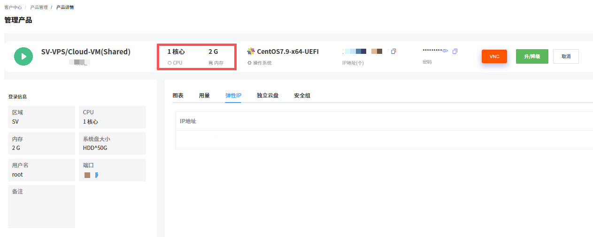

---

### 注意事项

对产品进行升级与变配会存在一些限制或影响，请留意操作界面的提示，或查看该产品的相关文档了解详情。

1. 不同产品升级与变配时可能会存在限制。
   例如：实例的网络类型不允许改变；硬盘容量只允许升级，不支持降级。
2. 升级与变配可能会对您的资源费用、生效时间、计费方式产生影响。
   例如，升级时，可能需要您为当前计费周期的规格或配置补差价。
3. 部分产品的升级与变配可能会对您的业务造成短暂影响。
   - 提前规划升级时间：建议选择业务低峰期执行升级 / 变配操作（如凌晨、节假日），最大程度降低对核心业务的影响。
   - 备份业务数据与配置：操作前务必完成全量数据备份和关键配置文件导出，避免因升级异常导致数据丢失或配置错乱。
   - 业务恢复后校验：升级完成后，需逐一验证业务功能、网络连通性、数据完整性，确认无异常后再恢复全量业务访问。
   - 问题反馈：若遇任务卡顿、失败等异常，及时通过控制台工单系统或客服渠道反馈。

## VPS 取消

Raksmart VPS 取消指用户主动终止当前 VPS 的服务。包括 VPS 到期用户不再续费和立即取消两种情况。退款规则的介绍可参考[产品取消和退订](管理已购买的产品.md#产品取消和退订)。

- 生效规则：如选择的是 账单周期结束 后取消 ，则不会立即停止服务，而是在当前账单周期结束后终止服务。例如当前是 1 月订阅，申请取消后可持续使用到 1 月账单周期到期；
- 费用说明：提交取消后无法再对订单进行续费操作；
- 数据注意：请在提交取消申请前备份服务器内的所有数据，服务终止后数据会被清理，无法恢复。

1. 登录 [raksmart 控制台](https://billing.raksmart.com/whmcs/index.php?rp=/user/security)。

2. 在左侧导航**产品管理**区域，单击 **VPS**，进入**我的产品与服务**页面。

   

3. （可选）若当前列表没有找到想要查看的 VPS ，支持通过地区或状态进行筛选，或者通过搜索框搜索。

   

4. 选择一台需要查看的 VPS ，单击**产品/服务**名称，进入**管理产品**页面。

   

5. 单击**取消**。

   

6. 在**账户取消请求**页面，输入**简要说明取消理由**，选择**取消类型**。
   - 账单周期结束：指服务器到期用户不再续费，用户取消服务器后不产生退款。
   - 立即：指立即终止服务器的使用，可能产生退款。退款规则的介绍可参考服务器退订。

   

7. 单击**请求取消**，系统提示如下信息；单击**返回**可以回到管理产品页面。

   

8. （可选）若您需要继续使用产品或者撤销取消申请，单击**移除请求**。

   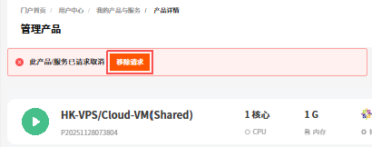

## 账单与续费管理

### 查看账单信息

查看账单信息支持查看 VPS 的全部账单记录。

1. 登录 [Raksmart 控制台](https://billing.raksmart.com/whmcs/clientarea.php?language=chinese-cn)。

2. 在左侧导航**产品管理**区域，单击 **VPS**，进入**我的产品与服务**页面。

   

3. （可选）若当前列表没有找到想要查看的 VPS ，支持通过地区或状态进行筛选，或者通过搜索框搜索。

   

4. 找到需要查看账单信息的 VPS ，单击**账单信息**。

   

5. 在**我的账单**页面，支持查看全部、已付款、未付款、已取消、已退款和已过期的账单；支持通过搜索框搜索账单；支持查看服务、查看账单和批量付款。

   

   a. 查看服务
   支持查看当前帐单对应的服务。单击**查看服务**，进入我的产品与服务页面。

   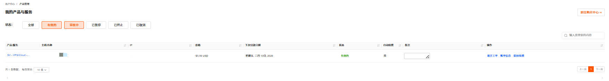

   b. 查看账单
   支持查看当前账单详情，单击查看账单，进入我的帐单页面。此页面可查看账单详情信息，可根据需要打印和下载账单。

   

---

### 提前续费

提前续费是指在当前服务有效期还没结束时，主动为其续费来延长使用时间。

> **说明**
>
> 为保障您的产品/服务正常使用，请留意以下续费及产品/服务状态变更规则：
>
> - 产品/服务到期前 10 天，系统将自动生成续费账单，请您及时完成续费操作；
> - 到期未续费的，产品/服务会在到期后的第 2 天被暂停。
>   - 暂停期间完成续费，产品/服务可立即恢复使用；
>   - 若暂停满 4 天仍未续费，产品/服务将被下架。

1. 在**我的产品/服务** - **VPS/云机**页面列表右侧，单击**提前续费**，进入**续费管理**页面。

   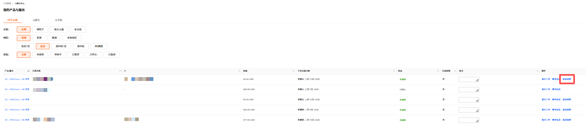

2. **续费管理**页面支持查看当前付款周期和当前产品到期时间，以及选择续费周期和结账。续费周期支持月付、季付、半年付和年付。单击选择**续费周期**，并单击**结账**。

   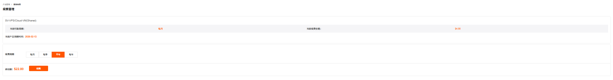

3. 在**我的账单**页面，选择付款方式或者使用余额支付。

   

4. 完成付款。

   

## 新开工单

新开工单支持对当前 VPS 提交问题工单。

1. 在**我的产品与服务**页面列表右侧，单击**新开工单**，进入**提交工单**页面。

   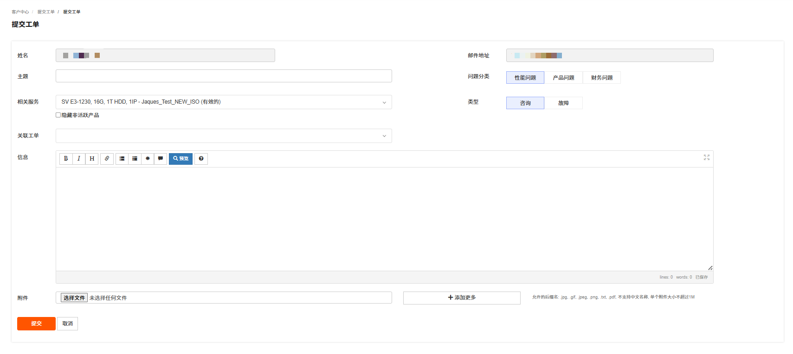

2. 根据页面提示输入主题、问题描述等信息。

3. 单击**提交**。
