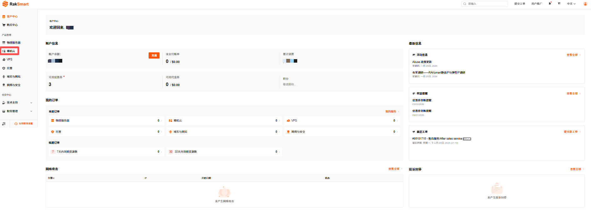
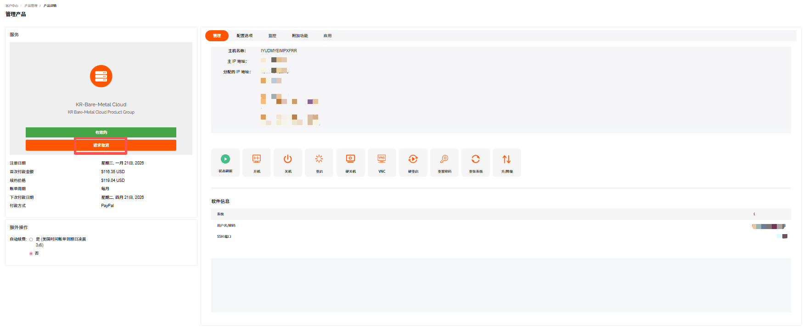

RakSmart 裸机云服务器取消指用户主动终止当前裸机云服务器的服务。服务器取消包括服务器到期用户不再续费和立即取消两种情况。退款规则的介绍可参考[产品取消和退订](/beginners-guide/manage-products/cancellation.md)。

- 生效规则：如选择的是 账单周期结束 后取消 ，则不会立即停止服务，而是在当前账单周期结束后终止服务。例如当前是 1 月订阅，申请取消后可持续使用到 1 月账单周期到期；
- 费用说明：提交取消后无法再对订单进行续费操作；
- 数据注意：请在提交取消申请前备份服务器内的所有数据，服务终止后数据会被清理，无法恢复。

1. 登录 [RakSmart 控制台](https://billing.raksmart.com/whmcs/index.php?rp=/user/security)。

2. 在客户中心页面左侧导航**产品管理**区域，单击**裸机云服务器**，进入**我的产品与服务**页面。

   

3. 找到需要取消服务的裸机云服务器，单击**产品/服务**名称进**管理产品**页面。

   

4. 单击**请求取消**，进入**账户取消请求**页面。

   

5. 输入**简要说明取消理由**，选择**取消类型**，单击**请求取消**。

   
   - 账单周期结束：指服务器到期用户不再续费，用户取消服务器后不产生退款。
   - 立即：指立即终止服务器的使用，可能产生退款。退款规则的介绍可参考服务器退订。

6. 系统提示如下信息，单击**返回**可以回到管理产品页面。

   

7. （可选）若您需要继续使用产品或者撤销取消申请，在**管理产品**页面单击**移除请求**。

   
