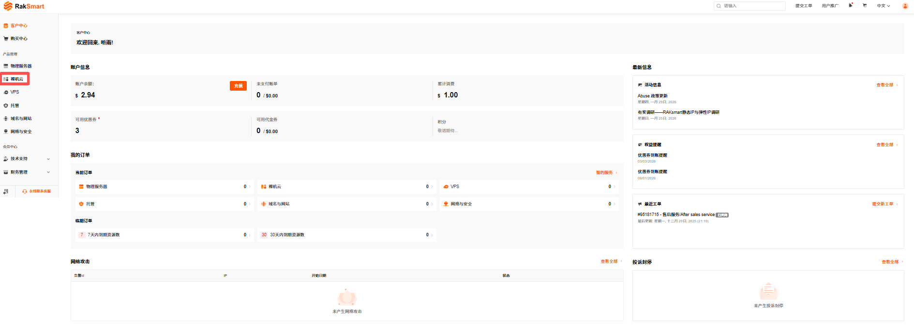
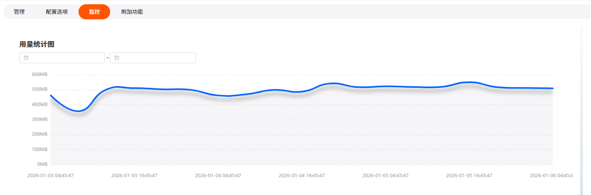

支持查看裸机云服务器的基础信息、配置选项、网络监控信息和附加信息。

---

### 查看裸机云基础信息

1. 在控制台左侧导航**产品管理**区域，单击**裸机云**服务器，进入**我的产品与服务**页面。
   

2. 选择一台需要查看的裸机云服务器，单击**产品/服务**名称，进入**管理产品**详情页面。支持通过地区和状态筛选出对应的产品和服务。

   

3. 在裸机云服务器**管理产品**页面，可直接查看服务器核心信息。

   
   - 基本信息：主机名、主 IP 地址、附加 IP 地址等标识信息。
   - 产品信息：服务器型号（如 SV-Bare-Metal Cloud）。
   - 服务周期：
     - 订购日期 / 到期日期。
     - 费用（如 $59.00 USD）。
     - 下次续费日期、付款方式等。

---

### 查看配置选项

在裸机云**管理产品**页面，单击**配置选项**，可查看服务器系统配置信息。

---

### 监控

在裸机云**管理产品**页面，单击**监控**面板，可查看服务器的网络使用情况。支持通过时间筛选。

---

### 附加功能

可查看裸机云的安全组附加信息。详细内容可参考[管理安全组](./security-groups.md)。

---

### 后续操作

使用裸机云服务器请参考[执行服务器操作](./server-operations.md)。
