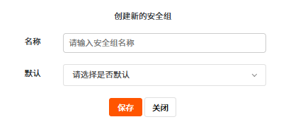
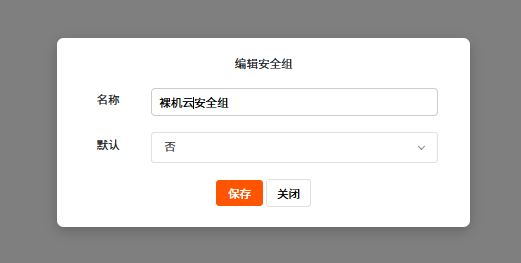
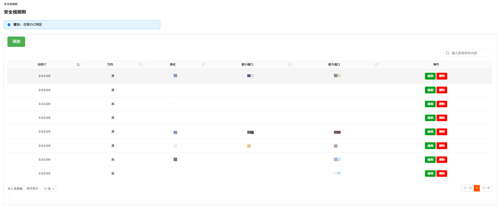
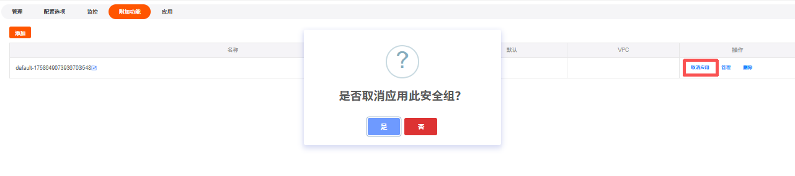

RakSmart 支持购买裸机云产品后到控制台查看和管理其安全组。关于 RakSmart 安全组的详细介绍可参考 安全组。

---

### 创建安全组

如果您不需要使用裸机云自带的默认安全组，可自行创建并替换为符合业务需求的自定义安全组。

1. 在**我的产品与服务**页面，选择一台需要查看的裸机云服务器，单击**产品/服务**名称，进入**管理产品**详情页面。

   

2. 在裸机云服务器**管理产品**页面，单击**附加功能**面板。

   

3. 单击**添加**。

4. 在创建新的安全组页面，输入安全组名称和选择是否使用默认安全组。

   

5. 单击**保存**。

---

### 编辑安全组名称

1. 在**管理产品**页面，单击**附加功能**面板。

2. 单击安全组名称后面的**编辑**按钮，进入**编辑安全组名称**页面。

3. 输入要修改的安全组名称，并在默认下拉框中选择是否使用默认安全组。

   

4. 单击**保存**。

---

### 管理安全组

1. 在**附加功能**面板，单击**管理**，进入管理安全组页面。

   

2. 你可以对该安全组下的具体安全规则进行添加、编辑和删除。

   

---

### 取消安全组应用

当您需要更换安全组，需先取消当前安全组，再绑定新安全组。

> **注意**
>
> 取消应用安全组后，若未及时绑定新安全组，服务器的网络访问可能会受影响，建议提前准备好新的安全组配置。

1. 在**附加功能**面板，单击**取消应用**。

   

2. 在取消应用确认页面，单击**是**。

---
