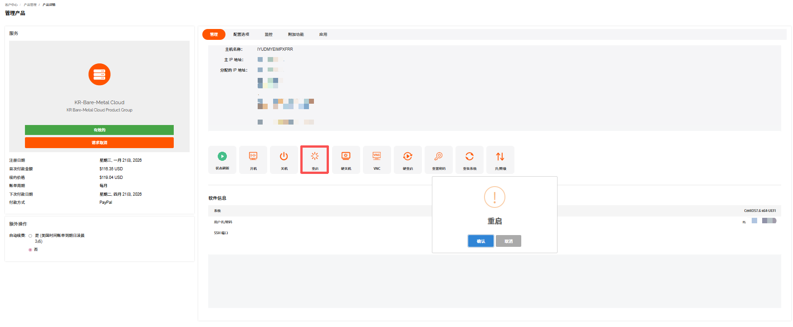
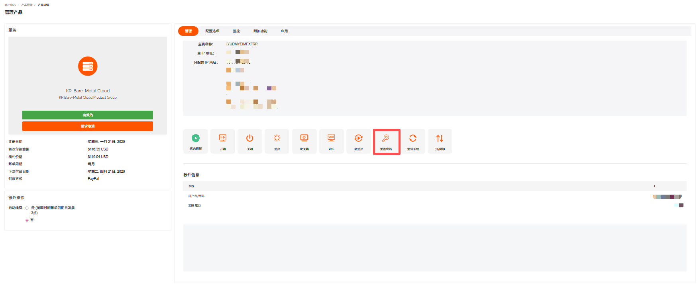

在裸机云服务器**管理产品**页面，支持开机、关机、重启等操作。

---

### 开机

服务器开机是指启动已关机的服务器。

1. 在裸机云**管理产品** -> **管理**面板，单击**开机**。

   

2. 在开机确认页面单击**确认**。

---

### 关机

服务器关机是指关闭运行中的服务器。建议先通过远程连接保存数据。

1. 在裸机云**管理产品** -> **管理**面板，单击**关机**。

2. 在关机确认页面单击**确认**。

---

### 重启

服务器重启是指将运行中的服务器关机并重新开机。适用于系统卡顿、配置生效等场景。

1. 在裸机云**管理产品** -> **管理**面板，单击**重启**。

   

2. 在重启确认页面单击**确认**。

---

### 硬关机

硬关机等同于裸机云服务器直接断电，强制切断主机供电以关闭系统。

1. 在裸机云**管理产品** -> **管理**面板，单击**硬关机**。

   

2. 在硬关机确认页面单击**确认**。

   > **注意**
   >
   > - 易导致未保存的业务数据丢失、文件系统损坏。
   > - 仅适用于系统卡死、软关机无响应的紧急场景。
   > - 操作后建议检查磁盘完整性。

---

### 使用 VNC

使用 VNC 是指通过 VNC 远程连接服务器控制台。无需网络配置，直接访问系统界面。关于如何连接裸机云服务器的方法可参考使用裸机云服务器。

---

### 硬重启

硬重启是指强制断电后立即通电重启主机，跳过系统正常关机流程，属于紧急重启方式。

1. 在裸机云**管理产品** -> **管理**面板，单击**硬重启**。

   

2. 在硬重启确认页面单击**确认**。

---

### 重置密码

重置密码是指重置服务器的系统管理员密码，适用于密码遗忘或权限变更场景。

1. 在裸机云**管理产品** -> **管理**面板，单击**重置密码**。

   

2. 在**重置密码**页面，输入修改后的密码。

   

   > **注意**
   > 当前操作需要实例在关机状态下进行：
   >
   > - 实例将关机中断您的业务，请仔细确认。
   > - 强制关机可能会导致数据丢失或文件系统损坏，您也可以主动关机后再进行操作。

3. 单击**确认**。

---

### 重装系统

重装系统是指重新部署操作系统镜像，将服务器系统盘恢复至初始状态，常用于系统故障、更换系统版本或清理环境等场景，操作会格式化系统盘（数据盘通常不受影响，视配置而定）。

> **注意**
> 重装会清除系统盘数据，请提前备份。

1. 在裸机云**管理产品**->**管理**面板，单击**重装系统**。

   

2. 在**重装系统**页面，根据提示完成系统、登录方式和端口信息的选择和输入。

3. 单击**确认**。
