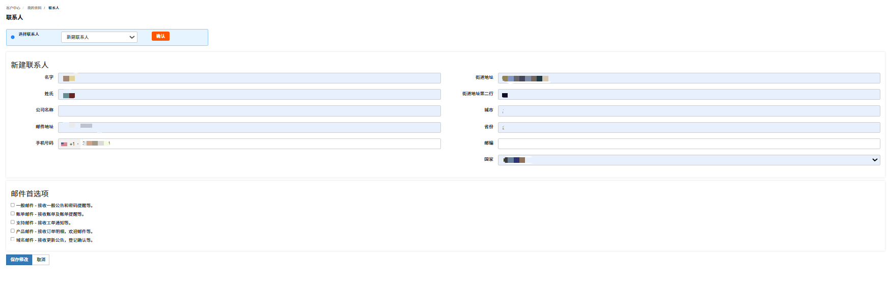
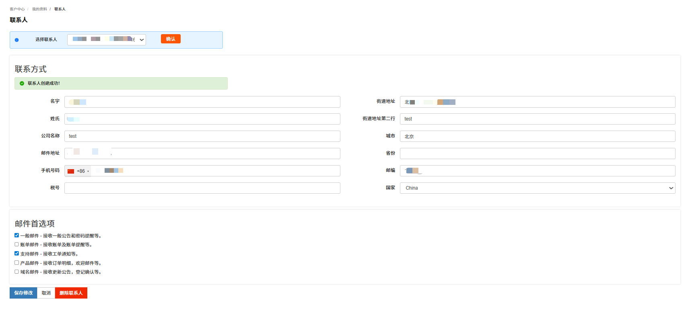

可添加多个联系人信息、修改联系方式、配置联系人接收通知（如账单提醒、服务到期通知）和删除联系人。

---

### 添加联系人

支持添加多个联系人信息。

1. 登录 [RakSmart 控制台](https://cn.raksmart.com/login/index.html)。

2. 在控制台右上角个人资料下拉列表，单击**联系人**。进入**联系人**页面。

   

3. 在选择联系人下拉框中，单击**新建联系人**。

   

4. 在**新建联系人**区域根据提示输入联系人的信息，如名字、姓氏、公司名称、邮件地址等。
   

5. 若需要配置邮件通知，在邮件首选项区域勾选需要发送给联系人的通知邮件类型。

6. 单击**保存修改**。

7. 系统”**提示联系人创建成功**“。
   

---

### 修改联系人

支持修改联系人信息和邮件通知类型。

1. 在选择联系人下拉框中选择需要修改信息的联系人，单击**确认**。

2. 在联系方式区域，支持修改联系人的联系方式。如名字、姓氏、公司名称、邮件地址等信息。
   

3. （可选）修改邮件首选项配置。

4. 单击**保存修改**。

5. 系统提示”**更新联系人成功**“。

   

---

### 删除联系人

1. 在选择联系人下拉框中选择需要删除的联系人，单击**确认**。

2. 单击**删除联系人**。

   

3. 在删除确认页面单击**删除**。

4. 系统提示删除联系人成功。

   
