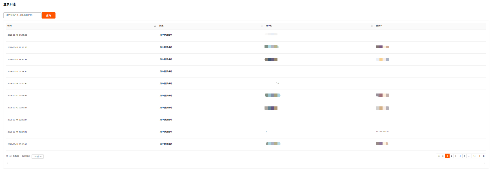
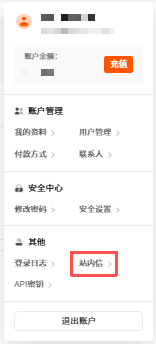
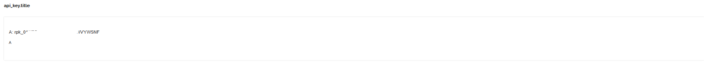

其他设置包括查看登录日志、站内信和设置 API 密钥。

---

### 登录日志

1. 在个人头像下拉菜单，单击**登录日志**，进入**登录日志**页面。

   

2. 在**登录日志**页面，展示账户的登录历史信息，包括登录时间、登录 IP、登录设备等，便于核查账户的安全访问情况。支持通过时间查询日志。
   

---

### 站内信

站内信是指系统内部的消息通知功能。

1. 在个人头像下拉菜单，单击**站内信**，进入**站内信**页面。

   

2. 在**站内信**页面，展示系统消息内容、接收时间和消息类型。支持通过消息类型和消息状态查询。

   

   <table width="100%">
      <tr style="text-align: left;">
        <th width="18%">项目</th>
        <th width="82%">描述</th>
      </tr>
      <tr>
        <td>消息内容</td>
        <td>展示站内信的具体文字信息，如通知、提醒、指引等内容，是消息的核心内容部分。</td>
      </tr>
       <tr>
        <td>接收时间</td>
        <td>记录用户收到这条站内信的具体日期和时间，格式一般为 “年 - 月 - 日 时：分: 秒”。</td>
      </tr>
      <tr>
        <td>消息类型</td>
        <td>对站内信进行分类的标签，如 “权益提醒”“操作指引”“系统通知” 等，便于筛选查询。</td>
      </tr>
    </table>

---

### API 密钥

用于生成或管理账户的 API 密钥。

1. 在个人头像下拉菜单，单击**API密钥**，进入`api_key.title`页面。

   

2. 在`api_key.title`页面，生成或管理账户的 API 密钥，用于通过 API 接口对接 RakSmart 服务（如自动化管理云资源），需妥善保管密钥信息。

   
