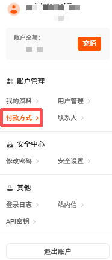
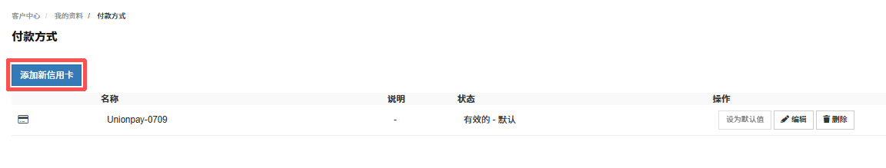

为满足用户便捷、安全的支付需求，RakSmart 提供信用卡付款方式管理功能。您可通过该功能添加、维护信用卡信息，帮助您完成交易支付。

1. 在控制台个人头像下拉列表，单击**付款方式**，进入付款方式页面。

   

2. 在**付款方式**页面，单击**添加新信用卡**，进入**添加新付款方式**页面。

   

3. 在**添加新付款方式**页面，参考页面提示输入信息。

   

   <table width="100%">
      <tr style="text-align: left;">
        <th width="18%">项目</th>
        <th width="82%">描述</th>
      </tr>
      <tr>
        <td>类型</td>
        <td>系统默认勾选 <strong>Credit Card</strong>，明确选择信用卡作为付款方式。</td>
      </tr>
      <tr>
        <td>填写说明（可选）</td>
        <td>您可根据自身需求，在说明栏填写对该信用卡的备注信息，方便后续识别与管理。</td>
      </tr>
       <tr>
        <td>输入信用卡号码</td>
        <td>准确填写信用卡卡号，若系统提示 “输入的卡号似乎无效，请再试一次”，请仔细核对卡号是否正确，确认无误后重新尝试输入。</td>
      </tr>
      <tr>
        <td>设置失效日期</td>
        <td>按照 “月 / 年” 格式，填写信用卡的失效日期，确保日期准确无误。</td>
      </tr>
         <tr>
        <td>填写 CVV/CVC2</td>
        <td>在对应栏位准确填写信用卡的 CVV/CVC2 码，若对该码位置存疑，可点击<strong>我应该从哪找到此号码？</strong>获取指引。</td>
      </tr>
      <tr>
        <td>选择账单地址</td>
        <td>可直接勾选已有账单地址，若需新增，点击<strong>添加新地址</strong>完成地址录入后选择。</td>
      </tr>
    </table>

4. 完成配置填写后，单击**保存修改**。

5. 添加信用卡成功。 您可按需对已添加的信用卡进行设置、修改信息和删除操作。

   

   a.设为默认值：若用户有多张有效信用卡，可点击该按钮将指定信用卡设置为默认付款方式，后续交易将优先使用此卡支付，简化支付流程。

   b.编辑：单击**编辑**，可进入信用卡信息编辑页面，对失效日期、账单地址等信息进行修改维护，确保支付信息准确有效。

   c.删除：若用户不再使用某张信用卡，单击**删除**即可移除该信用卡信息。
