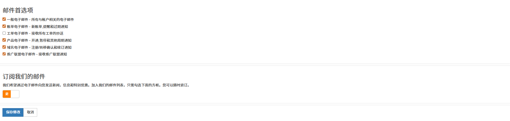
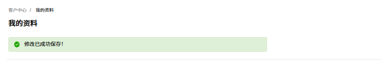

账户管理可集中管理个人账户的各类信息与权限配置，包括我的资料、用户管理和联系人管理。

---

### 我的资料

平台账户信息模块致力于为用户打造便捷、个性化的账户管理体验，涵盖资料维护、邮件及通知订阅等多维度设置，助力用户高效掌控账户相关内容，及时获取关键信息。包含我的资料、邮件首选项和 Telegram 通知订阅选项等功能。

1.  登录 [RakSmart 控制台](https://billing.raksmart.com/whmcs/index.php?rp=/user/security)。

2.  在个人头像下拉列表单击**我的资料**，进入**我的资料**页面。

    

3.  在**我的资料**页面，支持修改个人资料、设置邮件首选项、订阅邮件和配置 Telegram 通知订阅选项。

---

### 设置邮件首选项

平台提供新闻、信息及特别优惠推送服务，用户只需勾选邮件通知类型和订阅即可加入邮件订阅；后续若想退订，也可随时操作，灵活自主管理营销信息接收。

1. 在**我的资料**页面邮件首选项区域，勾选邮件首选项；若不再需要某个选项，可以取消勾选。

   <table width="100%">
      <tr style="text-align: left;">
        <th width="20%">项目</th>
        <th width="80%">描述</th>
      </tr>
      <tr>
        <td>一般电子邮件</td>
        <td>涵盖所有与账户相关的通用邮件，是账户全流程信息传递的基础通道，如账户状态变更告知等。</td>
      </tr>
      <tr>
        <td>账单电子邮件</td>
        <td>聚焦新账单生成、付款提醒及过期通知，助力用户把控财务账单节点，避免逾期风险。</td>
      </tr>
       <tr>
        <td>工单电子邮件</td>
        <td>接收所有工单通知，方便用户同步知晓工单处理进程，参与问题解决沟通，保障服务诉求闭环处理。</td>
      </tr>
      <tr>
        <td>产品电子邮件</td>
        <td>聚焦产品全周期关键节点，向用户推送开通、暂停及其他周期相关通知 。无论是新功能启用、服务阶段性调整，还是周期性业务变更，都能让用户及时知晓产品状态变化，保障对产品使用的清晰掌控。</td>
      </tr>
          <tr>
        <td>域名电子邮件</td>
        <td>围绕域名业务核心流程，发送注册 / 转移确认及续订通知 。从域名初始权属确立、转移过程验证，到临近到期的续订提醒，全链路覆盖域名管理关键环节，助力用户维护域名权益，避免因疏漏导致域名状态异常。</td>
      </tr>
      <tr>
        <td>推广联盟电子邮件</td>
        <td>为参与推广联盟的用户打造专属通道，及时接收推广联盟相关通知，包含推广政策更新、佣金结算动态、合作活动启动等信息，助力用户紧跟联盟业务节奏，高效开展推广工作，提升收益转化。</td>
      </tr>
    </table>

2. 打开**订阅我们的邮件通知**按钮。

3. 单击**保存修改**。

4. 若不再需要订阅邮件通知，在**订阅我们的邮件通知**区域单击**否**按钮，然后单击单击**保存修改**。

5. 完成邮件首选项设置后，页面提示如下图。

   

---

### 设置 Telegram 通知订阅选项

此功能用于绑定 Telegram 账号，来接收该平台的业务提醒，如订单、续费等。

1. 在 Telegram 通知订阅选项区域，输入**用户名**和 **Chat ID**。

2. 勾选 Telegram 通知订阅选项。

   

   <table width="100%">
         <tr style="text-align: left;">
           <th width="20%">项目</th>
           <th width="80%">描述</th>
         </tr>
         <tr>
           <td>订单账单到期提醒</td>
           <td>通过 Telegram 及时推送订单账单到期信息，强化财务节点提醒，辅助用户合理安排资金。</td>
         </tr>
         <tr>
           <td>机器交付提醒</td>
           <td>针对涉及机器交付场景，提前告知用户交付动态。</td>
         </tr>
          <tr>
           <td>工单回复提醒</td>
           <td>当工单有新回复时，Telegram 推送提醒，让用户第一时间跟进问题处理，提升沟通效率。</td>
         </tr>
         <tr>
           <td>新工单通知提醒</td>
           <td>当你提交的工单（如技术咨询、故障申报）有新的回复或状态更新时，系统会通过 Telegram 向你发送提醒。</td>
         </tr>
             <tr>
           <td>域名续费提醒</td>
           <td>当你账户下的域名即将到期时，系统会在到期前（通常提前数天）向你推送续费提醒。</td>
         </tr>
       </table>

3. 单击**保存**。

---

### 用户管理

RakSmart 的用户管理模块主要用于管理账户下的关联用户，包含**用户管理**和**邀请新用户**两个核心功能。详细内容可参考[为普通用户授权](./user-permissions.md)。

---

### 联系人

在平台的账户体系中，主账户拥有丰富的管理权限，其中添加子账户并设置权限的功能， 能满足企业或团队多样化的管理需求。主账户可灵活分配各项操作权限，既保障了账户数据的安全，又提高了管理效率和协作的便利性。详细内容可参考[配置联系人和邮件通知](./contacts.md)。
