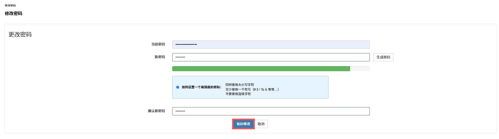
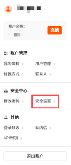
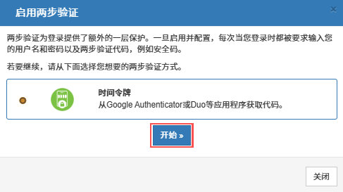
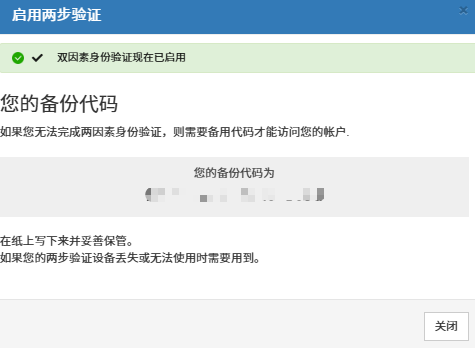

为保护您的 RakSmart 账号安全，建议至少完成一项安全设置：

- 设置复杂度高的登录密码并定期修改。
- 开启两步认证。两步认证是登录密码之外的第二层安全保护，也是简单有效的安全防护措施。开启两步认证后，再次登录 RakSmart 时，除输入登录密码外，系统还会提示您输入验证设备生成的校验码。

---

### 修改登录密码

1. 登录 [RakSmart 控制台](https://billing.raksmart.com/whmcs/index.php?rp=/user/security)。

2. 在控制台右上角个人头像下拉列表中，单击**修改密码**，进入**修改密码**页面。

   

3. 在**修改密码**页面，根据提示和要求修改您的登录密码。也可点击**生成密码**按钮，系统将自动生成一个高强度密码供您使用。

   

   > **重要**
   >
   > 为确保密码安全性，平台建议设置高强度密码。建议：同时使用大小写字符、至少使用一个符号，如 #、$、!、%、& 等，不要使用连续字符。

4. 在**确认新密码**输入框中再次填写新设置的密码，以确保两次输入的密码一致，避免因输入错误导致密码设置失败。

5. 单击**保存修改**。

---

### 注意事项

- 密码安全性：请务必设置符合平台要求的高强度密码，避免使用过于简单或容易被猜测的密码，如生日、连续数字等，以保障账户安全。

- 密码一致性：在输入新密码和确认新密码时，请注意仔细核对，确保两次输入完全一致，以免因密码不一致导致修改失败。

- 密码保管：新密码设置完成后，请妥善保管，勿向他人泄露。平台将采取安全技术措施保障用户账户安全，但用户自身也需提高安全意识，防止密码被盗用。

- 定期修改：为进一步提升账户安全性，建议用户定期修改密码，如每 3 个月或 6 个月更换一次，降低密码被破解的风险。

---

### 开启两步验证

两步验证为用户登录提供了额外的一层保护。一旦启用并配置该功能，每次用户登录时，除了需要输入用户名和密码外，还需提供两步验证代码，如安全码、时间令牌，或从 Google Authenticator、Duo 等专门的身份验证应用程序获取的动态代码。通过这种双重验证方式，极大地增加了账户被非法入侵的难度，显著提升账户安全性。

#### 前提条件

操作前，请在移动设备端下载并安装 Google Authenticator 或 Duo 等应用程序。

#### 操作步骤

1. 登录 [raksmart 控制台](https://billing.raksmart.com/whmcs/index.php?rp=/user/security)。

2. 在控制台右上角个人头像在下拉列表中，单击**安全设置**，进入**安全设置**页面。

   

3. 在**安全设置**页面**两步验证**配置框中，单击**点击这里启用**。

   

   > **说明**
   >
   > 若您之前没有设置两步验证，两步验证的状态显示**已禁用**。

4. 在**启用两步验证**确认页面，单击**开始**。

   

5. 移动端登录 Google Authenticator，会显示当前 RakSmart 账号的 6 位校验码。

   > **说明**
   >
   > 校验码每 30 秒更新一次。

6. 在绑定二次验证口令页面，输入上述校验码后单击**提交**。

   

7. 若身份验证页面提示“绑定成功”，则说明两步验证已成功开启。

   
