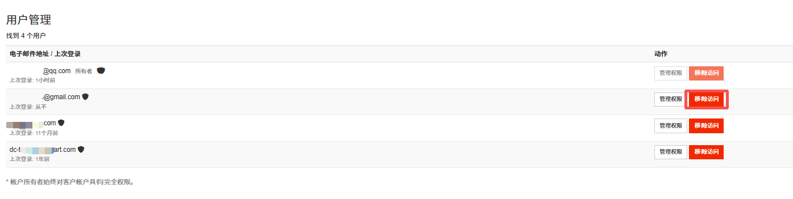
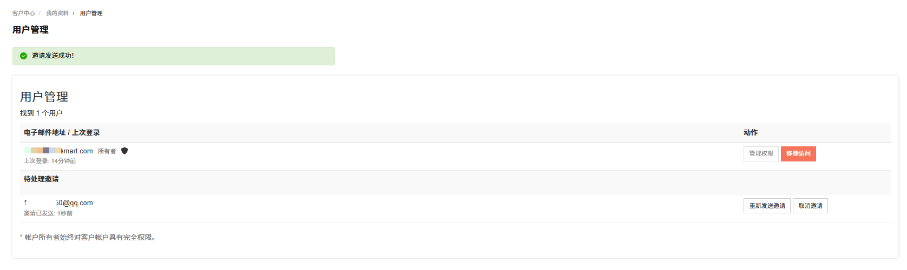

如果想要将资源分配给企业中不同的员工或者应用程序使用，为了避免分享自己的账号密码，您可以使用所有者用户的用户管理功能，给员工或应用程序的普通用户授予权限。

> **说明**
>
> 建议您遵循最小化原则，按需授予普通用户角色必要的权限。

---

### 用户管理

用户管理模块通过管理权限和移除访问功能修改用户权限。

#### 管理权限

管理权限通过选择或取消选择权限项，完成对用户的权限调整。

1. 登录 [RakSmart 控制台](https://cn.raksmart.com/login/index.html)。

2. 在个人资料列表单击**用户管理**，进入**用户管理**页面。

   

3. 在用户管理列表，找到不带有”所有者“标签的普通用户。单击**管理权限**，进入**管理权限**页面。

   

4. 在**管理权限**页面列表里，勾选或者取消勾选权限项，完成对用户的权限调整。

   

   > **说明**
   >
   > 可从以下维度精细化分配普通用户的权限配置。
   >
   > - **账户信息类**：修改账户信息、管理联系人信息等；
   > - **产品管理类**：查看 / 修改产品、管理域名 / 服务标签等；
   > - **订单操作类**：执行订单登录、查看 / 下新订单等；
   > - **财务类**：查看 / 支付账单、管理信用额度等；
   > - **售后类**：查看 / 提交工单、管理技术支持权限等。

5. 单击**保存修改**。

#### 移除访问

移除访问用于用户访问权限的删除。

1. 在用户管理页面用户管理列表，单击**移除访问**。

   

2. 在移除访问确认页面单击**确认**。

   > **权限说明**
   >
   > 标注 “**所有者**” 的用户为所有权限用户，这类用户对账户具备完全管理权限。

---

### 邀请新用户

邀请新用户是将新用户邀请到您的帐户中。如果被邀请者已经有一个帐户，那么他们可以使用现有帐户作为访问您的帐户的登录凭据。如果此用户还没有帐户，则可以创建一个，注册用户可参考[注册 RakSmart 账号](/beginners-guide/register-account/index.md)。

#### 邀请规则

通过输入电子邮箱邀请新用户。如果被邀请者已有 RakSmart 账户，则会直接关联到当前账户；若无账户，则会自动创建新账户。

#### 操作步骤

1. 在用户管理页面**邀请新用户**区域，填写新用户邮箱。

   

2. 为新用户选择**所有权限**或者通过**选择权限**按钮选择需要的权限。

   

3. 单击**发送邀请**。

4. 页面显示”**邀请发送成功**“。

   

5. 被邀请者需要登录已注册 RakSmart 子账号的邮箱，确认被邀请信息。单击**接受邀请**。

   

#### 操作结果

1. 在**接受邀请**页面填写子账户登录密码（若有），若之前没有使用邮箱创建 RakSmart 子账号，则选择注册账号。

   

2. 在 RakSmart 登录页面输入已注册的子账号邮箱和密码，完成登录。
