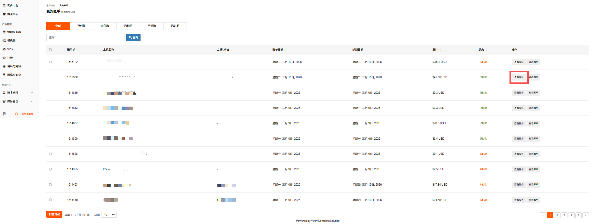
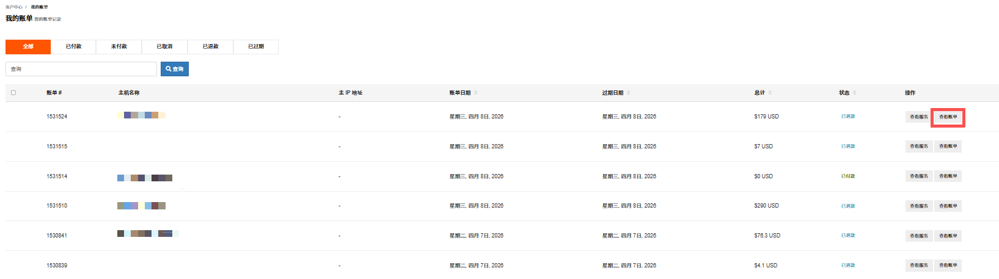
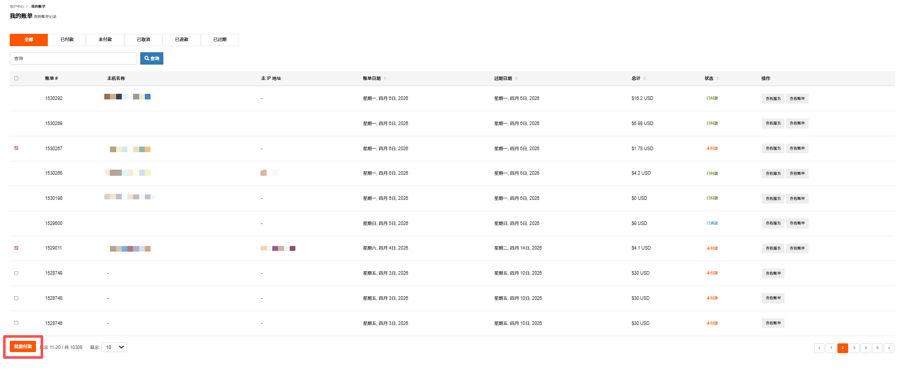

### 查看账单

1.  登录 [RakSmart 控制台](https://cn.raksmart.com/login/index.html)。

2.  在控制台左侧导航，单击**财务管理** -> **我的账单**，进入**我的账单**页面。账单列表顶部提供账单状态标签，可快速查看对应类型的账单。

    
    - **全部**：展示所有状态的账单（默认选中）；
    - **已付款**：仅显示已完成支付的账单；
    - **未付款**：仅显示待支付的账单；
    - **已取消**：仅显示已取消的账单；
    - **已退款**：仅显示已完成退款的账单；
    - **已过期**：仅显示已过期的账单。

3.  在**我的账单**页面右上角的**搜索框**，输入账单号、主机名称等关键词可精准查找账单。

### 查看服务

在账单列表某一行右侧单击**查看服务**，可查看对应主机/产品的服务详情页面。

### 查看账单

在账单列表某一行右侧单击**查看账单**，可查看该账单的详细内容，如费用明细、支付方式等。

### 批量付款

勾选未付款的账单，单击**批量付款**，可对未付款的账单的合并付款。

