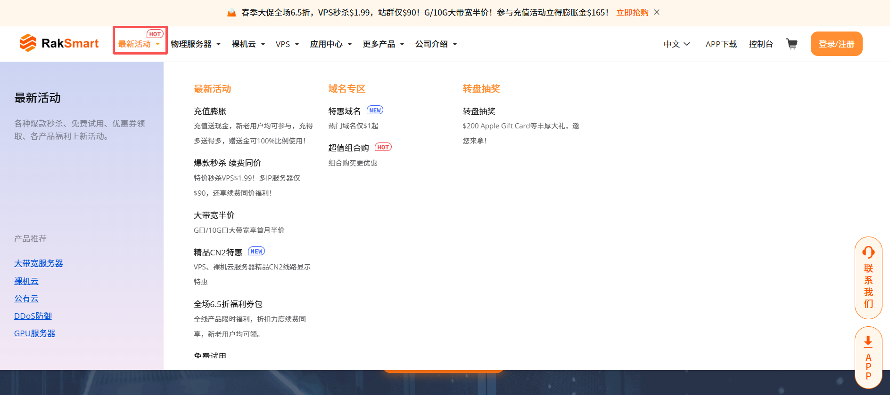
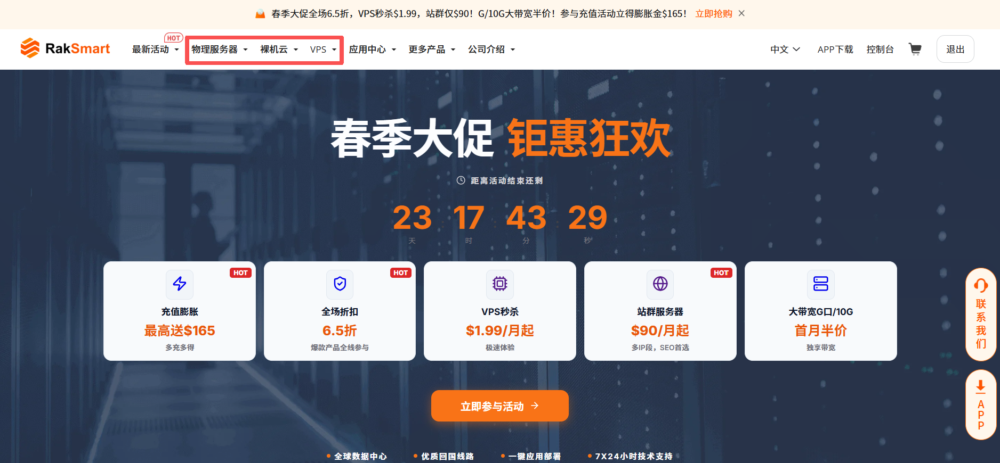
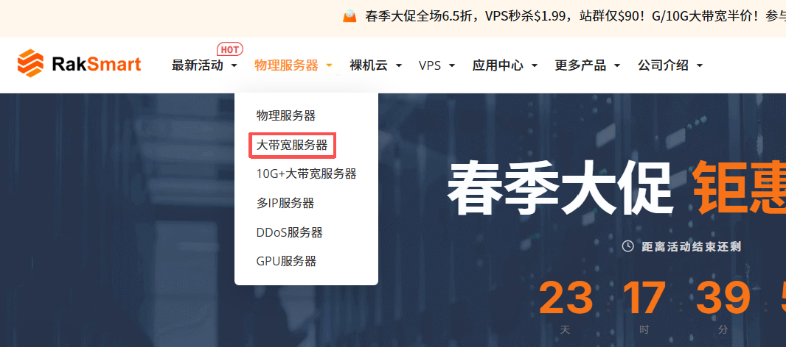
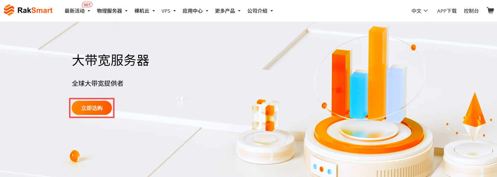

本文介绍购买 RakSmart 产品的三种方式：官网优惠活动入口、官网推荐产品入口和控制台购买中心入口。

---

### 官网优惠活动入口

官网优惠活动入口是 RakSmart 官网推出的产品优惠促销活动页面。

1. 登录 [RakSmart 官网](https://cn.raksmart.com/)。

2. 在顶部导航单击**最新活动**，打开活动下拉列表页面。

   

3. 在**最新活动**区域，单击选择某一个优惠产品。

   

---

### 官网推荐产品入口

官网推荐产品入口可用于选购 RakSmart 基于主流业务场景预设的标准化配置套餐。

1. 登录 [RakSmart 官网](https://cn.raksmart.com/)。

2. 在顶部导航单击某一款产品，进入产品下拉列表。

   

3. 选择某一款产品/服务，进入产品或服务页面。

   

4. 在产品服务页面，单击**立即选购**，进入购物车页面。

   

5. （可选）也可以将产品或服务页面下拉至**推荐产品配置**，单击**立即购买**。

   

---

### 控制台购买中心入口

RakSmart 控制台购买中心集中提供产品与服务选购、配置、下单、支付等功能。

1. 登录 [RakSmart 控制台](https://cn.raksmart.com/login/index.html)。

2. 在**控制台**左侧导航，单击**购买中心**，进入**购物车**页面。

   

3. 单击某个产品或服务名称，选择地区、分类等配置筛选出适合购买的服务器，单击**立即订购**。
