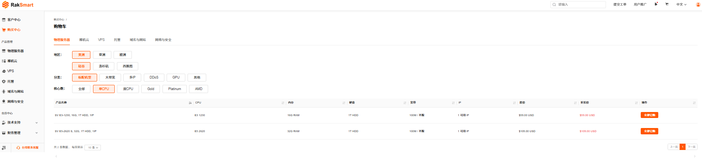
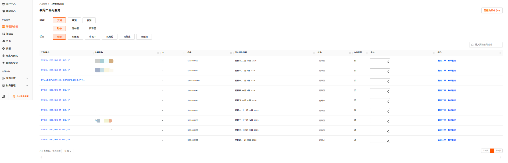
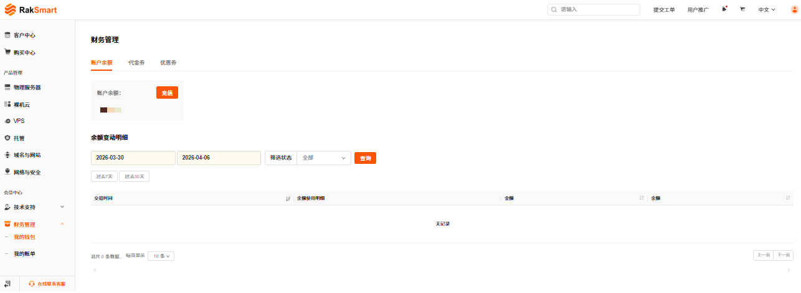
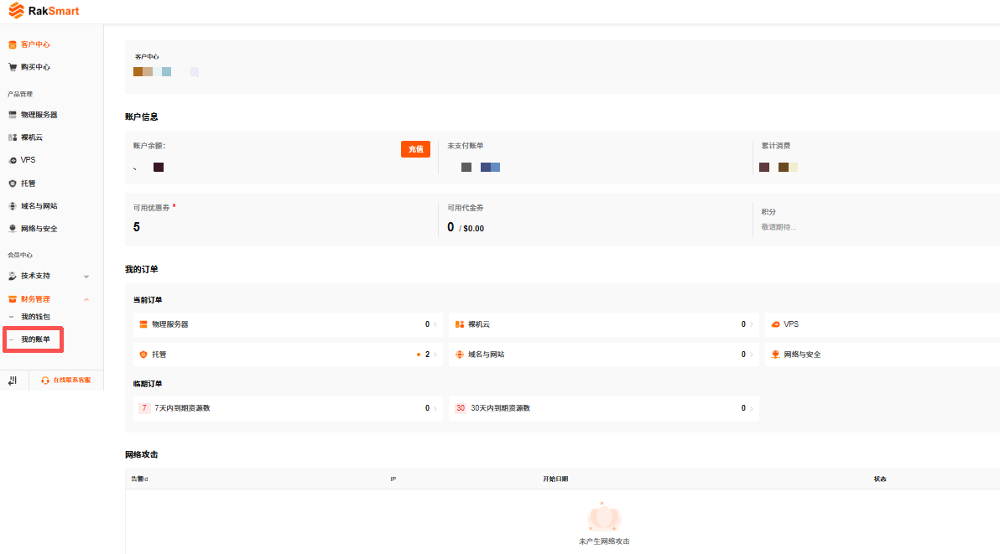
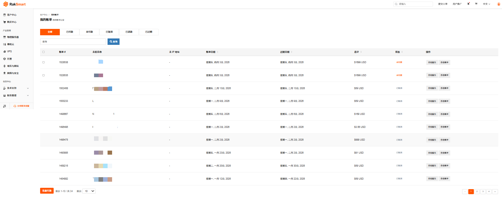

控制台首页和分页签包含客户中心、购买中心、产品管理、技术支持和财务管理五部分信息。

---

### 客户中心

客户中心包含账户信息、我的订单和最新信息与通知等模块。

#### 账户信息

账户信息模块支持如下操作：

- 支持充值操作，详细内容可参考[为 RakSmart 账号充值](/beginners-guide/wallet/balance.md#为-raksmart-账号充值)；

- 支持查看**余额/优惠券/代金券**，详细内容可参考[钱包管理](/beginners-guide/wallet/index.md)；

- 支持查看账单信息，如未支付账单、累计消费等信息。关于账单信息的详细介绍请参考[账单管理](/beginners-guide/billing/index.md)；

#### 我的订单

我的订单模块支持查看当前订单、临期订单和我的服务。

- **当前订单**：分类展示“物理服务器”、“裸机云”、“VPS” 等服务的订单数量，单击对应服务分类可查看具体订单详情；

- **临期订单**：显示“7 天内到期”、“30 天内到期”的资源数量，单击对应数字可查看即将到期的资源列表，便于及时续费。

- **我的服务**：单击**我的服务**可查看全部产品和服务信息，便于管理产品和服务。关于产品管理的详细介绍可参考[产品管理](/beginners-guide/manage-products/product-management.md)

#### 最新信息与通知

最新信息与通知模块支持查看活动信息、权益提醒、最新工单和投诉封停等信息。

- **活动信息**：查看平台最新促销活动，如当前的 YouTube 视频赚佣金活动；

- **权益提醒**：查看平台最新权益到账提醒，如优惠券到账提醒；

- **最近工单**：查看已提交工单的处理状态，如“已关闭”、“已处理”；

- **投诉封停**：查看 IP 的投诉及处理记录。

---

### 购买中心

在控制台内可直接选购新的产品与服务。

1. 登录 [RakSmart 控制台](https://cn.raksmart.com/login/index.html)。

2. 在左侧导航单击**购买中心**，进入产品和服务**购物车**页面。

   

3. 单击某个产品或服务名称，选择地区、分类等配置筛选出适合购买的服务器。关于如何购买 RakSmart 产品请参考[购买 RakSmart 产品](/beginners-guide/buy-products/purchase.md)。

   

---

### 产品管理

产品管理模块管理已购买的物理服务器、裸机云等产品。

1. 登录 [RakSmart 控制台](https://cn.raksmart.com/login/index.html)。

2. 在左侧导航**产品管理**区域，单击某一个产品或服务名称，进入**我的产品与服务**页面。

   

3. **我的产品与服务**页面支持查看产品/服务详情、新开工单和查看账单信息。
   
   - 查看产品/服务详情：单击**产品/服务**名称，即可打开该产品或服务的产品详情页面。
   - 新开工单：单击**新开工单**，支持对该产品服务提交问题工单。
   - 查看账单信息：单击**账单信息**，查看该产品/服务的账单记录。

---

### 财务管理

财务管理模块支持钱包管理、账单管理。

#### 我的钱包

1. 在控制台左侧导航，单击**财务管理**->**我的钱包**，进入**我的钱包**页面。

   

2. 我的钱包支持账户余额管理、代金券管理和优惠券管理。关于我的钱包的详细介绍可参考[钱包管理](/beginners-guide/wallet/index.md)。

   

#### 我的账单

1. 在控制台左侧导航，单击**财务管理**->**我的账单**，进入**我的账单**页面。

   

2. 我的账单支持查看不同状态的账单列表和账单管理。关于我的账单的详细介绍可参考[账单管理](/beginners-guide/billing/index.md)。

   
