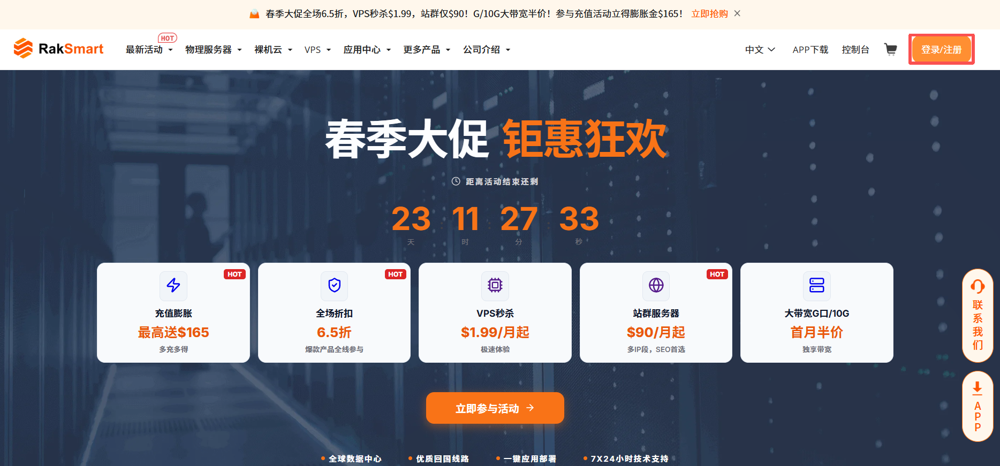
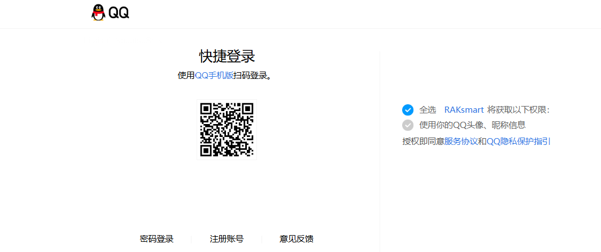

平台的用户类型分为所有者用户和普通用户两类。经过授权的普通用户账号和所有者用户账号登录的步骤相同。本节介绍如何登录 RakSmart 控制台。

---

### 准备工作

1. 注册 RakSmart 账号。

   在登录控制台之前，请先[注册 RakSmart 账号](/beginners-guide/register-account/index.md)。如果您已开通 RakSmart 账号，请忽略此步骤。

2. 创建普通用户并授予权限。

   如果想要将资源或权限分配给企业中不同部门的员工使用，为了避免分享自己的账号密码，您可以使用所有者用户的用户管理功能，给员工的普通用户授予权限。详细内容可参考[用户身份与权限说明](/beginners-guide/account/user-roles.md)和[为普通用户授权](/beginners-guide/account/user-permissions.md)。如果您已创建普通用户并授予权限，请忽略此步骤。

---

### 通过官网首页登录

1. 进入 [RakSmart 官网](https://cn.raksmart.com/) 。

2. 在页面右上角单击**控制台**或者**登录/注册**进入登录页面。

   

3. 输入已注册的电子邮件地址及密码，单击**登录**。

   

4. 登录成功后，自动进入控制台**客户中心**页面。

   

---

### 使用 QQ 账号快捷登录

如果您已有 RakSmart 账号，支持使用腾讯 QQ 账号快捷登录。

1. 进入 [RakSmart 官网](https://cn.raksmart.com/) 。

2. 在页面右上角单击**控制台**或者**登录/注册**进入登录页面。

   

3. 在登录页面右下角选择**用 QQ 账号登录**。

   

4. 在移动端，打开 QQ App，扫描页面上的二维码登录。

   

5. 在**腾讯 QQ 快捷登录**页面，单击**已有 RakSmart 账号**。

   

6. 输入电子邮件和密码，单击**提交**。
   
