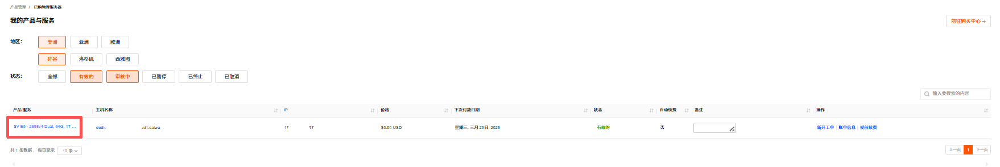

产品取消与退订是用户在产品租用 / 托管服务周期内，主动终止服务协议、停止使用目标资源的操作行为，适用于物理服务器、裸机云、vps等各类租用场景。

---

### 产品取消

RakSmart 产品取消包括到期用户不再续费和立即取消两种情况。

> **说明**
>
> - 生效规则：如选择的是 账单周期结束 后取消 ，则不会立即停止服务，而是在当前账单周期结束后终止服务。例如当前是 1 月订阅，申请取消后可持续使用到 1 月账单周期到期；
> - 费用说明：提交取消后无法再对订单进行续费操作；
> - 数据注意：请在提交取消申请前备份服务器内的所有数据，服务终止后数据会被清理，无法恢复。

1. 登录 [RakSmart 控制台](https://billing.raksmart.com/whmcs/index.php?rp=/user/security)。

2. 在控制台左侧导航**产品管理**区域，单击需要取消服务的产品，进入**我的产品与服务**详情页面。

   

3. 选择需要取消服务的服务器，单击**产品/服务**名称进入**管理产品**页面。
   

4. 单击**请求取消**，进入**账户取消请求**页面。
   

5. **简要说明取消理由**，选择**取消类型**，单击**请求取消**。
   
   - 账单周期结束：指服务器到期用户不再续费，用户取消服务器后不产生退款。
   - 立即：指立即终止服务器的使用，可能产生退款。退款规则的介绍可参考退款规则。
6. 单击**请求取消**，系统提示如下信息；单击**返回**可以回到管理产品页面。

   

7. 若您需要继续使用产品或者撤销取消申请，单击**移除请求**。

   

### 退款规则

- 退款金额计算：按产品剩余使用期限折算退款金额。
  - 月付退款金额 =（支付金额÷30）x 退款天数(30天-已使用天数)- 手续费；
  - 季付、半年付、年付套餐申请退款时，将按月付标准单价核算已使用时长的费用；
  - 若套餐包含赠送的时长 / 资源，且申请退款时赠送部分未使用完毕，需按对应产品的月付标准单价补足赠送部分的差价，再核算剩余款项退款金额。

- 退款到账：根据支付方式的不同退款方式主要分为以下两种
  - 非余额支付：您可选择该支付接口支持的退款方式（如原路退回），款项将按支付平台的处理周期到账。如遇节假日，到账时间可能顺延；
  - 余额支付：退款将退回至您的账户余额，即时到账；不支持提现。

- 数据保留：退订成功后，产品即刻回收且不可恢复。相关数据将被永久删除，无法恢复；

- 特殊说明：若退订产品为套餐类产品（含多个子资源），退款将按套餐整体剩余期限折算，不支持单独退订套餐内某一子资源。
