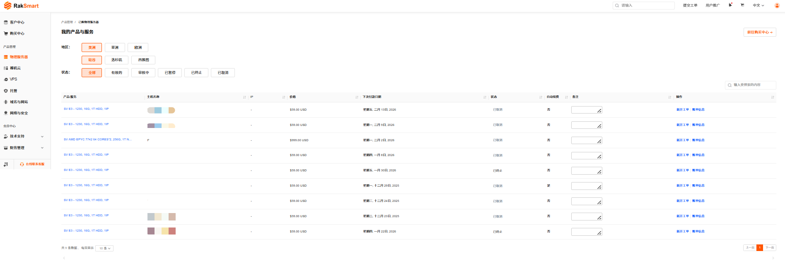
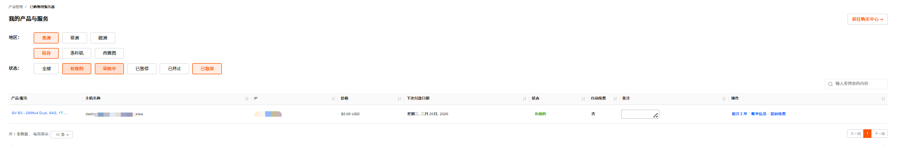
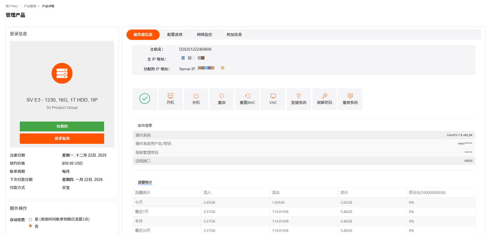
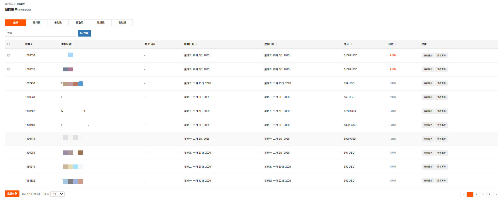
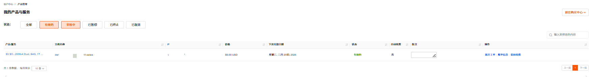
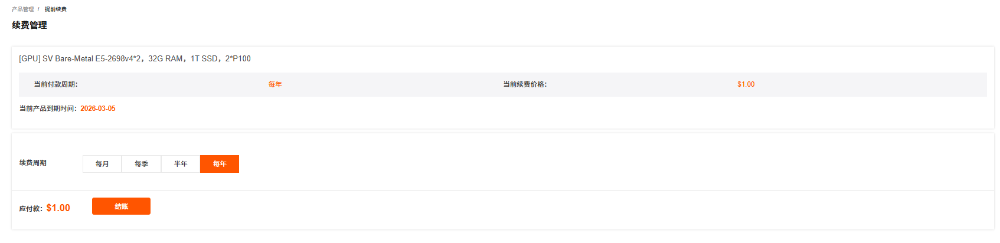

产品管理支持管理已购买的物理服务器、裸机云和 VPS 等产品。

---

### 产品管理入口

1. 登录 [RakSmart 控制台](https://billing.raksmart.com/whmcs/clientarea.php?language=chinese-cn)。

2. 在控制台左侧导航**产品管理**区域，单击目标产品或服务名称，进入**我的产品与服务**页面。 **我的产品与服务**页面支持查看产品/服务详情、新开工单、查看账单和提前续费等功能。

   

---

### 查看产品或服务详情

查看产品/服务详情支持查看不同地区和状态的产品/服务。

1. 在我的产品与服务页面，选择地区和状态，筛选出对应的产品/服务。状态是指产品/服务的使用状态，包括全部、有效的、审核中、已暂停、已终止和已取消。

   

2. 单击**产品/服务**名称，进入**管理产品**详情页面。此页面支持请求取消、开机、关机等操作。关于服务器信息详情介绍和服务器操作可参考各产品或服务的文档。

   

---

### 新开工单

新开工单支持对该产品服务提交问题工单。

1. 在我的产品与服务页面列表右侧，单击**新开工单**，进入**提交工单**页面。

   

2. 根据页面提示输入主题、问题描述等信息。
   

3. 单击提交。

---

### 查看账单信息

查看账单信息支持查看该产品/服务的全部账单记录。

1. 在我的产品与服务页面列表右侧，单击**账单信息**，进入**我的账单**页面。此页面支持查看全部、已付款、未付款、已取消、已退款和已过期的账单；支持通过搜索框搜索账单；支持查看购买此产品的不同日期产生的账单。

   

2. 我的账单页面支持查看服务和查看账单。

   

   a.查看服务：支持查看当前帐单对应的服务。
   单击**查看服务**，进入我的产品与服务页面。

   

   b.查看账单：支持查看当前账单详情。
   单击**查看账单**，进入我的帐单页面。此页面支持查看账单详情信息，可根据需要打印和下载账单。

   

---

### 提前续费

提前续费是指在当前服务有效期还没结束时，主动为其续费来延长使用时间。

> **说明**
>
> 为保障您的产品/服务正常使用，请留意以下续费及产品/服务状态变更规则：
>
> - 产品/服务到期前 10 天，系统将自动生成续费账单，请您及时完成续费操作；
> - 到期未续费的，产品/服务会在到期后的第 2 天被暂停。
>   - 暂停期间完成续费，产品/服务可立即恢复使用；
>   - 若暂停满 4 天仍未续费，产品/服务将被下架。

1. 在我的产品/服务列表右侧操作列，单击**提前续费**，进入**续费管理**页面。**续费管理**页面支持查看当前付款周期和当前产品到期时间。

   

2. 选择不同的续费周期，续费周期支持选择月付、季付、半年付和年付。单击**结账**。

3. 在**我的账单**页面，选择付款方式。若有余额，可以选择使用余额支付。

   

4. 完成付款。
