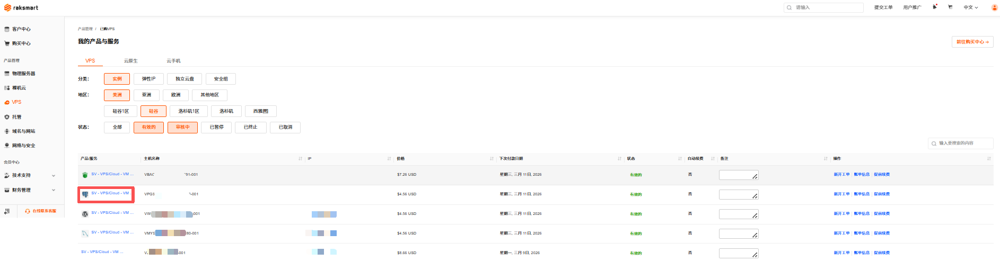
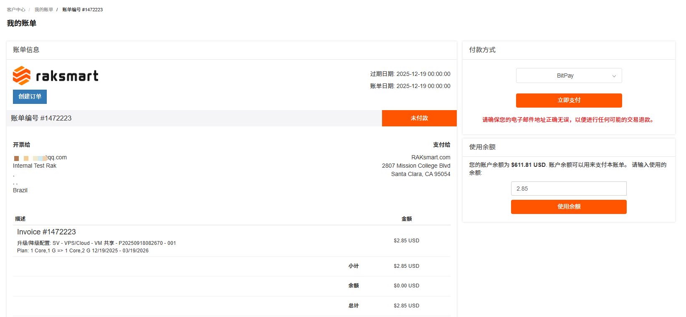
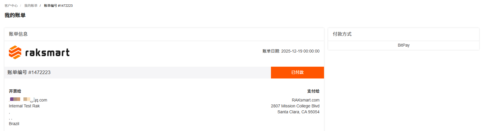

购买 RakSmart 产品后，您可以根据需要，自主对产品的配置进行升级或降级操作。通过升降级，可满足您业务扩张的需求、优化云资源配置、应对业务负载变化 或节省成本等。

不同的产品，支持升降级的资源类型不同，例如产品规格、公网带宽配置、存储容量、资源包规格、云盘类型和资源参数等。本文主要介绍如何通过控制台进行产品升降级。

---

### 操作步骤

以 VPS 为例，如果需要对实例升降级，可前往 VPS 控制台，针对指定配置进行升降级操作。

1. 使用 RakSmart 账号登录 [RakSmart 控制台](https://billing.raksmart.com/whmcs/index.php?rp=/user/security)。

2. 在控制台左侧导航**产品管理**区域，单击需要升降级的产品/服务名称进入**我的产品与服务**页面。

   

3. 单击**产品/服务**名称，进入**管理产品**页面。

   

4. 在**管理产品**页面，单击**升/降级**。进入**升级/降级**页面。

   

5. 重新填写或选择需要升降级的配置。例如实例规格由计算型 1 核心 CPU 改选为计算型 2 核心 CPU。

   

6. 单击**点击继续**，进入**升级/降级**价格确认页面。确认页面展示哪些配置做了升降级，和对应的价格变化。

   

7. 确认升降级配置和价格没有问题后，单击**点击继续**。进入**我的账单**页面。

   

8. 在**我的账单**页面，选择支付方式或者使用余额支付。

9. 付款成功。

   

10. 支付成功后，系统将自动完成配置调整。可在产品详情页查看更新后的配置信息，确认是否生效。

---

### 注意事项

对产品进行升降级会存在一些限制或影响，请留意操作界面的提示，或查看该产品的相关文档了解详情。

1. 不同产品升降级时可能会存在限制。

   例如：实例的网络类型不允许改变；硬盘容量只允许升级，不支持降级。

2. 升级与变配可能会对您的资源费用、生效时间、计费方式产生影响。

   例如，升级时，可能需要您为当前计费周期的规格或配置补差价。

3. 部分产品的升级与变配可能会对您的业务造成短暂影响。
   - 提前规划升级时间：建议选择业务低峰期执行升级 / 变配操作（如凌晨、节假日），最大程度降低对核心业务的影响。
   - 备份业务数据与配置：操作前务必完成全量数据备份和关键配置文件导出，避免因升级异常导致数据丢失或配置错乱。
   - 业务恢复后校验：升级完成后，需逐一验证业务功能、网络连通性、数据完整性，确认无异常后再恢复全量业务访问。
   - 问题反馈：若遇任务卡顿、失败等异常，及时通过控制台工单系统或客服渠道反馈。
