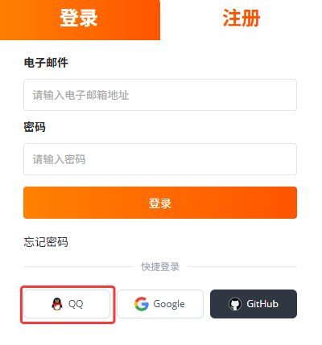

如果您没有 RakSmart 账号，支持通过 QQ 账号完成新用户快速注册。

1. 打开 [RakSmart 官网](https://cn.raksmart.com/) 。

2. 在页面右侧单击**登录/注册**。

   

3. 在登录页面右下角选择**用 QQ 账号登录**。

   
   
4. 在移动端，打开 QQ App，扫描页面上的二维码登录。

5. 在**腾讯 QQ 快捷登录**页面，输入电子邮件地址，勾选“我已阅读并同意服务条款”，单击**快速注册**。

   
