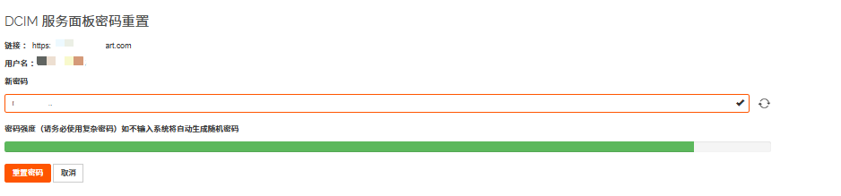

本文档用于指导 RakSmart 用户在会员中心完成 DCIM 服务面板与 RAK Cloud 服务面板的密码重置操作，确保用户能够安全、高效地管理面板访问权限。

---

### DCIM 服务面板密码重置

DCIM 服务面板（Data Center Infrastructure Management Service Panel）是 RakSmart 为物理服务器用户提供的数据中心基础设施管理控制台，用于远程管理和监控物理服务器的硬件状态、网络配置及运维操作。本文主要介绍如何在 RakSmart 控制台重置 DCIM 服务面板密码。

1. 登录 [RakSmart 控制台](https://cn.raksmart.com/login/index.html)。

2. 在左侧导航栏中，单击**技术支持** -> **服务面板密码重置**，进入**服务面板密码重置**页面。

   

3. 你可以通过以下两种方式完成 DCIM 服务面板密码重置。

   

   a. 方式一：在**新密码**输入框中，输入符合复杂度要求的新密码。

   b. 方式二：单击**新密码**输入框右侧的刷新图标，系统将自动生成高强度随机密码。

4. 单击**重置密码**。

5. 系统提示如下信息即完成 DCIM 服务面板密码更新。

   

---

### RAK Cloud 服务面板密码重置

RAK Cloud 服务面板是 RakSmart 为云服务器用户提供的云资源管理控制台，用于自助管理/监控 云服务器、云存储、云网络等弹性云资源，支持系统重装、网络配置、快照管理等云服务全生命周期操作。本文主要介绍如何在 RakSmart 控制台重置 RAK Cloud 服务面板密码。

1. 登录 [RakSmart 控制台](https://cn.raksmart.com/login/index.html)。

2. 在左侧导航栏中，单击**技术支持** -> **服务面板密码重置**，进入**服务面板密码重置**页面。

   

3. 你可以通过以下两种方式完成 RAK Cloud 服务面板密码重置。

   

   a. 方式一：在**新密码**输入框中，输入符合复杂度要求的新密码。
   b. 方式二：单击**新密码**输入框右侧的刷新图标，系统将自动生成高强度随机密码。

4. 单击**重置密码**。

5. 系统提示如下信息即完成 RAK Cloud 服务面板密码更新。

   
