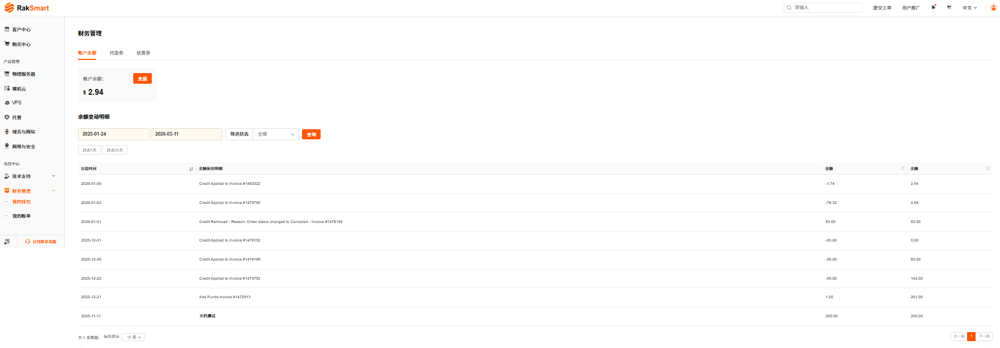
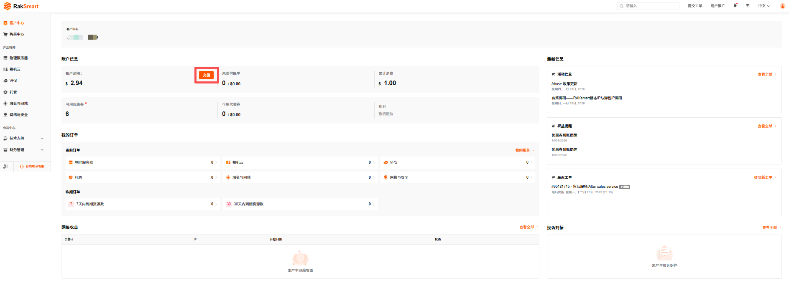
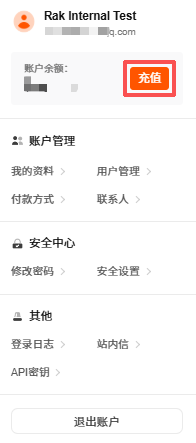

账户余额管理支持查看账户余额、充值和查询余额变动明细。

---

### 查看账户余额

1. 登录 [RakSmart 控制台](https://cn.raksmart.com/login/index.html)。

2. 在左侧导航会员中心区域，单击**财务管理**->**我的钱包**。

   

3. 在**账户余额**页面，可直接查看当前账户余额和余额变动明细。

   

---

### 为 RakSmart 账号充值

为了方便您购买 RakSmart 产品和服务，建议您提前为账号充值。

#### 充值入口

##### 从客户中心入口充值

1. 登录 [RakSmart 控制台](https://cn.raksmart.com/login/index.html)，进入**客户中心**页面。

2. 在**账户信息**区域，单击**充值**，进入**账户充值**页面。

   

3. 输入充值金额并选择付款方式；支持通过 BitPay、贝宝、信用卡、银联、支付宝等在线充值方式进行充值。

   

   > **说明**
   >
   > - 不同的充值金额可选的支付方式不同，您可根据实际充值情况选择充值方式。
   > - 最低充值金额 $1.00 USD，最高充值金额 $20000.00 USD，账户预存上限是 $100000.00 USD。

4. 单击**账户充值**。

##### 从个人资料入口充值

1. 登录 [RakSmart 控制台](https://cn.raksmart.com/login/index.html)，可进入**客户中心**页面。

2. 在个人头像下拉列表，单击**充值**。

   

3. 充值步骤参考[从客户中心入口充值](#从客户中心入口充值)。

#### 预期结果

1. 选择一种付款方式，例如选择支付宝支付。

2. 页面显示付款成功。

   

3. 可以返回控制台查看账户余额或账单信息，如下图所示。
   - 账户余额：

     

   - 账单信息：

     

#### 常见问题

在线充值如遇到未到账的情况，请通过工单系统，发送相关支付截图，我们会第一时间为您处理。

---

### 查看余额变动明细

支持通过交易时间、入账和消费等条件筛选每笔余额变动的时间、明细、金额及变动后余额。

1. 在**余额管理**->**余额变动明细**区域，通过**时间**条件或**筛选状态**条件完成余额查询：
   - 选择**开始日期** / **结束日期**，或快捷选择**过去 7 天** / **过去 30 天**查询余额变动明细；
   - 通过筛选状态筛选，选择**全部** / **入账** / **消费**。
   - 支持同时使用时间和筛选状态条件查询。

2. 单击**查询**，筛选结果如下图所示。

   
