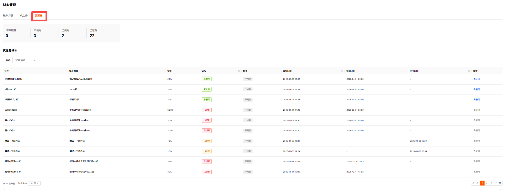
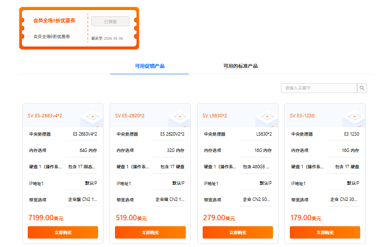

优惠券管理支持通过使用状态查看优惠券、使用优惠券。

---

### 查看优惠券

1. 登录 [RakSmart 控制台](https://cn.raksmart.com/login/index.html)。

2. 在左侧导航产品管理区域，单击**财务管理**->**我的钱包**。

   

3. 在**财务管理**页面，单击**优惠券**，进入**优惠券**列表页面。支持查看优惠券名称、使用明细、金额、状态、续费、领取日期、到期日期和使用日期。

   

4. 在**状态**下拉框选择**全部状态**、**未使用**、**已过期**、**已使用**或者**不可用**，可查看不同使用状态的优惠券。

   
   - 即将到期：临近有效期的优惠券数量。
   - 未使用：当前可使用的优惠券数量。
   - 已使用：已完成抵扣的优惠券数量。
   - 已过期：超出有效期的优惠券数量。

---

### 使用优惠券

> **说明**
>
> 优惠券使用需满足使用条件，如 “新用户订单满 100”，且需在有效期内使用；已使用或过期的优惠券无法再次使用，可通过列表状态区分可用范围。

1. 在**优惠券**页面，选择状态为**未使用**的优惠券，在列表右侧单击**去使用**。

   

2. 在产品选择页面，选择**符合条件的促销产品**或者**符合条件的标准产品**，单击**立即购买**，跳转至对应产品购物车配置页面使用该代金券。

   
