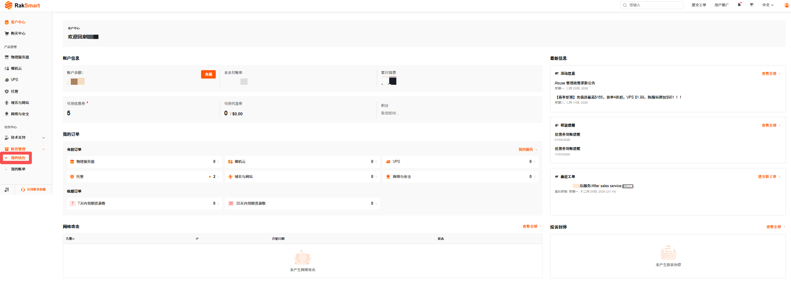
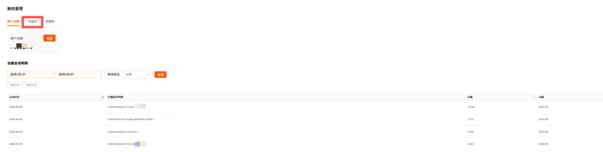
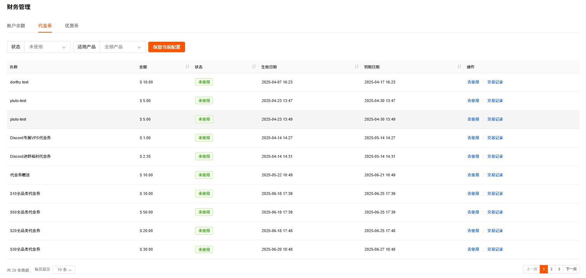
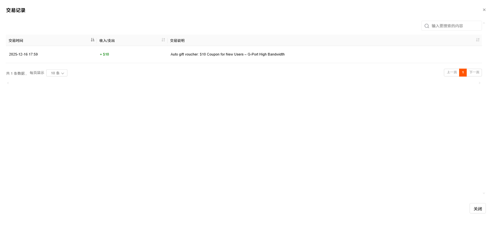

代金券管理支持查看使用状态和交易记录、使用代金券。

---

### 查看代金券

支持通过状态和适用产品查看代金券。

1. 登录 [RakSmart 控制台](https://cn.raksmart.com/login/index.html)。

2. 在左侧导航产品管理区域，单击**财务管理**->**我的钱包**。

   

3. 在财务管理页面，单击**代金券**，进入**代金券**列表页签。**代金券**列表支持查看代金券名称、金额、状态、生效日期和到期日期。

   

4. 选择**状态**或**适用产品**条件查询，筛选代金券。

   

---

### 使用代金券

1. 在代金券页签，列表右侧单击**去使用**。

   

2. 您可以选择**可用标准产品**或者**可用促销产品**，单击**立即购买**，跳转至对应产品购物车配置页面使用该代金券。
   

---

### 查看交易记录

支持查看代金券的使用状态和明细。

1. 在代金券页签，单击代金券列表中某一代金券操作列的**交易记录**。

   

2. 单击交易记录，可查看该代金券的使用状态和明细。

   
