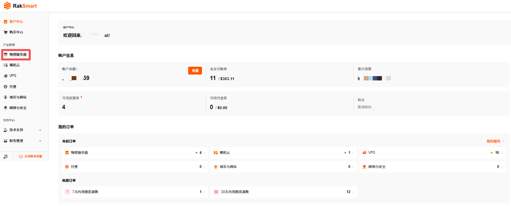
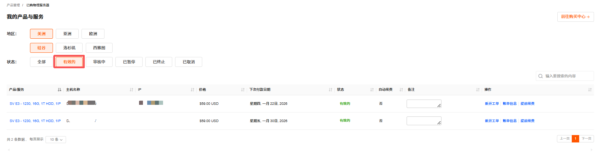
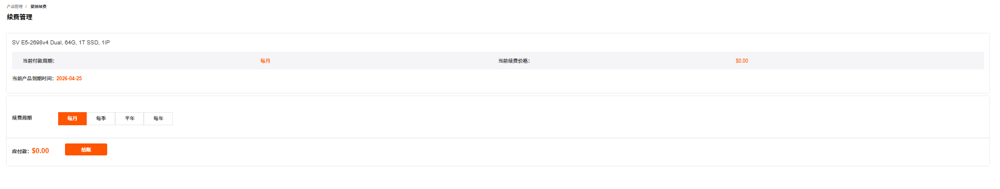
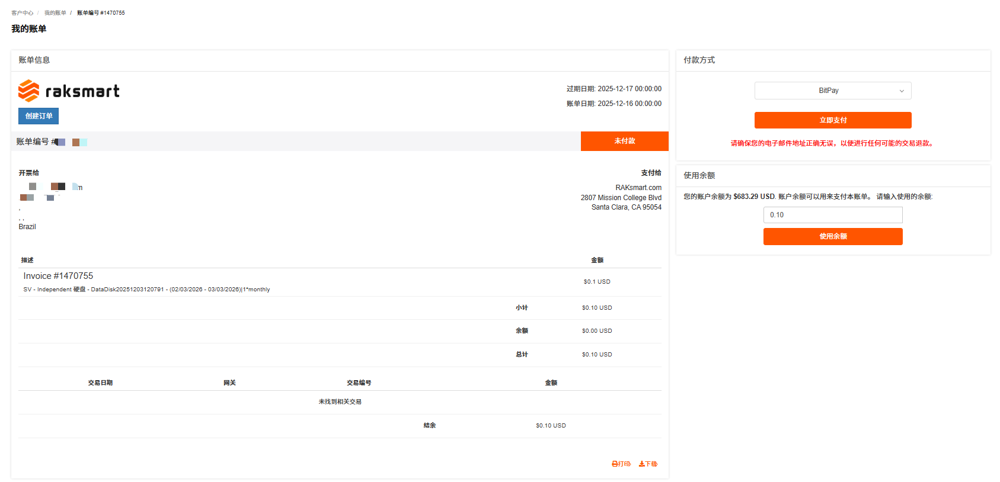
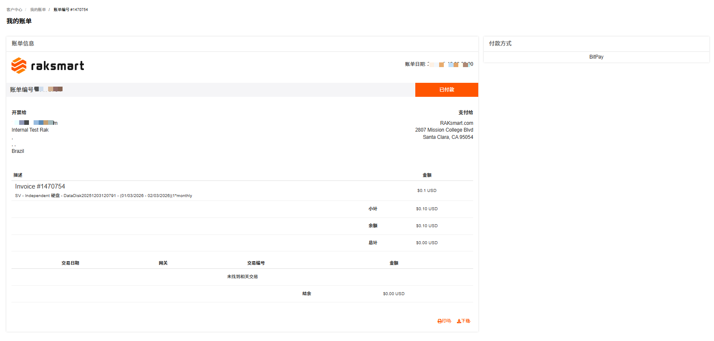

### 查看账单信息

查看账单信息支持查看物理服务器的全部账单记录。

1. 登录 [Raksmart 控制台](https://billing.raksmart.com/whmcs/clientarea.php?language=chinese-cn)。

2. 在左侧导航**产品管理**区域，单击**物理服务器**，进入**我的产品与服务**页面。

   

3. （可选）若当前列表没有找到想要查看的物理服务器，支持通过地区或状态进行筛选，或者通过搜索框搜索。

   

4. 找到需要查看账单信息的物理服务器，单击**账单信息**。

5. 在**我的账单**页面，支持查看全部、已付款、未付款、已取消、已退款和已过期的账单；支持通过搜索框搜索账单；支持查看服务、查看账单和批量付款。

   

   a. 查看服务

   支持查看当前帐单对应的服务。单击**查看服务**，进入我的产品与服务页面。

   

   b. 查看账单  
   支持查看当前账单详情。单击**查看账单**，进入我的帐单页面。此页面支持查看账单详情信息，可根据需要打印和下载账单。

   

---

### 提前续费

提前续费是指在当前服务有效期还没结束时，主动为其续费来延长使用时间。

> **说明**
>
> 为保障您的产品/服务正常使用，请留意以下续费及产品/服务状态变更规则：
>
> - 产品/服务到期前 10 天，系统将自动生成续费账单，请您及时完成续费操作；
> - 到期未续费的，产品/服务会在到期后的第 2 天被暂停。
>   - 暂停期间完成续费，产品/服务可立即恢复使用；
>   - 若暂停满 4 天仍未续费，产品/服务将被下架。

1. 在**我的产品/服务**列表右侧操作列，单击**提前续费**，进入**续费管理**页面。**续费管理**页面支持查看当前付款周期和当前产品到期时间。

   

2. 选择不同的续费周期。续费周期支持选择月付、季付、半年付和年付。

3. 单击结账，进入**我的账单**页面。

   

4. 在**我的账单**页面，选择付款方式或者使用余额支付。

5. 完成付款。

   
