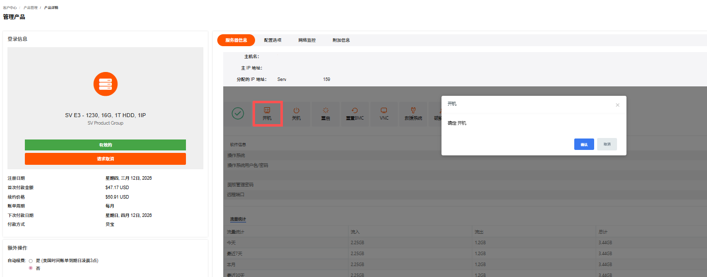
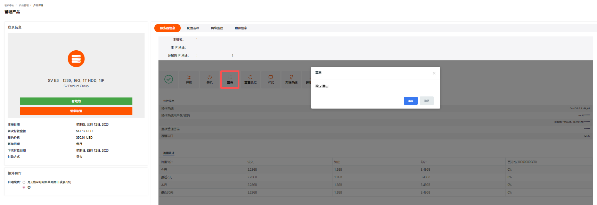
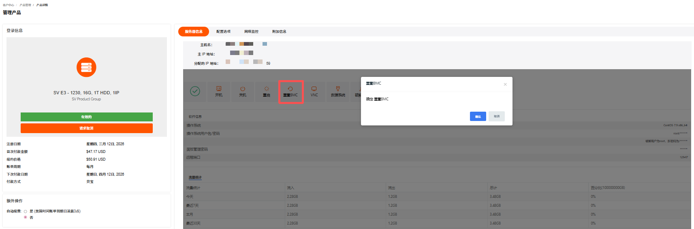
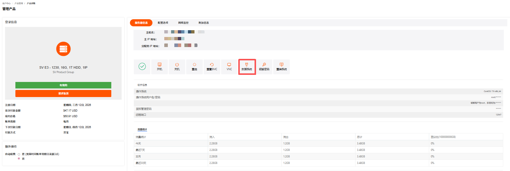
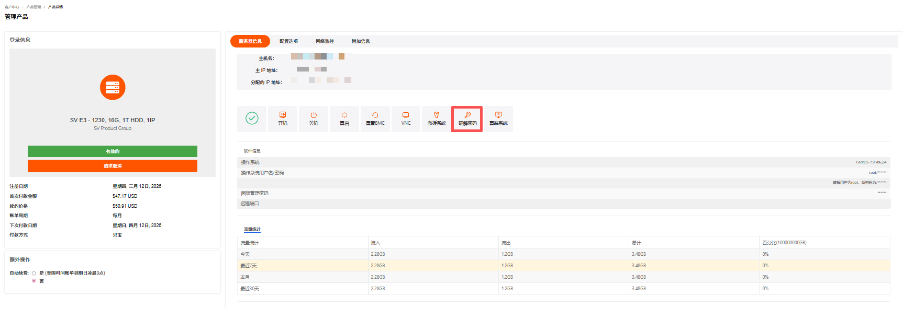
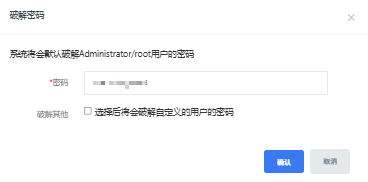
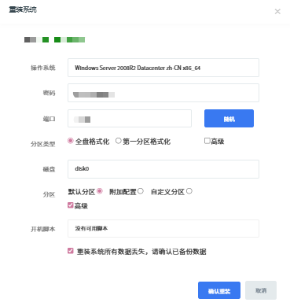

在物理服务器**管理产品**页面，支持开机、关机、重启、重置 BMC、使用 VNC、救援系统、破解密码和重装系统等操作。

---

### 开机

物理服务器开机是指启动已关机的服务器。

1. 在物理服务器管理产品->管理面板，单击**开机**。

   

2. 在**开机**确认页面单击**确认**。

---

### 关机

物理服务器关机是指关闭运行中的服务器。建议先通过远程连接保存数据。

1. 在物理服务器管理产品->管理面板，单击**关机**。

   

2. 在**关机**确认页面单击**确认**。

---

### 重启

物理服务器重启是指将运行中的服务器关机并重新开机。适用于系统卡顿、配置生效等场景。

1. 在物理服务器管理产品->管理面板，单击**重启**。

   

2. 在**重启**确认页面单击**确认**。

---

### 重置 BMC

重置 BMC 是指重置物理服务器管理控制器，解决远程管理相关故障。

1. 在物理服务器管理产品->管理面板，单击**重置BMC**。

   

2. 在**重置 BMC**确认页面单击**确认**。

---

### 使用 VNC

使用 VNC 是指通过 VNC 远程连接物理服务器控制台。无需网络配置，直接访问系统界面。关于如何连接物理服务器的方法可参考[登录物理服务器](/dedicatedserver/quickstart/login.md)。

---

### 救援系统

救援系统是指启动救援模式。用于系统故障、密码找回等紧急场景。

1. 在物理服务器**管理产品**页面，单击**救援系统**。

   

2. 选择**操作系统**，单击**确认**。

   

---

### 破解密码

破解密码是指重置物理服务器系统登录密码。

1. 在物理服务器**管理产品**页面，单击**破解密码**。

   

2. 在**破解密码**页面，系统将会默认破解 Administrator/root 用户的密码，单击**确认**。

   

3. （可选）在**破解密码**页面，勾选**选择后将会破解自定义的用户的密码**，输入**自定义用户**，单击**确认**。

   

---

### 重装系统

重装系统是指重新部署操作系统镜像，将物理服务器系统盘恢复至初始状态，常用于系统故障、更换系统版本或清理环境等场景，操作会格式化系统盘（数据盘通常不受影响，视配置而定）。

> **注意**
>
> 重装会清除系统盘数据，请提前备份。

1. 在物理服务器管理产品->管理面板，单击**重装系统**。

   

2. 在**重装系统**页面，根据提示完成操作系统、密码、端口等信息的选择和输入。

   

3. 单击**确认重装**。
