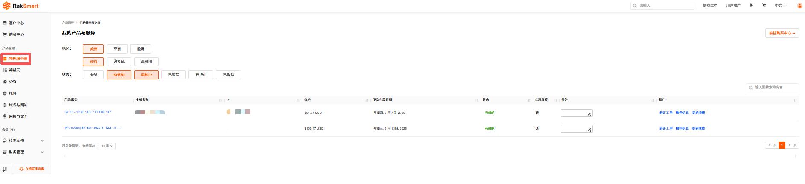
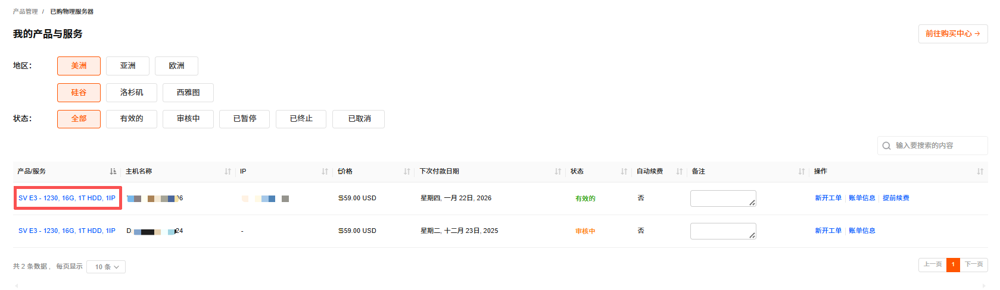
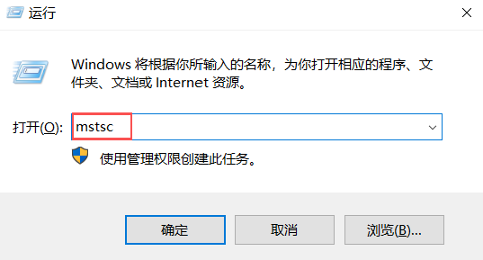
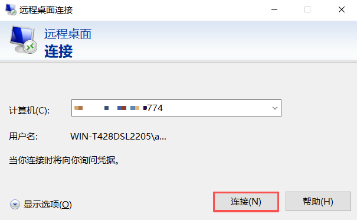
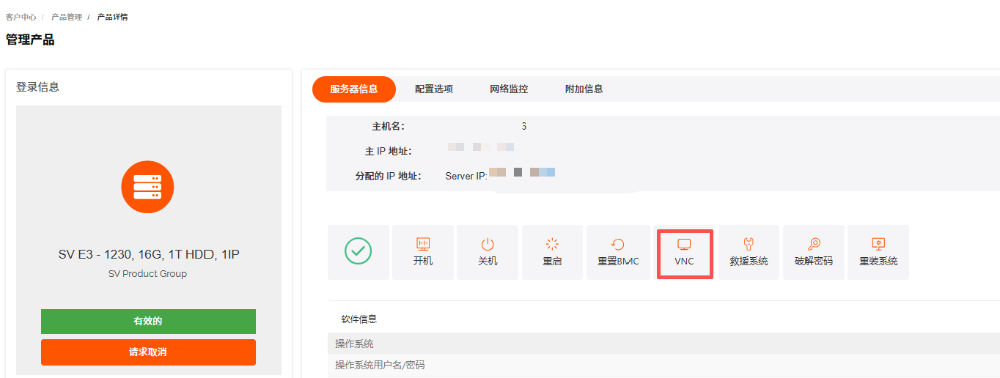
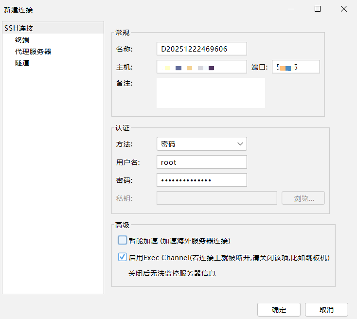

根据购买服务器操作系统类型的不同，可将物理服务器分为 Windows 物理服务器和 Linux 物理服务器。购买并激活服务器后，您可以选择以下方式登录服务器。

---

### 登录 Windows 物理服务器

#### 方式 1：通过控制台 VNC 登录

VNC 远程控制窗口是连接物理服务器的可视化操作界面，可进行系统操作、文件管理等操作。

1. 登录 [RakSmart 控制台](https://billing.raksmart.com/whmcs/clientarea.php?language=chinese-cn)。

2. 在控制台左侧导航**产品管理**区域，单击**物理服务器**，进入**我的产品与服务**页面。

   

3. 选择状态为**有效的**物理服务器，单击**产品/服务**名称，进入此服务器的产品详情页面。支持通过地区或状态查找物理服务器

   

4. 在物理服务器**管理产品**页面，单击**VNC**，进入 VNC 连接面板。

   

5. 在 Windows 系统登录界面，输入服务器密码，完成登录。

   

---

### 方式 2：使用远程桌面登录

本例以 Windows 系统自带的远程桌面连接应用作简要说明。

1. 在本地 Windows 电脑上，按 `Win + R` 键打开**运行**对话框，输入 `mstsc`，回车或者单击**确认**打开**远程桌面连接**工具。

   

2. 在**计算机**输入框中，输入 Windows 服务器的公网 IP 地址，如：192.168.1.1。默认的远程桌面端口默认为 3389，如果服务器修改了默认的端口，则需在 IP 加上冒号和本机端口号，如：192.168.1.1:3390。

   

3. 单击**连接**。

4. 在弹出的窗口中，输入服务器的**管理员账号**（通常是 Administrator）和对应的密码，单击**确定**。

   

---

### 登录 Linux 物理服务器

登录 Linux 物理服务器包含使用控制台 VNC 功能登录和使用 SSH 远程登录。

#### 方式 1：通过控制台 VNC 登录

VNC 远程控制窗口是连接物理服务器的可视化操作界面，可进行系统操作、文件管理等。

1. 登录 [RakSmart 控制台](https://billing.raksmart.com/whmcs/clientarea.php?language=chinese-cn)。

2. 在控制台左侧导航**产品管理**区域，单击**物理服务器**，进入**我的产品与服务**页面。

   

3. 在**我的产品与服务**页面，可以通过地区或状态查找物理服务器。

   

4. 选择状态为**有效的**物理服务器，单击**产品/服务**名称，进入此服务器的**管理产品**页面。

   

5. 单击**VNC**，进入 VNC 连接面板。详细的连接步骤可参考上述登录 Windows 物理服务器 - 通过控制台 VNC 登录。

   

#### 方式 2：使用 SSH 客户端远程登录

通过 SSH 远程连接服务器是指是指使用 SSH 工具，在本地设备上通过网络远程访问服务器，登录系统进行命令行操作的过程。

##### 前提条件

本地设备已安装 SSH 客户端：

- Windows 可使用 PuTTY、Xshell；
- Mac/Linux 可用自带终端。

##### 操作步骤

1. 打开本地 SSH 客户端工具。

   

2. 在连接配置中填写如下信息。
   - 名称：服务器主机名。
   - 主机地址：服务器主 IP；
   - 端口：默认 SSH 端口为 22；
   - 方法：支持密码、公钥和Keyboard Interactive方式，选择其中一种方式；
   - 用户名：root（对应操作系统用户名）。
   - 密码：服务器连接密码。

   > **说明**
   >
   > 可在产品信息邮件中查找对应密码。产品信息邮件会在产品购买开通后由 RakSmart 发送给用户。

3. 单击**确定**，远程连接服务器成功如下图所示。

   
