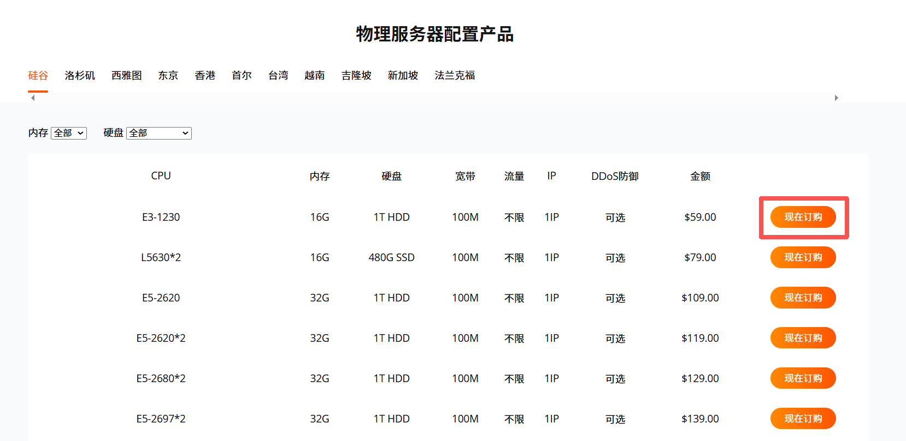
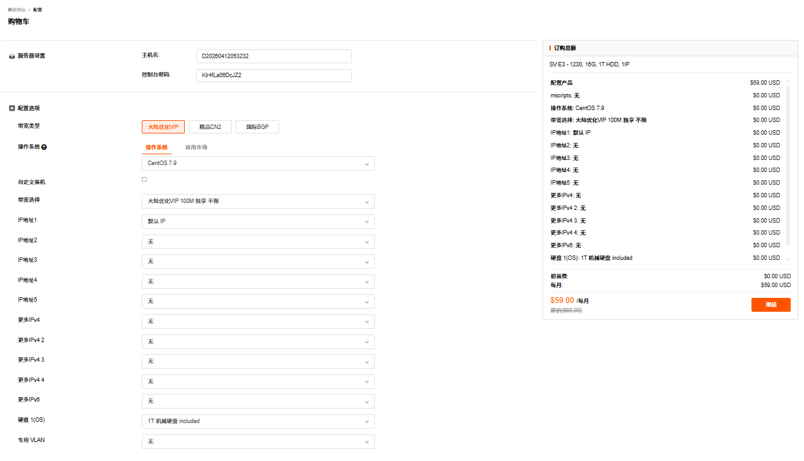
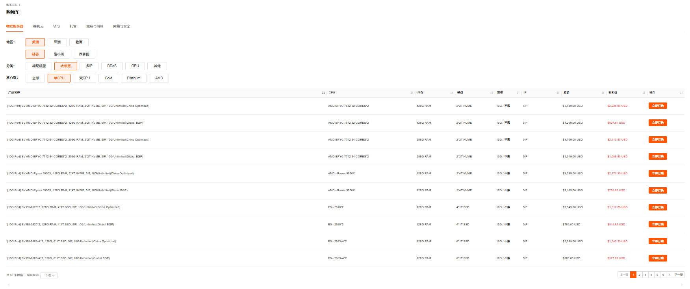
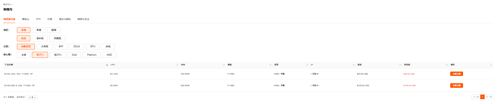
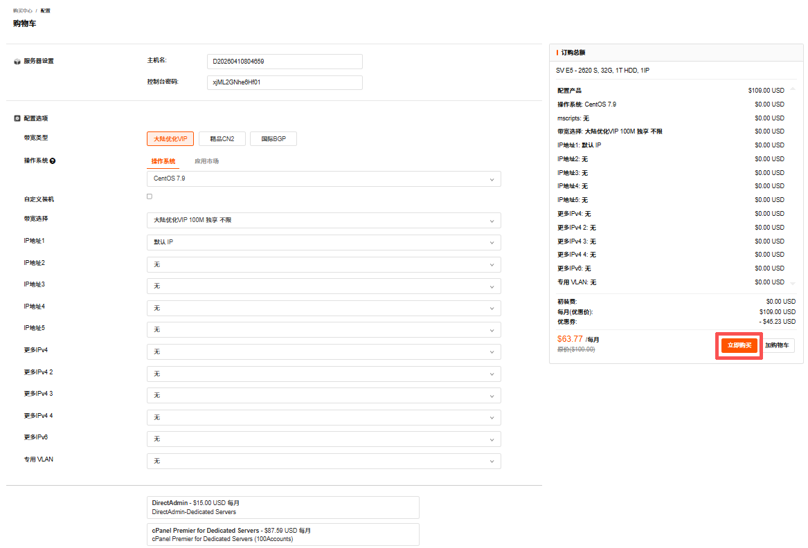
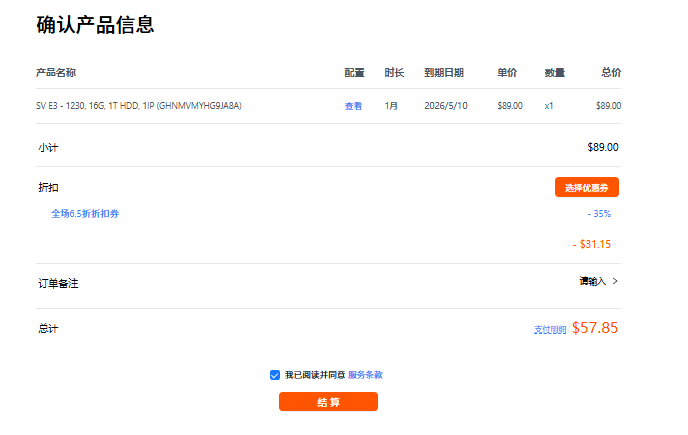
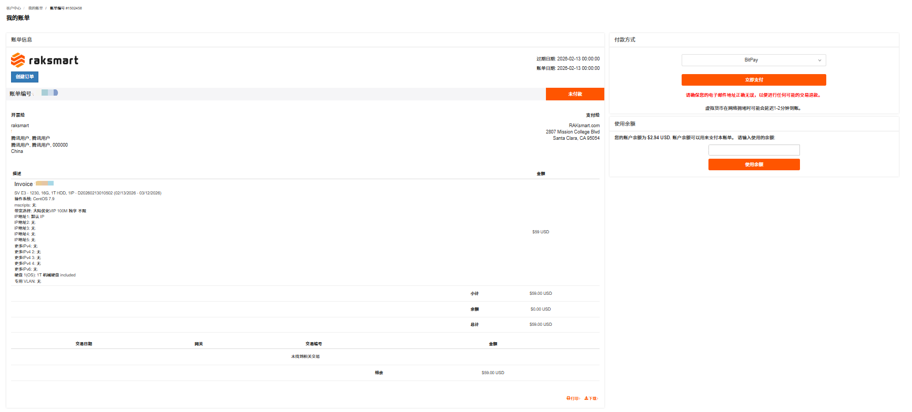
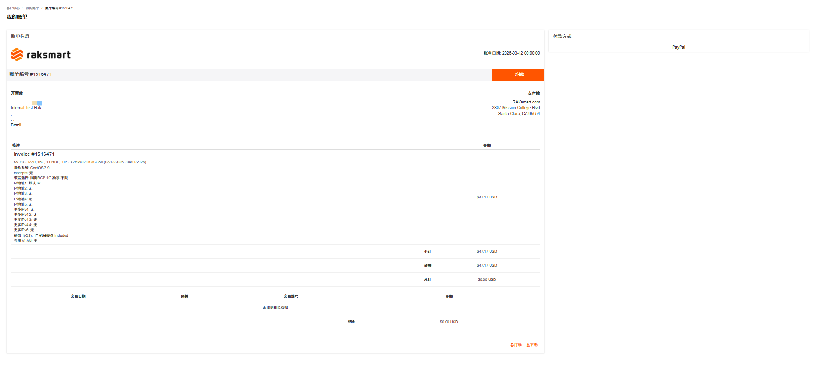
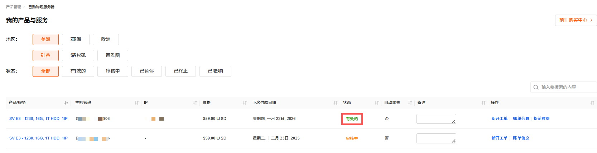

本文主要介绍如何通过 RakSmart 官网产品入口和控制台入口购买物理服务器。

---

### 准备工作

1. 注册 RakSmart 账号，详细步骤可参考[注册 RakSmart 账号](https://cn.raksmart.com/login/index.html)。

2. 了解 RakSmart 产品和配置项、计费周期、付款方式等信息，参考[购买 RakSmart 产品](/beginners-guide/buy-products/purchase.md)。

---

### 通过官网产品入口购买

您可以直接通过 RakSmart 官网顶部导航入口购买物理服务器。

1. 使用注册的 RakSmart 账号登录 [RakSmart 官网](https://cn.raksmart.com/)。

2. 将鼠标悬停在顶部导航**物理服务器**，打开下拉列表。

   

3. 选择一个物理服务器产品类型，进入产品页面。

   

4. 单击**立即订购**。

   

5. 在产品清单页面，选择购买物理服务器的地区、配置，单击**现在订购**。

   

6. 在**配置** - **购物**车页面，参考如下信息完成自定义产品配置。各配置项详细说明，请参考[配置项及付款流程说明](#配置项及付款流程说明)。

   

---

### 通过控制台入口购买

本文主要介绍通过 RakSmart 控制台购买中心入口购买物理服务器。

1. 使用注册的 RakSmart 账号登录 [RakSmart 官网](https://cn.raksmart.com/login/index.html)。

   

2. 在官网顶部导航右侧，单击**控制台**，进入控制台**客户中心**页面。

   

3. 单击**购买中心**，进入**购物车** - **物理服务器**面板。

   

4. 选择地区、分类、核心数等产品信息，单击**立即订购**。进入**配置** - **购物车**页面。各配置项详细说明，请参考[配置项及付款流程说明](#配置项及付款流程说明)。

   

   <table width="100%">
     <tr style="text-align: left;">
       <th width="20%">配置项</th>
       <th width="80%">说明</th>
     </tr>
     <tr>
       <td>地区</td>
       <td>物理服务器部署的可用区。目前支持的区域和可用区有美洲的硅谷、洛杉矶、西雅图，亚洲的
   香港、台湾、东京等区和欧洲的法兰克福。关于区域和可用区的详细介绍可参考 区域和可用区。 </td>
     </tr>
     <tr>
       <td>分类</td>
       <td>物理服务器的功能和配置类型，主要包括按如下分类： - 标配机型：基础标准配置，满足常规业务，如网站部署、轻量应用运行的基础算力与资源需求； - 站群多 IP：配备更多独立 IP，适配多网站、多域名并行部署的业务场景； - 大带宽：提供高带宽资源，适配视频流媒体、数据传输等高网络吞吐需求的业务； - 高防：集成抗攻击防护能力，适配易受网络攻击的业务（如电商平台、游戏服务器）； </td>
     </tr>
      <tr>
       <td>核心数</td>
        <td>物理服务器的核心配置选项， 支持通过核心数选择单 CPU / 双 CPU；也支持通过 Gold、Platinum 和 AMD 等 CPU 型号选择。</td>
     </tr>
   </table>

---

### 配置项及付款流程说明

1. 服务器设置
   主机名称与控制台密码默认由系统生成，支持自定义修改。

2. 配置选项  
   请参考如下信息完成**配置选项**配置。

   <table width="100%">
        <tr style="text-align: left;">
          <th width="20%">参数</th>
          <th width="80%">说明</th>
        </tr>
        <tr>
          <td>带宽类型</td>
          <td>选择带宽线路，如大陆优化 VIP、精品 CN2、国际 BGP；</td>
        </tr>
        <tr>
          <td>操作系统</td>
          <td>服务器运行的系统环境，可选类型包括： - Linux 系统：- CentOS、 Ubuntu、Debian、Rocky、Almalinux； - Windows 系统：Windows Server Datacenter 版本。</td>
        </tr>
        <tr>
          <td>自定义装机</td>
          <td>是否开启自定义装机的开关。 
            - 自定义装机是系统安装后对系统或软件的深度预装与部署（含镜像、脚本、应用栈）。</td>
        </tr>
        <tr>
          <td>带宽选择</td>
          <td>选择具体的带宽套餐，如大陆优化 VIP 100M 不限</td>
        </tr>
        <tr>
          <td>IP地址1-5 / 更多IPv4 / 更多IPv6</td>
          <td>系统默认分配 1 个公网 IP，若需要额外购买 IP，可在 IP 地址 2-5 及更多 IPv4 等选项中自行选择。也可以选择不同规格的高防 IP 服务。</td>
        </tr>
        <tr>
          <td>硬盘</td>
          <td>硬盘 1（系统盘）默认包含“1T 机械硬盘”，即系统自带 1TB 容量的机械硬盘，该费用已包含在基础套餐内，无需额外付费； 可选升级：可付费升级为“1T 固态硬盘”，即用 1TB 容量的固态硬盘替代默认机械硬盘，需要额外支付费用。</td>
        </tr>
        <tr>
          <td>专用VLAN</td>
          <td>用于构建内网的选项。默认配置"无"，即不启用专用 VLAN，服务器仅通过公网连接。</td>
        </tr>
        </table>   

3. 可用增值服务

   可选购的服务器管理面板服务，如 DirectAdmin、cPanel、Plesk 等，不同版本对应不同价格和功能。

4. 附加信息

   根据您的业务需求，选择是否开启自动续费的开关。若开启系统将自动从您的账户余额扣款续费；否则到期后服务将暂停。

5. 付款周期

   选择服务的购买时长，支持月付、季度付、半年付和年付。

6. 数量

   调整购买服务器的台数。

7. 完成选择配置后，单击**立即购买**。

   

8. 在确认产品页面支持选择优惠券（若有）和输入备注信息；确认没有问题后，勾选**我已阅读并同意**服务条款，单击**结算**。

   

9. 在**支付**页面，选择某一种付款方式支付或者使用余额支付。

   

10. 支付完成后如下图所示。

    

---

### 操作结果

返回**产品管理**的**物理服务器**列表，您能看到已购的物理服务器。当物理服务器的状态由**审核中**变为**有效的**时，即可以正常使用此物理服务器。

---

### 后续操作

购买并开通物理服务器后，您可以开始登录并使用物理服务器。参考[登录物理服务器](./login.md)。
