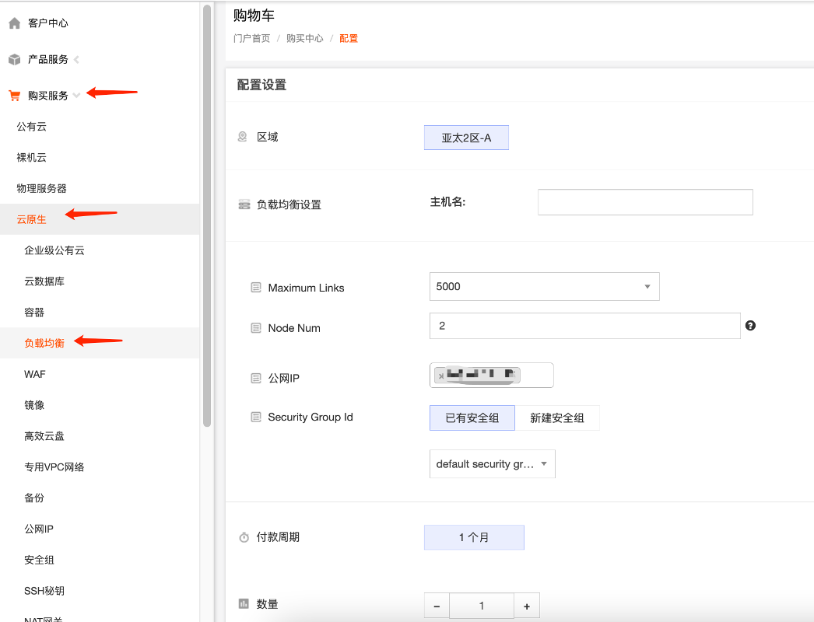
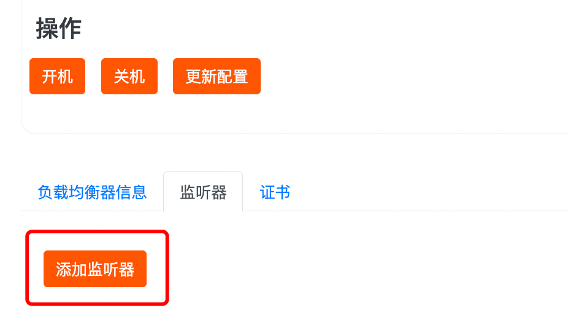
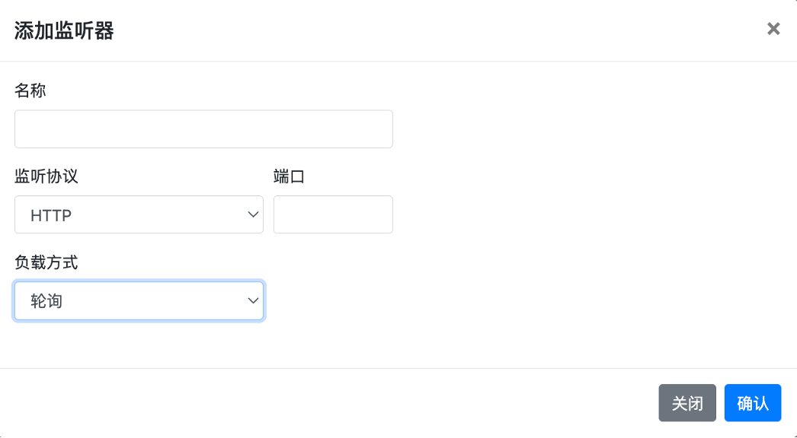
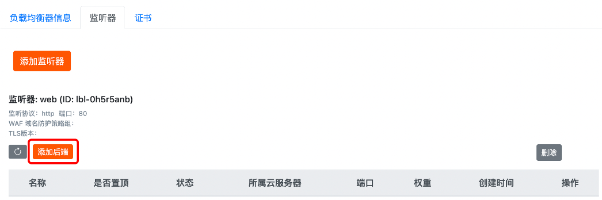
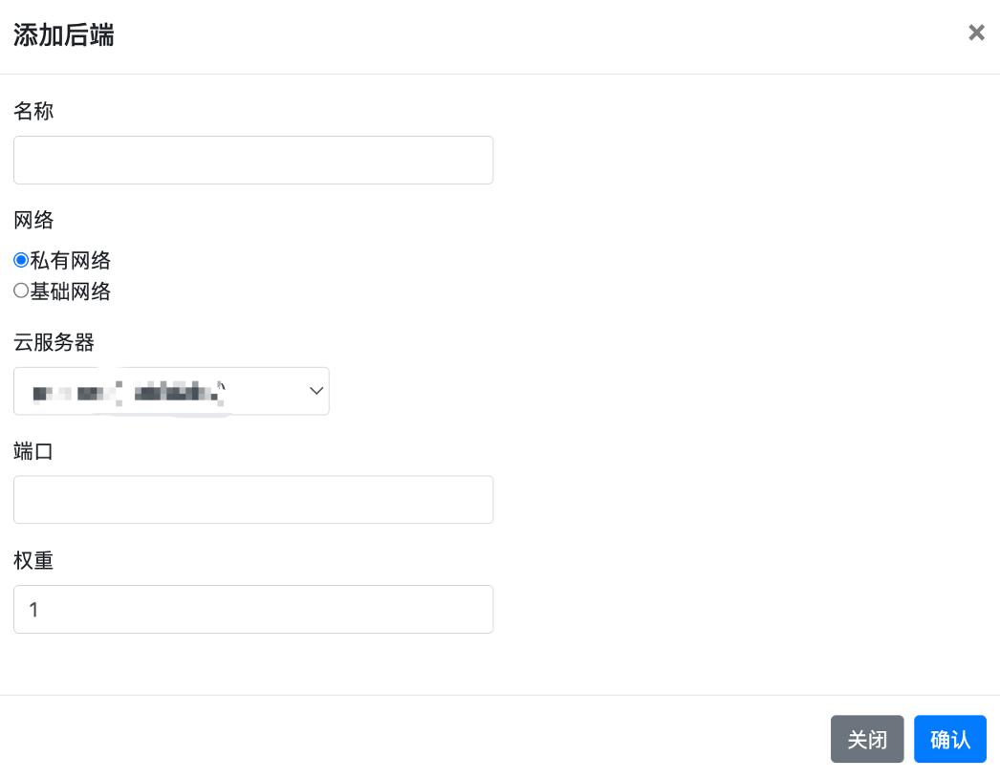

负载均衡器实例是运行负载均衡服务的实体，搭建负载均衡器服务您需要先创建负载均衡器实例。

1.购买负载均衡，购买前需要购买公网IP，如果空闲的公网IP就可以直接购买。

2.监听器

创建负载均衡器后，需要为负载均衡器配置监听器。监听器负责监听负载均衡器上的请求，并根据负载均衡策略分发流量到后端服务器。

监听器可以监听负载均衡实例上的四层和七层请求，您可根据从客户端到负载均衡器的应用场景选择监听协议。

四层和七层负载均衡的区别主要体现在：对用户请求进行负载均衡时，是依据四层协议还是七层协议来进行转发流量。

- 四层协议：传输层协议，主要通过 VIP + Port 接受请求并分配流量到后端服务器。例如：TCP、UDP、SSL 等协议。
- 七层协议：应用层协议，基于 URL、HTTP 头部等应用层信息进行流量分发。例如：HTTP、HTTPS 等协议。

3.添加后端服务器

创建监听器后，您需要添加云服务器作为后端服务器。监听器使用您配置的协议和端口检查来自客户端的连接请求，并根据您定义的分配策略将请求转发到后端服务器，由后端服务器进行处理。

|  |  |
| --- | --- |
| **参数** | **说明** |
| 名称 | 后端服务器名称 |
| 网络 | 选择云服务器所属网络类型。可选**受管私有网络**、**基础网络**以及 **IP**。 UDP 监听器只支持私有网络类型的后端。 |
| 私有网络/基础网络 | 选择择受管私有网络时，需要选择云服务器所属私有网络。 选择基础网络时，需要选择云服务器所属基础网络。 |
| 所属云服务器 | 选择需要添加的云服务器 |
| 端口 | 设置云服务器的服务端口 |
| 权重 | 权重越大转发的请求越多  默认为 1，取值范围为：[0 - 100]。 当权重设置为 0，该服务器不会再接受新请求 |
