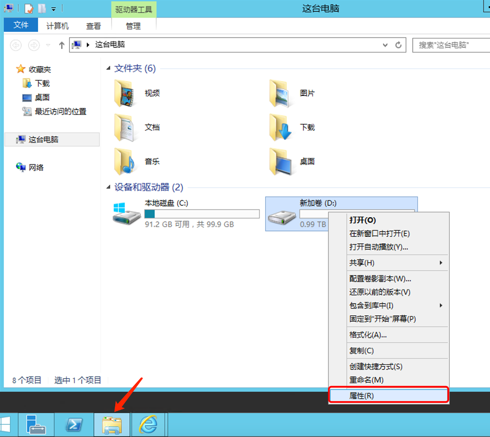
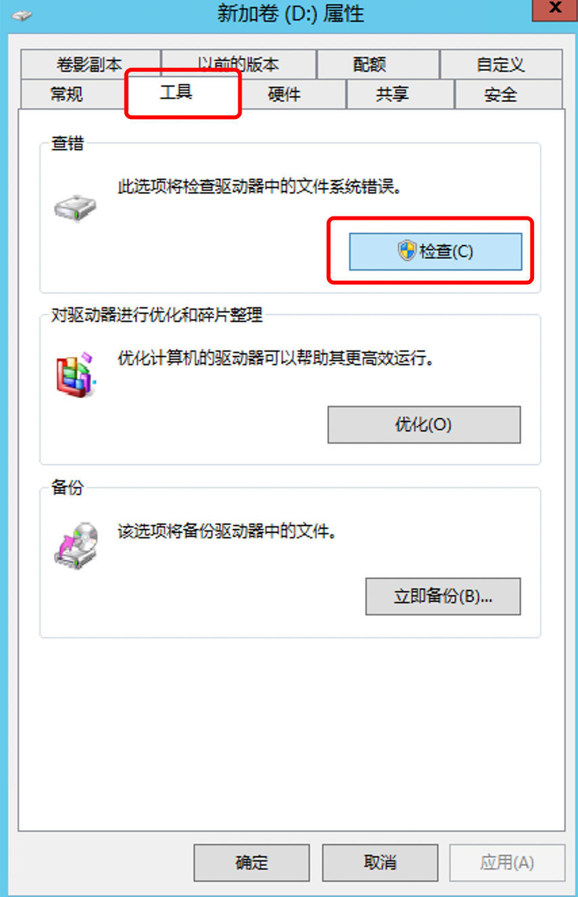

Windows系统

Windows 操作系统自带了磁盘检测和修复工具，叫做 "磁盘检查"（Check Disk）。它可以扫描并尝试修复文件系统中的错误、坏道等问题。

以下是使用磁盘检查工具的步骤：

1.打开 "文件资源管理器" （快捷键：Win + E）

2.选中需要检测的磁盘，右击后选择 "属性"

3.在 "工具" 选项卡下，点击 "检查" 按钮。

4.如果该磁盘正在被使用，你会看到一个提示框，询问你是否想要计划下次启动时进行检查。如果你想立即检查，请单击 "立即检查" 按钮。否则，选择 "计划磁盘检查" 并选择适当的选项。

5.系统会开始扫描和修复该磁盘上的问题。完成后，会显示扫描结果。

除此之外，还有一些第三方的磁盘检测软件，比如 CrystalDiskInfo、HD Tune、Victoria 等等。这些软件功能更加强大，可以提供更多的磁盘状态信息和诊断报告。

Linux系统

Linux可以通过命令工具查看

smartmontools：这是一个命令行工具集，包括 smartctl 和 smartd。smartctl 可以检查硬盘的 SMART 属性并报告任何问题，而 smartd 则可以在后台运行并监控磁盘状态。

CentOS：

yum -y install smartmontools && smartctl --all /dev/nvme0n1  #/dev/\* 具体名称请运行 sudo fdisk -l 查看

Ubuntu：

sudo apt install smartmontools && sudo smartctl --all /dev/nvme0n1   #/dev/\* 具体名称请运行 sudo fdisk -l 查看
