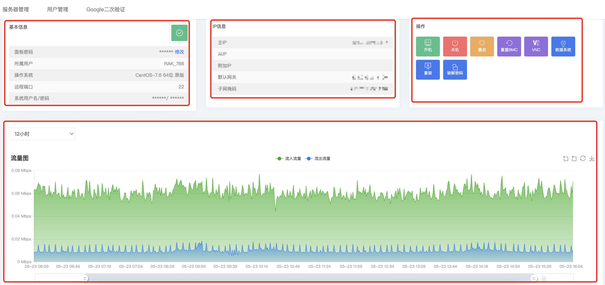
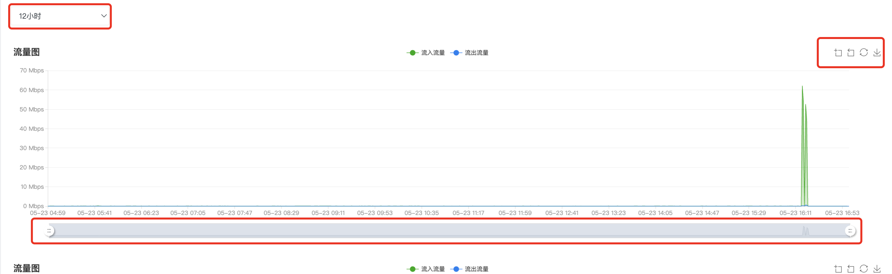
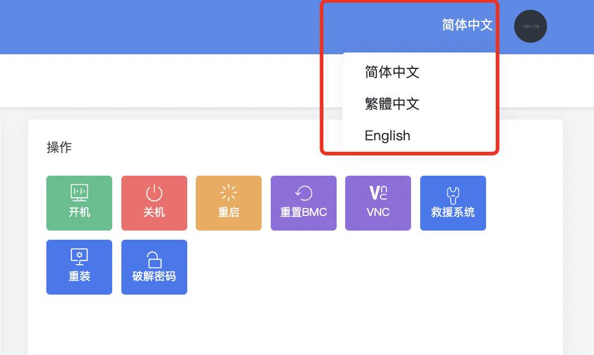
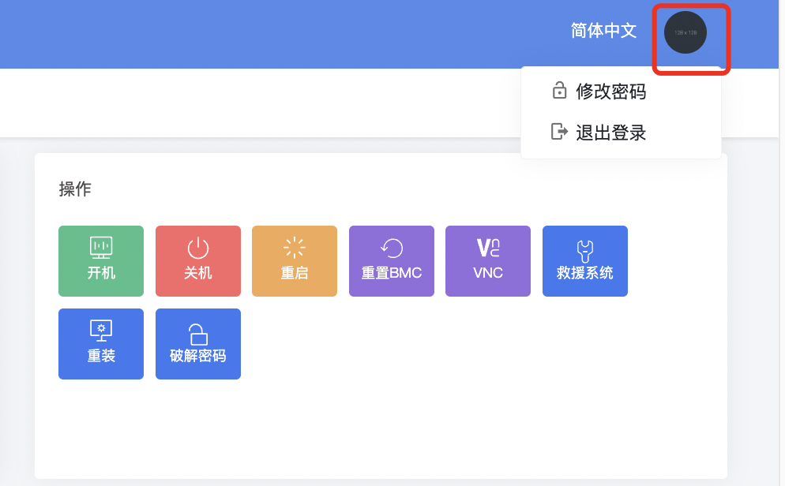

一、面板管理显示信息分为四个板块

1.基本信息，显示机器状态、面板密码、操作系统、远程端口、系统用户及密码（\*\*\*部分点击即可正常显示）

2.IP信息，显示主IP、从IP、附加IP、默认网关、子网掩码

3.操作，可以对物理服务器开机、关机、重启、重置BMC、打开VNC、救援系统、重装、破解密码的操作

4.流量图

- **选择周期进行显示**

- **流量图选择区域缩放、区域缩放还原、还原流量图、下载流量图**

- **通过鼠标进行左右拉动，流量图会跟随周期调整。**

**二、语言切换**

**支持：简体中文、繁体中文、English**

**三、退出登录**

**右上角点击圆圈即可选择退出登录**

**四、Google二次验证，针对客户面板与单台机器登录配置动态密钥，提升机器安全。**

**请参考： [公有云开启google二次验证](https://billing.raksmart.com/whmcs/index.php?rp=/knowledgebase/312/%E5%85%AC%E6%9C%89%E4%BA%91%E5%BC%80%E5%90%AFgoogle%E4%BA%8C%E6%AC%A1%E9%AA%8C%E8%AF%81.html)**
