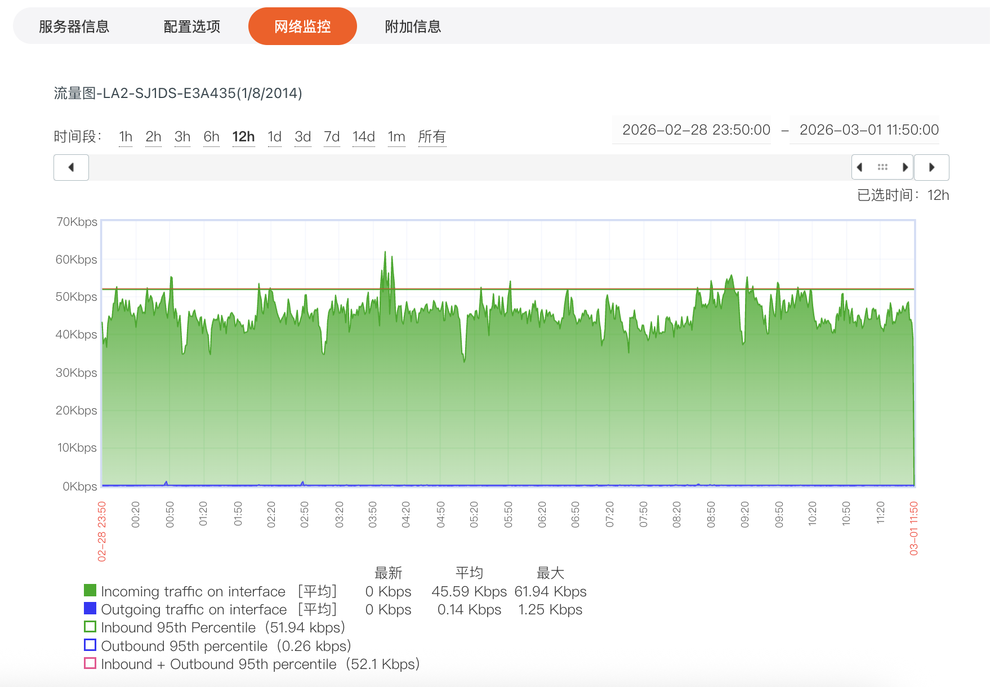

## 一、功能概述

网络监控功能为用户提供了服务器网络流量的可视化监控能力。通过直观的流量图，用户可以清晰了解服务器在不同时间段内的网络流入、流出等流量情况，助力用户及时掌握网络状态，为服务器的网络资源规划、故障排查等提供数据支持。

## 二、功能入口

登录平台，进入客户中心，下方\*\*“我的订单”\*\* 点击 **“物理服务器”**。或者在 **“产品管理”** 点击 **“物理服务器”**，根据机器所在地区和状态筛选。**在页面上方标签栏中点击**“网络监控”\*\*，即可进入网络监控界面。

## 三、界面与功能说明

### （一）流量图区域

1. **时间范围选择**：在流量图上方，提供 “1h”“2h”“3h”“6h”“12h”“1d”“3d”“7d”“14d”“1m”“所有” 等时间范围选项，用户可根据需求选择查看不同时长内的流量情况。同时，也可在右侧自定义时间区间，精准定位特定时间段的流量数据。
2. **流量趋势展示**：流量图以折线等形式展示网络流量趋势，不同颜色线条代表不同流量类型：

   - （Incoming traffic on interface [平均]）：接口平均流入流量。
   - （Outgoing traffic on interface [平均]）：接口平均流出流量。
   - （Inbound 95th Percentile）：流入流量。
   - （Outbound 95th percentile）：流出流量。
   - （Inbound + Outbound 95th percentile）：流入与流出流量之和。

### （二）流量统计信息

在流量图下方，展示了流量的**最新**、**平均**、**最大**等统计数据，对应不同流量类型，帮助用户快速了解流量的关键指标情况。

## 四、使用价值

1. **网络资源规划**：通过长期的流量监控数据，用户可分析服务器网络流量的规律与峰值，合理规划网络资源，避免因资源不足影响业务运行。
2. **故障排查**：当服务器网络出现异常（如流量突增或突降）时，可通过网络监控功能快速定位问题时间段和流量异常类型，为故障排查提供方向。
3. **性能优化**：依据流量监控数据，可对服务器的网络配置、应用部署等进行优化调整，提升网络性能和业务体验。
