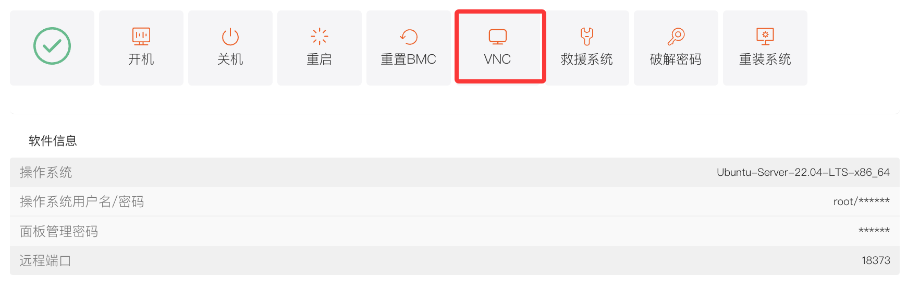

## 一、功能介绍

VNC是一种为用户提供的通过 Web 浏览器远程连接服务器的方式。当您未安装远程登录客户端，或客户端远程登录出现问题时，可通过 VNC 连接到服务器，实时观察服务器状态，并使用服务器账户开展基本的服务器管理操作，如执行命令、查看系统日志等。

## 二、操作入口

1. 登录平台，进入客户**中心**，下方\*\*“我的订单”\*\* 点击 \*\*“物理服务器”\*\*。或者在 \*\*“产品管理”\*\* 点击 \*\*“物理服务器”\*\*，根据机器所在地区和状态筛选。
2. 在产品列表中，找到目标服务器，点击进入 \*\*“产品详情”\*\* 页面。
3. 在 “服务器信息” 标签页下，找到并点击 \*\*“VNC”\*\* 按钮，即可启动 VNC 连接，进入 VNC 操作界面。

## 三、VNC 界面功能

### （一）顶部操作栏

- **强制刷新 vnc**：当 VNC 画面显示异常或卡顿，点击该按钮可强制刷新画面，恢复正常显示。
- **开机 / 关机 / 重启**：可直接在 VNC 界面对服务器执行开机、关机、重启操作，方便快捷地管理服务器电源状态。

### （二）快捷操作功能

- **剪切板**：若您有需要输入到服务器控制台的命令或密码等文本，可先将其复制到本地剪切板，然后在 VNC 界面点击 “剪切板”，在弹出的输入框中粘贴文本，点击 “确定”，即可将文本发送到服务器控制台，无需手动输入，提升操作效率。
- **粘贴密码**：点击该功能，系统会自动将服务器后台的密码粘贴到控制台输入区域，方便您快速进行登录等需要密码的操作。
- **Send CtrlAltDel**：模拟键盘的 “Ctrl + Alt + Del” 组合键操作，在 Windows 系统场景下，可用于触发系统登录界面。

## 四、注意事项

1. 通过 VNC 进行服务器管理时，操作具有与本地操作相同的权限，请注意谨慎操作，避免误操作导致服务器故障或数据丢失。
2. 若 VNC 无法成功连接或黑屏，可尝试在后台“重置BMC”、重启服务器或联系平台技术支持。
