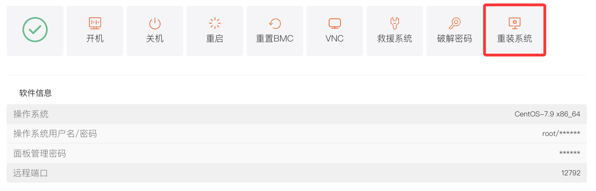
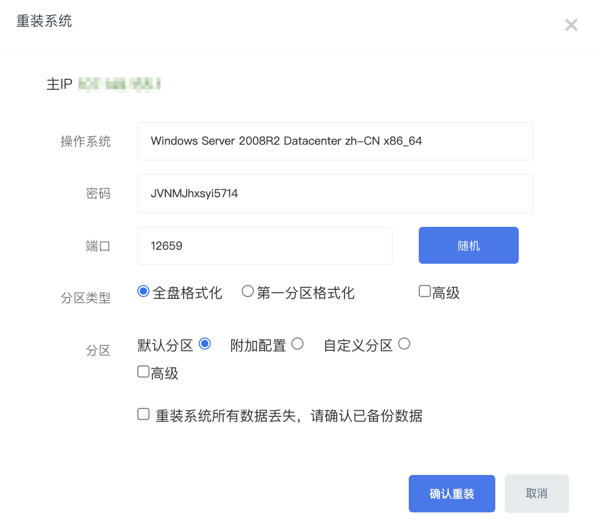

在使用服务器的过程中，您可能会遇到需要更换操作系统、修复系统故障或重新规划磁盘分区等情况。后台面板的重装系统功能，允许您便捷地对服务器操作系统进行重新安装，满足多样化的使用需求。

## 一、操作入口

1. 登录平台，进入客户中心，下方\*\*“我的订单”\*\* 点击 \*\*“物理服务器”\*\*。或者在 \*\*“产品管理”\*\* 点击 \*\*“物理服务器”\*\*，根据机器所在地区和状态筛选。
2. 在 “管理产品” 页面，您可以看到服务器的基本信息。点击上方的 **“服务器信息”** 标签，在操作按钮区域找到 **“重装系统”** 按钮。

## 二、操作步骤

1. **点击 “重装系统” 按钮**：点击后，会弹出 “重装系统” 窗口。
2. **配置重装选项**：

   - **选择操作系统**：在 “操作系统” 下拉菜单中，根据您的业务需求，选择合适的操作系统版本。
   - **设置密码**：在 “密码” 输入框中，设置操作系统的登录密码。您也可以点击密码输入框右侧的 “随机” 按钮，由系统自动生成一个强密码。
   - **设置端口**：在 “端口” 输入框中，设置远程连接服务器的端口号，同样支持点击 “随机” 按钮生成随机端口。

- **选择分区类型（windows）**：

  - **全盘格式化**：选择该选项，将对服务器的整个硬盘进行格式化操作，会清除硬盘上的所有数据，请谨慎选择。一般在您需要彻底清理服务器数据，或者更换不同类型的操作系统时使用。
  - **第一分区格式化**：仅格式化服务器的第一个分区，其他分区的数据将被保留。适用于您仅需重新安装操作系统，而其他分区数据仍需保留的情况。
  - **选择分区方式**：

    - **默认分区**：系统将按照预设的标准方式对硬盘进行分区（默认分区系统为100G）
    - **自定义分区**：如果您对磁盘分区有特殊要求，如自定义每个分区的大小、文件系统类型等，可以选择此选项，手动设置分区参数。

- **数据备份提示**：在操作前，请务必仔细阅读 “重装系统所有数据丢失，请确认已备份数据” 提示。若您已对重要数据进行备份，勾选该提示前的复选框。

- **选择分区类型（linux）**：

  - Linux无法保留数据重装，确认重装即认可全盘格式化，无法恢复，请提前进行数据备份。
- **选择分区方式**：

  - **默认分区**：系统将按照预设的标准方式对硬盘进行分区（默认分区 /为最大空间）
  - **附加配置**：提供一些额外的分区配置选项，以满足特定的使用需求。
  - **自定义分区**：如果您对磁盘分区有特殊要求，如自定义每个分区的大小、文件系统类型等，可以选择此选项，手动设置分区参数。
- **数据备份提示**：在操作前，请务必仔细阅读 “重装系统所有数据丢失，请确认已备份数据” 提示。若您已对重要数据进行备份，勾选该提示前的复选框。

3. **确认重装**：在完成上述所有配置后，点击 **“确认重装”** 按钮，系统将开始执行重装系统操作。在此期间，服务器将无法正常使用，您可以在 “产品详情” 页面查看服务器安装状态，等待重装完成。
4. **登录信息**：重装完成后，在“**软件信息**”里，可查看重装后的登录信息，点击“**\***”可以查看登录密码

## 三、注意事项

1. **数据备份**：在进行重装系统操作前，务必对服务器上的重要数据进行备份，以免造成数据丢失。
2. **等待过程**：重装系统所需时间会根据服务器性能、网络状况以及操作系统安装复杂度而有所不同，请耐心等待。
