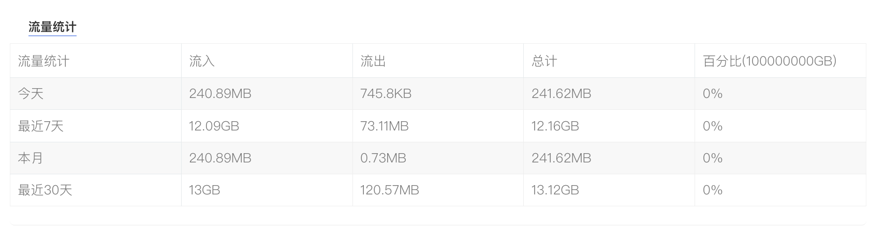

## 一、流量统计功能

在客户后台，您可查看服务器近期（近一个月等时间段）的流量统计情况。统计内容清晰展示了流入、流出及总计流量数据，涵盖 “今天”“最近 7 天”“本月”“最近 30 天” 等不同时间维度，帮助您直观了解服务器流量使用状况。

1）操作入口：登录平台，进入客户中心，下方\*\*“我的订单”\*\* 点击 \*\*“物理服务器”\*\*。或者在 \*\*“产品管理”\*\* 点击 \*\*“物理服务器”\*\*，在产品详情页面中，\*\*“服务器信息”\*\* 下方的\*\*“流量统计”\*\*。

## 二、流量超量提醒与处理

当服务器流量即将用尽时，我们会通过工单向您发送提醒，告知当前机器的流量信息，包括主机名、专属 IP、账单周期、下次缴费时间、带宽选项以及已使用流量占比等。若您在收到提醒后未及时升级流量，待流量使用完毕，服务器将在美国时间零点进行关机处理。为避免因流量超量导致机器关机，影响业务正常运行，建议您根据实际需求，及时安排升级流量至下一档。
