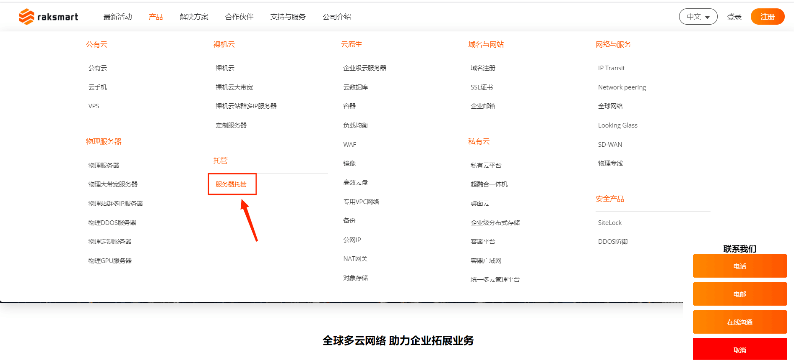
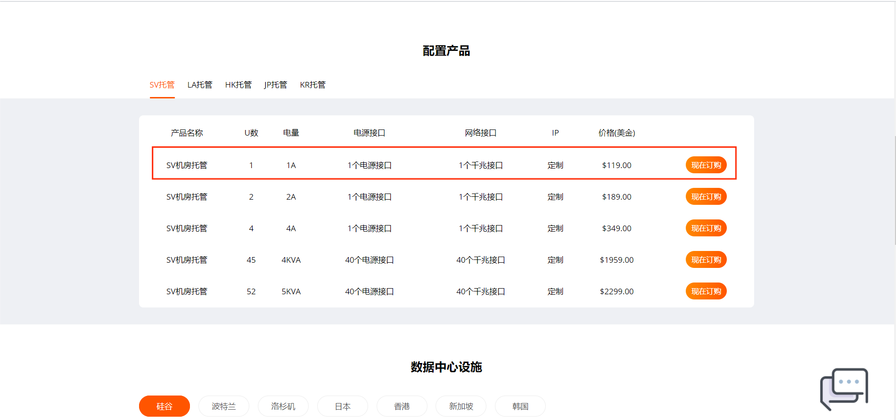
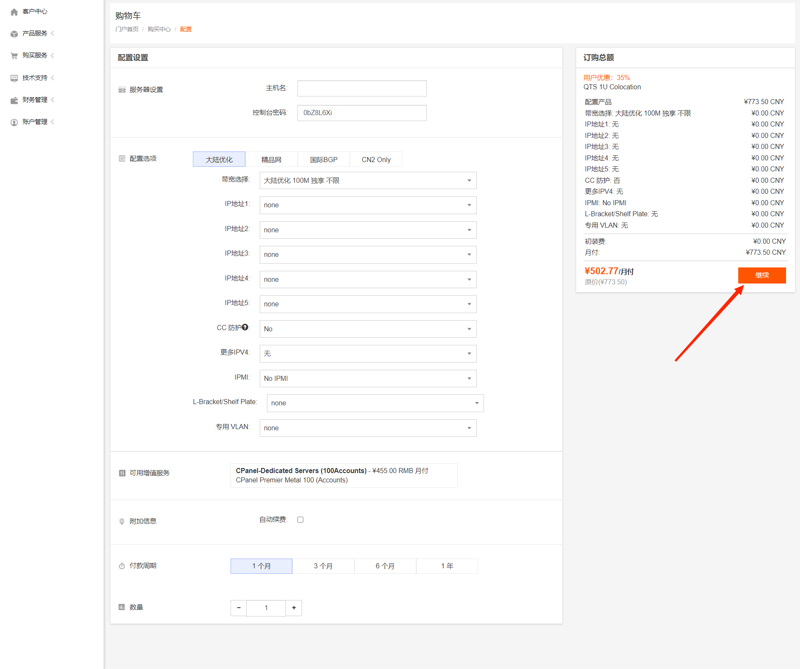

RAKsmart是专业的美国服务器运营商，机房位于离中国大陆位置最近的美国硅谷，RAKsmart多年的运营经验，在机房管理，服务器管理，用户服务管理等方面都有较完善的管理系统。RAKsmart主要提供服务器租用，服务器托管，宽带租用等业务，前面小编介绍了一些在RAKsmart官网下单，发工单，管理用户后台的文章，这节来介绍一下如何在RAKsmart官网进行服务器托管，有哪些项目需要选择。

1.首先登录RAKsmart官网（http://www.raksmart.com/），我们可以看到有裸机云，云集成服务，域名，托管，我们这边以托管里边的服务器托管为例。

2.进入服务器托管页面，我们可以看到需要托管的配置，此处我们以SV 1U托管为例

3.进入配置选项页面，选取相应的配置，选取完成后点击继续

4.都选好点击继续之后，产品已经在你的购物车了，可以选择继续购物，查看购物车，结账等。
