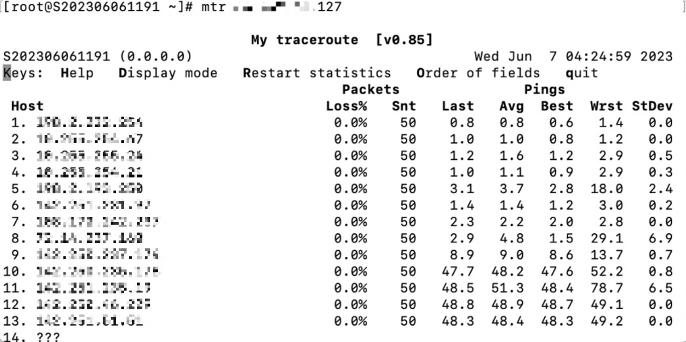
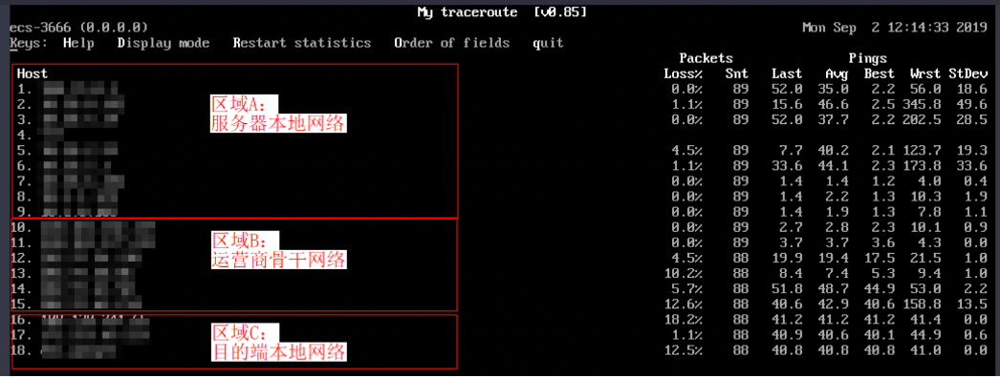
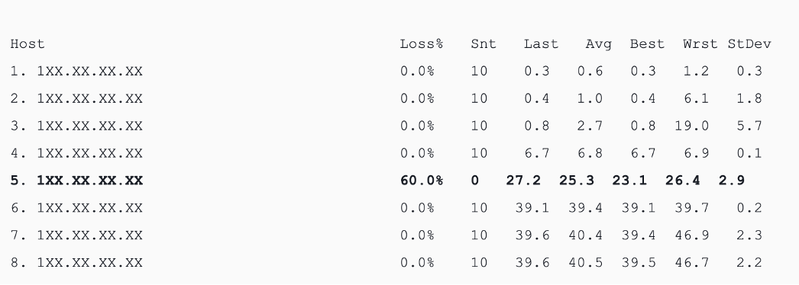
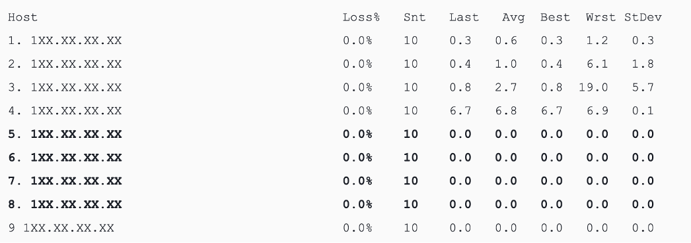

丢包或时延较高可能是链路拥塞、链路节点故障、服务器负载高、系统设置问题等原因引起。

在排除服务器自身原因后，您可以使用MTR工具进行进一步诊断。

MTR是路由跟踪测试工具，通过双向MTR可以查看本地到服务器和服务器到您本地经过的所有路由节点的延迟和丟包情況，以便定位相关问题

一.Windows系统

安装

通过浏览器访问外网，搜索并下载WinMTR安装包。

也可以使用该链接：\*\*http://tools.saiwa.cc/WinMTR\_x64.exe\*\* ，下载后即可使用，无需安装。

1.在WinMTR窗口的Host处，输入目的服务器IP地址或者域名，单击“Start”

2.根据实际情况，等待WinMTR运行一段时间，单击“Stop”，结束测试

3.测试结果的主要信息如下：

- Hostname：到目的服务器要经过的每个主机IP或域名
- Nr：经过节点的数量
- Loss%：对应节点的丢包率
- Sent：已发送的数据包数量
- Recv：已接收到响应的数量
- Best：最短的响应时间
- Avrg：平均响应时间
- Worst：最长的响应时间
- Last：最近一次的响应时间

二.Linux系统

安装

CentOS执行 yum install mtr -y

ubuntu或debian执行 apt-get install mtr -y

MTR相关参数说明

- -h/--help：显示帮助菜单
- -v/--version：显示MTR版本信息
- -r/--report：结果以报告形式输出
- -p/--split：与 --report相对，分别列出每次追踪的结果
- -c/--report-cycles：指定每次探测发送的数据包数量，默认值是10
- -s/--psize：设置数据包的大小
- -n/--no-dns：不对IP地址做域名解析
- -a/--address：用户设置发送数据包的IP地址，主要用户单一主机多个IP地址的场景
- -4：IPv4
- -6：IPv6

执行命令：mtr 119.xx.xx.xx

主要输出的信息如下：

- HOST：节点的IP地址或域名
- Loss%：丢包率
- Snt：每秒发送的数量包的数量
- Last：最近一次的响应时间
- Avg：平均响应时间
- Best：最短的响应时间
- Wrst：最长的响应时间
- StDev：标准偏差，偏差值越高，说明各个数据包在该节点的响应时间相差越大

三.WinMTR和MTR的报告分析处理

1.服务器本地网络：即图中A区域，代表本地局域网和本地网络提供商网络。

如果客户端本地网络中的节点出现异常，则需要对本地网络进行相应的排查分析。

如果本地网络提供商网络出现异常，则需要向当地运营商反馈问题。

2.运营商骨干网络：即图中B区域，如果该区域出现异常，可以根据异常节点的IP查询其所属的运营商，向对应运营商进行反馈。

3.目标端本地网络：即图中C区域，即目标服务器所属提供商的网络。

如果丢包发生在目的服务器，则可能是目的服务器的网络配置原因，请检查目的服务器的防火墙配置。

如果丢包发生在接近目的服务器的几跳，则可能是目标服务器所属提供商的网络问题。

四.常见的链路异常案例

1.目标主机配置不当

如下示例所示，数据包在目标地址出现了100%的丢包。从数据上看是数据包没有到达，其实很有可能是目标服务器网络配置原因，需检查目的服务器的防火墙配置。

2.ICMP限速

如下示例所示，在第5跳出现丢包，但后续节点均未见异常。所以推断是该节点ICMP限速所致。该场景对最终客户端到目标服务器的数据传输不会有影响，分析时可以忽略此种场景。

3.环路

如下示例所示，数据包在第5跳之后出现了循环跳转，导致最终无法到达目标服务器。出现此场景是由于运营商相关节点路由配置异常所致，需联系相应节点归属运营商处理。

4.链路中断

如下示例所示，数据包在第4跳之后就无法收到任何反馈。这通常是由于相应节点中断所致。建议结合反向链路测试做进一步确认。该场景需要联系相应节点归属运营商处理。

