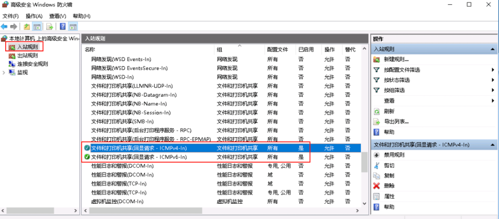
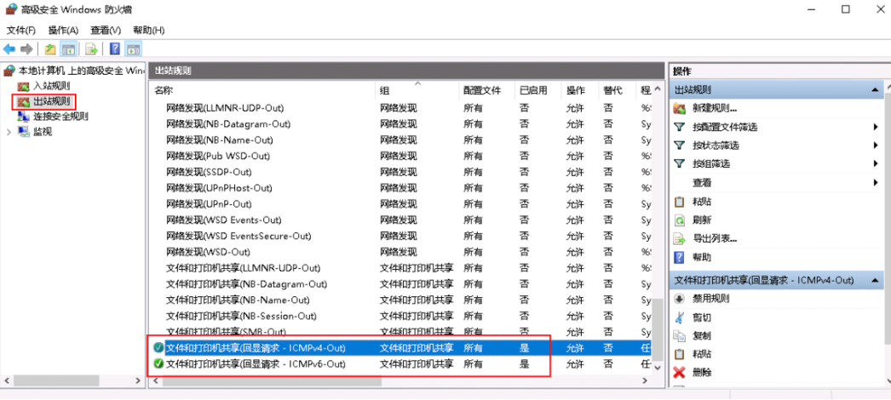
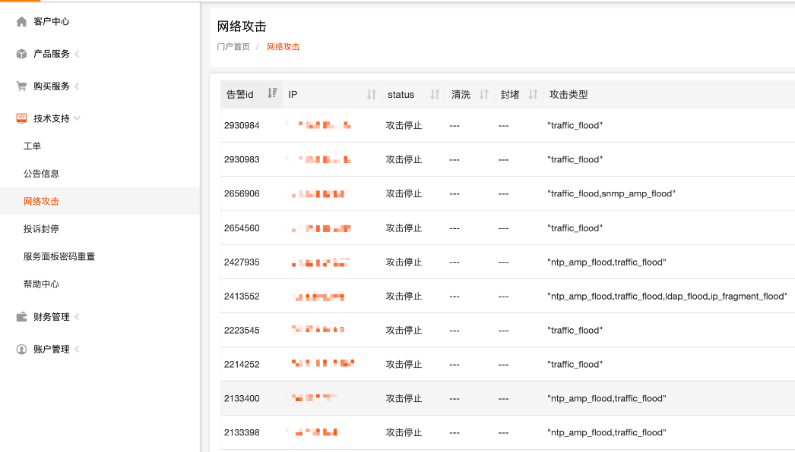
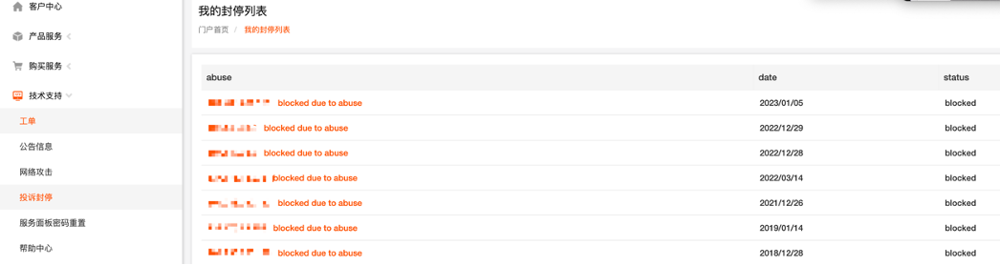

当机器无法正常通信时，可以通过VNC窗口登录到系统进行检查，有以下几种检查方法：

一．系统网卡的状态

检查系统网卡状态:

查询网卡状态可以使用以下命令:

- cat /sys/class/net/ethx/operstate ':显示网口的运行状态。如果输出为“up”，则表示网卡已启用并正常工作。如果输出为“down”，则表示网卡被禁用或不能正常工作。
- ethtool ethx | grep Link ':该命令提供网卡链路状态信息。如果输出显示“Link detected: yes”，则表示网卡已连接并正常工作。如果显示“Link detected: no”，表示网卡未连接或工作不正常。
- ‘systemctl restart network’:重启网络服务，包括所有网络接口。它可以用来刷新网络设置和解决任何与网络相关的问题。
- 注:将“ethx”替换为实际网口名称，如eth0、eth1等。

二．进入到网卡配置文件中检查下IP的配置

检查网口配置文件中的IP配置，操作步骤如下:

1.使用文本编辑器打开网络接口配置文件。文件的位置可能因Linux发行版而异，但常见的位置包括' /etc/network/interfaces'或' /etc/sysconfig/network-scripts/ifcfg-ethx '。

2.查找与您正在检查的网络接口相关的配置行(例如，' eth0 ')。这些行应该包括IP地址、子网掩码、网关和DNS服务器等信息。

3.检查IP配置是否正确，包括IP地址、子网掩码、网关和DNS服务器地址。确保配置中没有语法错误或拼写错误。

4.如果对配置进行了任何更改，请保存文件并退出文本编辑器。

5.重新启动网络服务以应用更改。您可以使用命令' systemctl restart network '或' servicenetworking restart '，这取决于您的Linux发行版。

6.重新启动网络服务后，使用 ' ip addr '或' ifconfig '命令检查ip配置是否已正确应用于网络接口。

如果配置错误或配置不成功，可能需要更正配置文件并重新启动网络服务

三．云机/裸机云检查下设置的安全组是否添加ICMP规则

四．检查系统内的防火墙设置

Linux系统

1.执行以下命令查看防火墙状态，以CentOS 7操作系统为例

#firewall-cmd --state  回显信息显示“running”代表防火墙已开启

2.查看服务器内部是否有安全规则所限制

#iptables -L  回显信息如下图所示说明没有ICMP规则被限制

3.如果ICMP规则被限制，请执行以下命令启用对应规则

#iptables -A INPUT -p icmp --icmp-type echo-request -j ACCEPT

#iptables -A OUTPUT -p icmp --icmp-type echo-reply -j ACCEPT

Windows操作系统

1. 登录Windows服务器，单击桌面左下角的Windows图标，选择“控制面板 > Windows防火墙”

2. 单击“启用或关闭Windows防火墙”

    查看并设置防火墙的具体状态：开启或关闭

3. 如果防火墙状态为“开启”，请执行4

4. 检查防火墙对ICMP规则的启用状态

- 在“Windows防火墙”页面，在左侧导航栏选择“高级设置 ”
- 启用以下规则

入站规则：“文件和打印机共享（回显请求-ICMPv4-In）”

出站规则：“文件和打印机共享（回显请求-ICMPv4-Out）”

- 如启用了IPV6请同时启用以下规则：

入站规则：“文件和打印机共享（回显请求-ICMPv6-In）”

出站规则：“文件和打印机共享（回显请求-ICMPv6-Out）”

入站规则

出站规则

五．查看是否是因为禁ping导致的无法ping通

Windows系统

使用命令行方式开启Ping设置

1. 打开cmd运行窗口

2. 执行如下命令开启Ping设置

netsh firewall set icmpsetting 8

Linux系统

检查服务器的内核参数

1. 检查文件/etc/sysctl.conf中配置项“net.ipv4.icmp\_echo\_ignore\_all”的值，0表示允许Ping，1表示禁止Ping。

2. 允许PING设置。

- 临时允许PING操作的命令：#echo 0 >/proc/sys/net/ipv4/icmp\_echo\_ignore\_all
- 永久允许PING配置方法：#net.ipv4.icmp\_echo\_ignore\_all=0

六．查看 IP是否有网络攻击或投诉封停

七．检查网络是否正常

1. 检查本地网络，使用相同区域主机进行Ping测试

使用在相同区域的云服务器去Ping没有Ping通的弹性公网IP，如果可以正常Ping通说明虚拟网络正常，请排除本地网络故障后重新Ping测试。

2. 检查是否链路故障

链路拥塞、链路节点故障、服务器负载高等问题均可能引起执行Ping命令时出现丢包或时延过高的问题。

具体检查操作请参考：[MTR工具安装及使用](https://billing.raksmart.com/whmcs/index.php?rp=/knowledgebase/576/MTR%E5%B7%A5%E5%85%B7%E5%AE%89%E8%A3%85%E5%8F%8A%E4%BD%BF%E7%94%A8.html)
