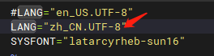
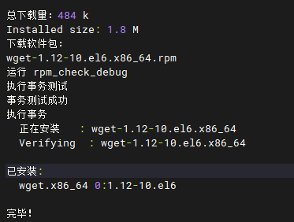
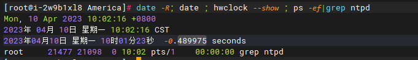
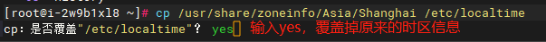
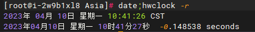
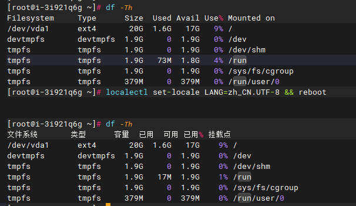

**CentOS6**

默认系统语言英语改为简体中文：

1.查询当日所有语言包执行： locale -a

2 .修改其配置文件：vi /etc/sysconfig/i18n ，将第一行默认项注释掉，修改完成后:wq保存并退出，重新启动即可有效。

3.我们可以使用yum下载wget来测试一下，发现系统语言已经成功切换为简体中文。

修改时间：

1.显示时间段以及硬件时间： date -R; Date ; Time--显示

+0800是中国大陆的北京时间。如果写明了+0800 (东八区) ,那就是指中国标准时间(中国标准时间) 。

北京和上海处在同一时间段，只能保留一个。而作为时间段代表上海已经具备足够的装备代表能力，因此其维护者没有足够的动力做改变。

2.设置为上海时区：cp /usr/share/zoneinfo/Asia/Shanghai / etc /localtime

时间的信息存在于/usr/share/zoneinfo/下面，本机的时间信息存在于/etc/localtime

3.显示系统时间以及硬件时间： date;hwclock -r

**CentOS7.x**

默认系统语言英语改为简体中文：

1 .查看当前语言配置：locale

显示支持英文显示。

2 .在CentOS7中，设置系统语言有两种方式：

执行：yum groupinstall "fonts" -y 查看是否有zh\_CN.utf8语言包，如果没有就需要下载安装字体（如果有就跳过这一步）

临时设置：

执行： LANG=“zh\_CN.UTF-8”，此时我们再执行df -Th就可以明显看出系统语言已经更改为简体中文了

缺点：重启服务器之后会还原到默认的系统语言

永久设置：

执行： localectl set-locale LANG=zh\_CN.UTF-8，重启服务器后生效：reboot。当服务器关机或是重启后再下一次开机时，系统语言环境简体中文依旧生效。

修改时区：

查看当前时区信息：timedatectl | grep“时区”

使用timedatectl命令，设置为中国大陆(东八区)时间：

timedatectl list-timezones |grep Shanghai  #显示系统当前已经知道时区

timedatectl set-timezone Asia/Shanghai #设置时区

timedatectl status #查看系统时间

执行：hwclock -w (与hwclock --systohc作用相同，执行时需要root权限) ，同步BIOS硬件时间。

