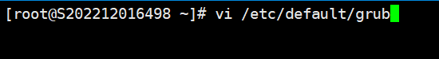
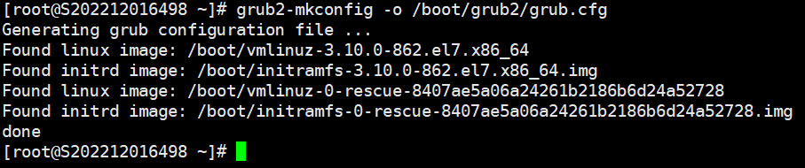
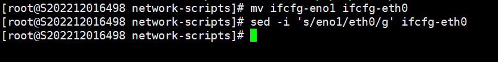

一.修改grub

1.编辑      vi /etc/default/grub

2.并加入 "net.ifnames=0 biosdevname=0 "

3.修改完成后：wq！保存退出，或者按ZZ退出

4.运行命令grub2-mkconfig -o /boot/grub2/grub.cfg 来重新生成GRUB配置并更新内核参数

二.修改当前网卡配置文件名称

1.需要先ip a查看下目前已经有的网卡名称，切记不要修改重复名称

2.cd /etc/sysconfig/network-scripts/  #进入网卡配置文件目录

mv ifcfg-eno1 ifcfg-eth0                  #重命名eth格式

sed -i 's/eno1/eth0/g' ifcfg-eth0      #修改里面的eno1为eth0，根据具体名称去修改命令

三.重启启动系统，使上面的修改生效
reboot     #重启
