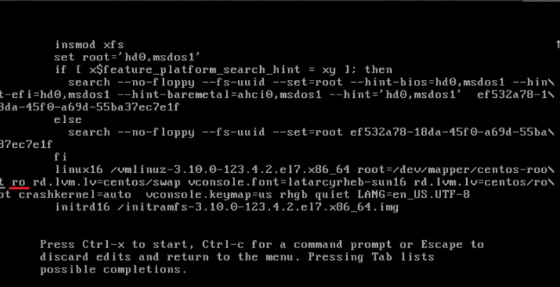
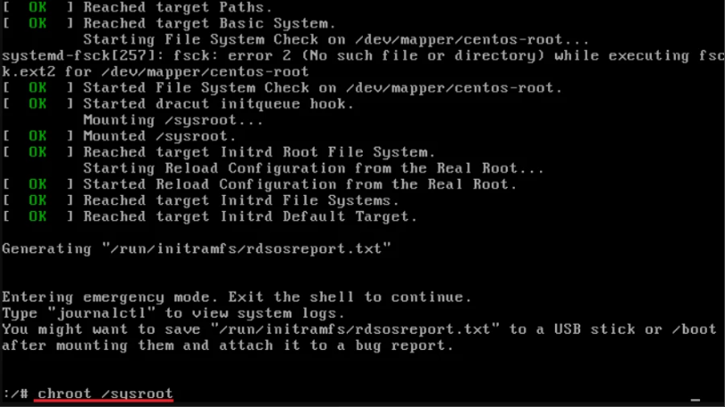

系统重置密码一般可以在后台点击进入自动重新设置，如果遇到特殊情况无法使用的话可以参考手动来重新设置密码

1.首先将机器重启动，到引导菜单中，按” e ”即可编辑现在有内核

2.下面进行向下滚动到列表，知道看下面（ro）下划线的行

需要将这个ro改为rw并开始执行一个bash shell

3.将ro更改为rw并在后面添加init=/sysroot/bin/sh

- rw init=/sysroot/bin/sh

4.更改之后，按下盘的Ctrl + X使用上面指定的bash shell启动到单用户模式，在这种模式下，我们将更改root密码，在单用户模式式下，运行如命令

- chroot /sysroot

5.最后，运行如下命令来更改root密码。

- passwd root

6.系统会提示您重新构建并确认新密码。创建新密码后，运行如下命令更新SELinux参数。

- Touch /.autorelabel

7.退出并重新启动系统即可使用新密码进入系统。

