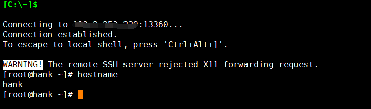

方法一：

1.打开终端或通过ssh登录到Linux系统中

2.使用root权限登录系统

3.使用以下命令检查当前主机名：

- hostname

4.使用以下命令修改主机名：

- hostnamectl set-hostname <new\_hostname>

其中，<new\_hostname>是您想要设置的新主机名

5.重新启动Linux系统或者使用以下命令重启网络服务：

- systemctl restart systemd-hostnamed

6.使用以下命令验证主机名是否已经修改成功：

- hostname

如果输出与新主机名相同，则表示修改主机名成功

将系统重启后，查看修改已生效

**方法二：**

1.打开/etc/hostname文件，使用以下命令：

- vi /etc/hostname

2.在打开的文件中修改主机名为您想要设置的您主机名

输入a即可进行编辑，将之前的主机名删除后设置您的新主机名，修改完成后，按Esc退出编辑模式，按Shift+：输入wq保存退出即可

3.重新启动Linux系统后查看主机名已生效

