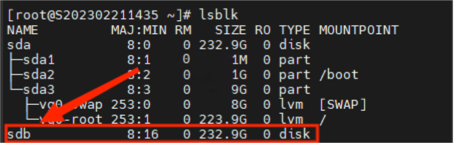
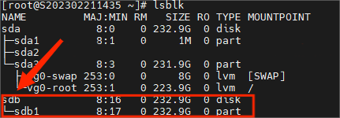
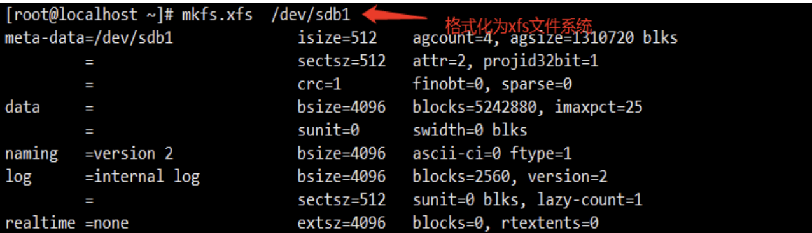
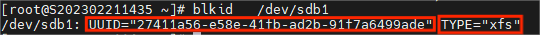
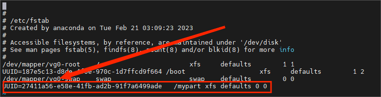
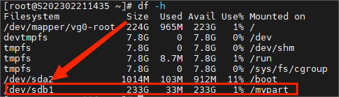
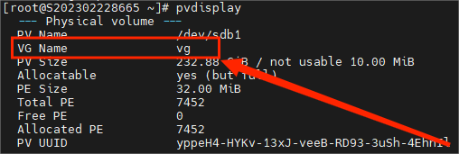
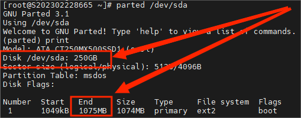

针对使用机器后期添加硬盘需手动挂载与扩容操作

数据无价,操作格式化之前确定数据已备份

**一、新分区挂载**

- #lsblk #查看当前系统识别的硬盘，记住新硬盘名称

- #fdisk    /dev/sdb   #开始分区

n 创建新的分区-----分区类型 回车-----分区编号 回车----起始扇区 回车-----在last结束时 +分区容量

p 查看分区表

w 保存并退出

- # lsblk  或 用 fdisk -l   #查看分区结果

- parted /dev/设备文件

- mklabel #创建一个分区表

- gpt     #我们要正确分区大于2TB的硬盘，应该使用gpt方式的分区表

- yes     #警告磁盘上的数据将会被销毁，询问是否继续，输入yes后回车

- mkpart  #进行分区操作, 分别输入分区名称、文件系统和分区的起止位置

- print   #打印输出分区信息

- # mkfs.xfs   -f   /dev/sdb1    #格式化文件系统xfs

- # blkid   /dev/sdb1      #查看文件系统类型和UUID

- # mkdir  /mypart  #创建挂载点

- # vim    /etc/fstab   #设置开机自动挂载

UUID=[文件系统UUID]   /mypart    xfs    defaults   0   0

- # mount   -a       # 刷新，重新加载/etc/fstab文件

检测/etc/fstab开机自动挂载配置文件,格式是否正确

检测/etc/fstab中,书写完成,但当前没有挂载的设备,进行挂载

- # df  -h

执行reboot后，查看挂载点没有问题 就说明开机自动挂载生效了

**二****、****现有分区扩容**

这里我们以为/www扩容为例：

首先核实您的硬盘是否为LVM卷组，如果您的机器并不是LVM卷组，那您的硬盘就不支持扩容

- # lsblk  #查看当前系统识别的硬盘，并记住当前容量

- # pvdisplay   #查看卷组名称

- #parted /dev/sda    print   #显示当前磁盘分区，查看格式是否是GPT格式，并记住当前参数

如遇下截图中的报错：根据系统提示输入“Fix”，系统会自动将磁盘扩容部分的容量设置为GPT。

mkpart primary 1075MB 250GB  #第一个1075MB代表第二步里的End容量，第二个250GB代表Disk /dev/sdb容量

完成后quit退出

- # df -h        #查看分区结果，这里我们可以看到已经分区成功。

将分区加入卷组

- # pvcreate   /dev/sda2  #将分区加入物理卷

- # vgextend   vg   /dev/sda2  #扩展vg卷组

- # lvextend  -l  +100%free  /dev/vg/www  #扩展逻辑卷

格式化文件系统

- # blkid  #查看需扩容的分区文件系统

xfs\_growf命令是扩展xfs文件系统，resize2fs是扩展ext4文件系统

- #resize2fs   /dev/vg/www  #格式化为ext4

- # df -h  #这里我们可以看到已经扩容成功了

## reboot  最后重启进入系统再确认
