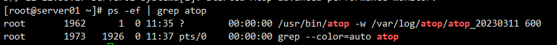
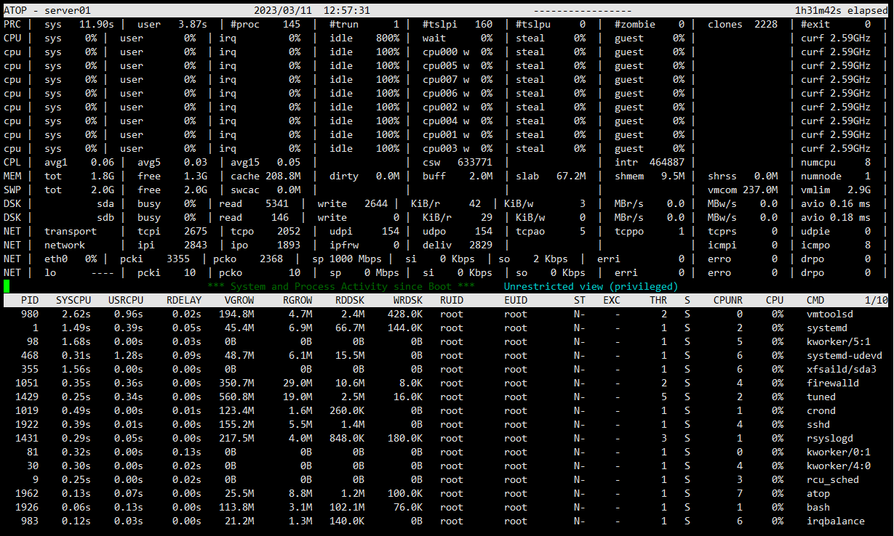

Atop是一款用于监控Linux系统资源与进程的工具，它以一定的频率记录系统的运行状态，所采集的数据包含系统CPU、内存、磁盘、网络的资源使用情况和进程运行情况，并能以日志文件的方式保存在磁盘中，服务器出现问题后，可获取相应的atop日志文件进行分析。

- CentOS系统执行如下命令安装:

- yum -y install epel-release

- yum install atop –y

- Ubuntu系统执行如下命令安装:

- apt-get install atop –y

启动atop，执行如下命令:

- service atop start 或 systemctl start atop

启动atop服务之后，执行如下命令，可以看到atop在后台运行，并且将数据写入指定目录。

- ps -ef | grep atop

配置atop

/etc/sysconfig/atop：atop配置文件，主要用于调整atop监控周期，默认600s采集一次数据，如下图所示

/var/log/atop：用于存放atop监控日志文件的目录，atop在启动之后，会将采集记录存放在/var/log/atop目录，执行如下命令，查看日志文件。

- atop -r /var/log/atop/atop\_20230311

分析atop日志文件

atop常用指令如下所示：

- c：按照进程CPU使用率进行降序筛选。
- m：按照进程内存使用率进行降序筛选。
- d：按照进程磁盘使用率进行降序筛选。
- a：按照进程资源综合使用率进行降序筛选。

- n：按照进程网络使用率进行降序筛选，需要额外安装内核模块才支持，默认不支持。
- t：跳转到下一个监控采集点。
- T：跳转到上一个监控采集点。
- B：指定时间点，格式为YYYYMMDDhhmm。

系统资源监控字段含义

上图中列出了部分字段以及数值，每个字段的含义都是相对采样周期而言，各字段的含义如下所示：

- ATOP列：显示了主机名、信息采样日期和时间点。
- PRC列：显示进程整体运行情况。
- sys、user字段：分别代表进程在内核态和用户态的运行时间。
- #proc字段：代表进程总数。

- #zombie字段：代表僵死进程的数量。
- #exit字段：代表atop采样周期期间退出的进程数量。
- CPU列：显示CPU整体的使用情况，即多核CPU作为一个整体CPU资源的使用情况，我们知道CPU可被用于执行进程、处理中断，也可处于空闲状态，空闲状态分两种，一种是活动进程等待磁盘IO导致CPU空闲，另一种是完全空闲。
- sys、user字段：CPU在用于处理进程时，进程在内核态、用户态所占CPU的时间比例。
- irq字段：CPU用于处理中断的时间比例。

- idle字段：CPU处在完全空闲状态的时间比例。
- wait字段：CPU处在“进程等待磁盘IO导致CPU空闲”状态的时间比例。
- cpu列：显示某一核CPU的使用情况，各字段含义可参照CPU列，各字段值相加结果为100%。
- CPL列：显示CPU负载情况。
- avg1、avg5和avg15字段：分别代表过去1分钟、5分钟和15分钟内运行队列中的平均进程数量。

- csw字段：上下文切换次数。
- intr字段：中断发生次数。
- MEM列：代表内存的使用情况。
- tot字段：物理内存总量。
- free字段：空闲内存的大小。

- cache字段：用于页缓存的内存大小。
- buff字段：用于文件缓存的内存大小。
- slab字段：系统内核占用的内存大小。
- SWP列：显示交换空间的使用情况。
- tot字段：交换区总量。

- free字段：空闲交换空间大小。
- PAG列：显示虚拟内存分页情况。
- swin、swout字段：分别代表换入和换出内存页数。
- DSK列：显示磁盘使用情况，每一个磁盘设备对应一列，如果有vdb设备，那么增多一列DSK信息。
- vda字段：磁盘设备标识。

- busy字段：磁盘忙时比例。
- read、write字段：分别代表读、写请求数量。
- NET列：多列NET展示了网络状况，包括传输层TCP和UDP、IP层以及各活动的网口信息。
- XXXi字段：各层或活动网口收包数目。
- XXXo字段：各层或活动网口发包数目。
