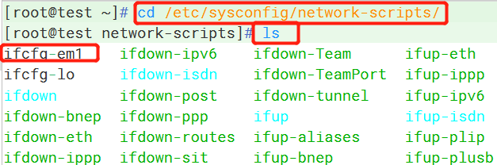
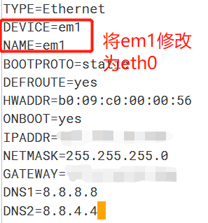
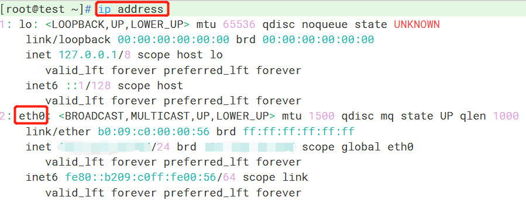
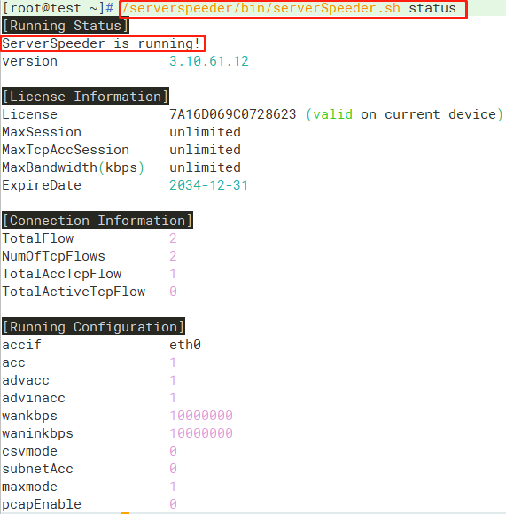

注意事项：锐速安装的前提是确保网卡为 eth 系列

步骤一：安装推荐版本内核，安装完成重启机器

步骤二：重启后核实内核安装正确，直接下载91YUN锐速安装脚本，会自动执行

一.修改网卡名称

1.使用ip address命令查看网卡名

2. 进到到网卡配置文件目录，使用ls命令查看网卡配置文件名称

- cd /etc/sysconfig/network-scripts/

3. 使用mv命令更改网卡配置文件名，ls查看是否修改成功

- mv ifcfg-\*\*\*（\*为原网卡名）   ifcfg-eth\*（如果是多网卡，eth后的数字可以向后顺延）

4. 更改文件内网卡名(仅需修改网卡名，如有引号也需要删除)

- vi ifcfg-eth\*

按i键进入文本输入模式，对网卡名进行修改

DEVICE=eth\*

NAME=eth\*

5.按ESC键退出文本输入模式，按Shift+:(冒号键)进入末行模式，输入wq回车保存修改内容。

6.使用cat命令查看是否修改成功。

- cat ifcfg-eth0

7.如果有Range文件形式的网卡配置文件，按以下命令进行修改，eth\*名称需要和主网卡名一致。

- mv ifcfg-\*\*\*-range0  ifcfg-eth\*-range0

8. 重启  reboot

9. 检查网卡名是否修改成功

- ip address

二.安装锐速

1.修改指定优化内核：

CentOS7.x内核更换为： 3.10.0-229.1.2.el7.x86\_64

- rpm -ivh <http://soft.91yun.org/ISO/Linux/CentOS/kernel/kernel-3.10.0-229.1.2.el7.x86_64.rpm> --force

2.查看内核是否安装成功

- rpm -qa | grep kernel

3.重启 reboot

4.查看内核是否更换成功

- uname -r

5.下载安装脚本并自动执行：

锐速安装方法 ：

- wget -N --no-check-certificate https://github.com/91yun/serverspeeder/raw/master/serverspeeder.sh && yum install net-tools && bash serverspeeder.sh

这里输入y回车继续

6.安装完成后，查询锐速运行状态：

- /serverspeeder/bin/serverSpeeder.sh status

7.设置锐速开机自启动：

- echo "service serverSpeeder start" >> /etc/rc.d/rc.local && chmod +x /etc/rc.d/rc.local

报错解决：

serverspeeder.sh: line 141: ifconfig: command not found

出现此问题的原因绝大多数情况下可能都是系统没有附带ipconfig；

因此这个时候只需要我们使用命令安装ipconfig即可，命令如下：

yum install upgrade

yum install net-tools

常用命令：

重启锐速：

/serverspeeder/bin/serverSpeeder.sh restart

锐速运行状态：

/serverspeeder/bin/serverSpeeder.sh status

卸载锐速：

chattr -i /serverspeeder/etc/apx\* && /serverspeeder/bin/serverSpeeder.sh uninstall -f
