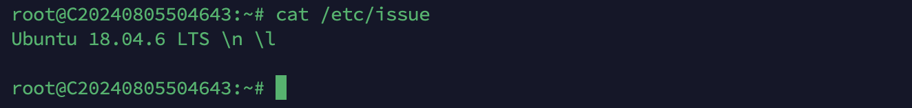
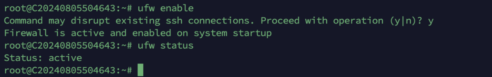
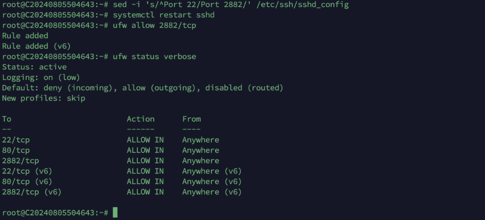

Ubuntu18.04-22.04，系统默认防火墙是ufw （Uncomplicated Firewall）以Ubuntu18.04为例 ,如下图所示：

1.看防火墙状态,默认是关闭的
#ufw status

2.开启防火墙
#ufw enable

3.关闭防火墙

#Ufw disable

4.如防火墙开启，放行指定端口命令如下

ufw allow 80/tcp                         ##放行端口80
ufw allow 22/tcp                         ##放行端口22
ufw allow 8112/tcp                     ##放行端口8112
ufw allow 1000:2000/tcp            ##放行端口范围 1000 到 2000

5.删除放行端口命令如下

ufw delete allow 80/tcp               ##删除放行端口80
ufw delete allow 22/tcp               ##删除放行端口22
ufw delete allow 1000:2000/tcp   ##删除放行端口范围1000:2000

6.修改远程端口，重启ssh服务，并放行新的远程端口

例如当前机器远程端口为22，需要修改远程端口为2882，示例命令如下：
sed -i 's/^Port 22/Port 2882/' /etc/ssh/sshd\_config     ##修改远程端口
systemctl restart sshd                 ##重启ssh服务器
ufw allow 2882/tcp                     ##放行新的远程端口

7.使用新端口进行远程登录

ssh root@具体IP -p 2882

(以上操作同样适用debian10-12系统)
