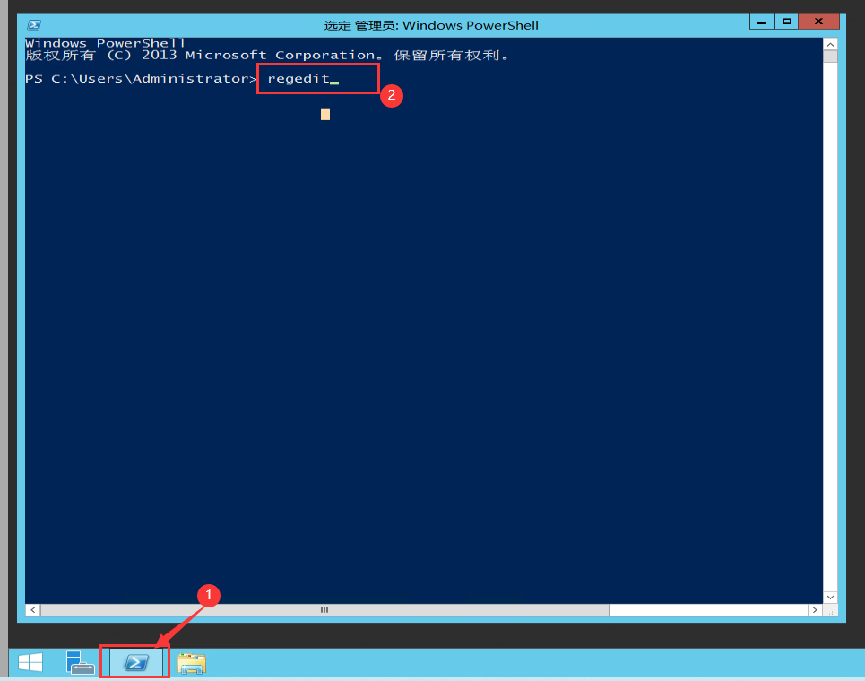
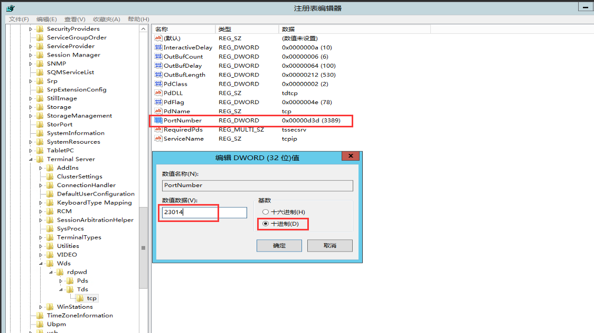
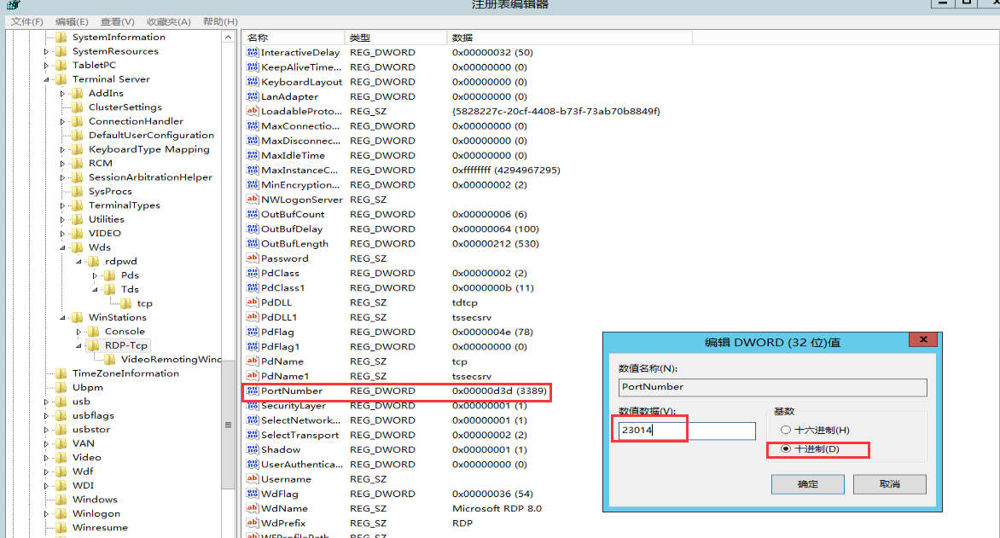
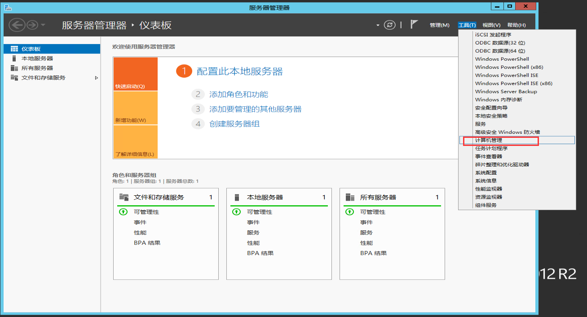
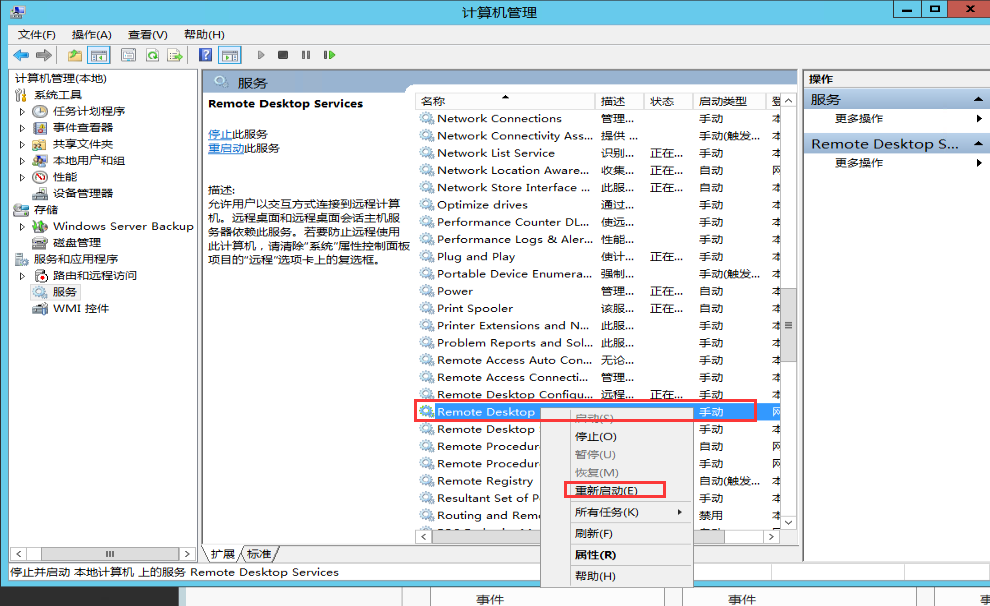
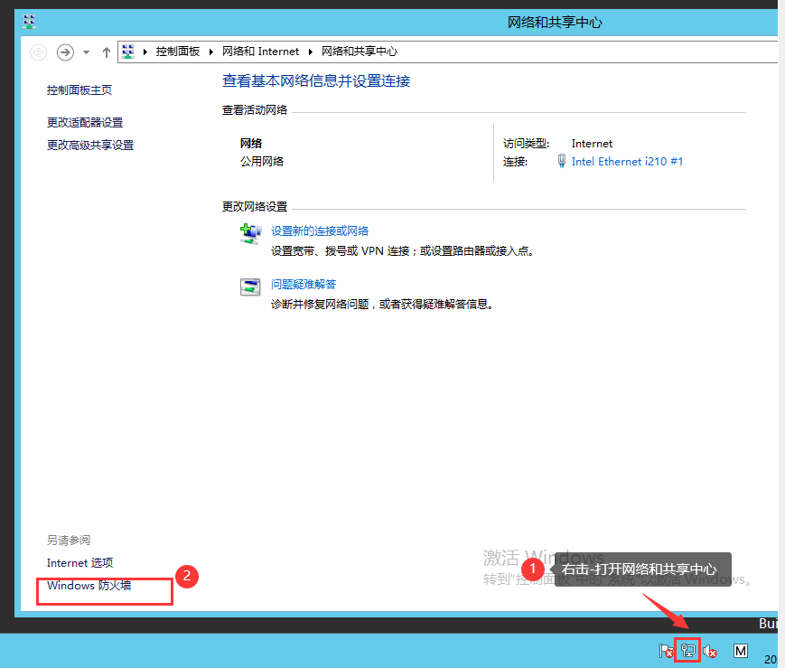
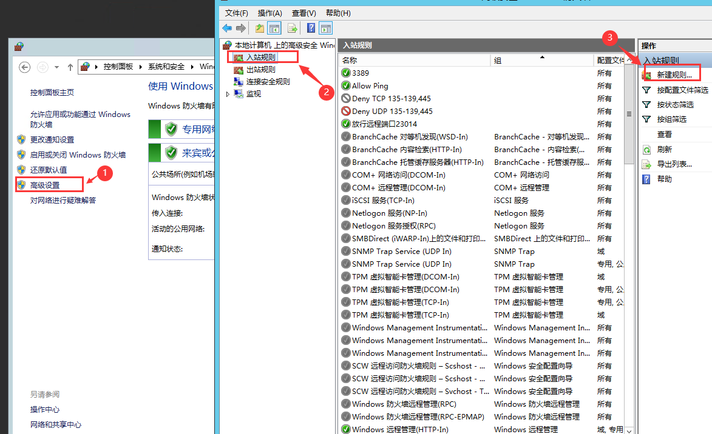
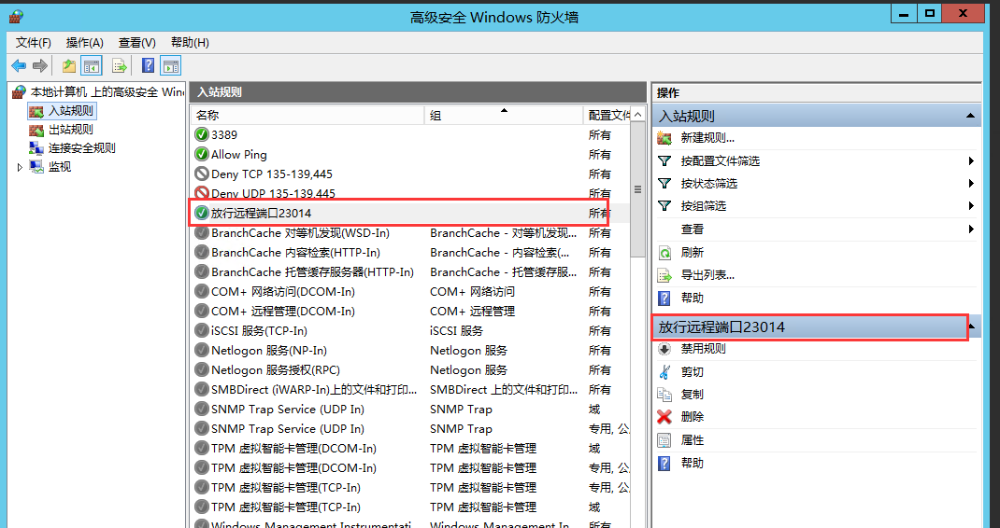
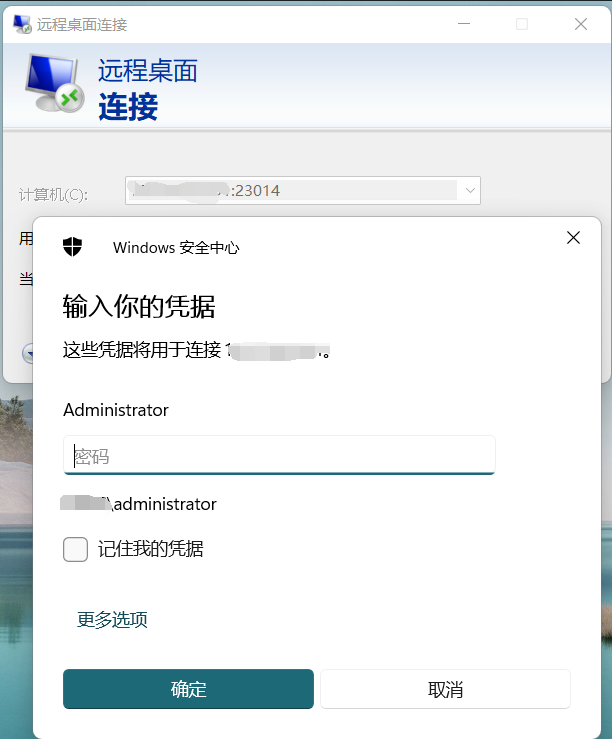

Windows系统的远程端口号范围是1024-65535之间，可以任意选取

1.登录进入系统，按快捷键 Win（Windows 徽标键）+R，启动运行窗口，或单击-Windows powerShell输入：regedit命令，打开注册表编辑器。

2.打开路径：HKEY\_LOCAL\_MACHINE\SYSTEM\CurrentControlSet\Control\Terminal Server\Wds\rdpwd\Tds\tcp

双击或右键“PortNamber”修改，把默认的3389修改为您自己想要的端口（端口范围1023-65535，尽量不要占用常用端口）点击确定即可

3.接着打开路径：HKEY\_LOCAL\_MACHINE\SYSTEM\CurrentContro1Set\Control\Tenninal Server\WinStations\RDP-Tcp

双击或右键“PortNamber”同样为3389修改成和上面要改的端口一样，确定

4.点击-服务器管理器，点击“计算机管理”，弹出的窗口左侧选“服务和应用程序”–>“服务”，找到“Remote Desktop Service“，右击，”重新启动“，更改的端口号即可生效

（也可以选择重启系统使端口生效）

- 如果用户计算机的防火墙是关闭的,那么现在就可以在另外一台电脑上通过远程桌面连接了

- 通常为了安全，都会保留防火墙的开启状态,因此还需要修改防火墙的入站规则

5.右击右下角网络-打开网络和共享中心-Windows防火墙-高级设置-入站规则-新建规则-选择端口-输入要放行的端口-允许连接-三个网络默认全部勾选-填写备注-完成

6.放行成功，即可使用新的远程端口号连接

7.测试远程访问，在远程地址后面添加新远程端口号即可连接

