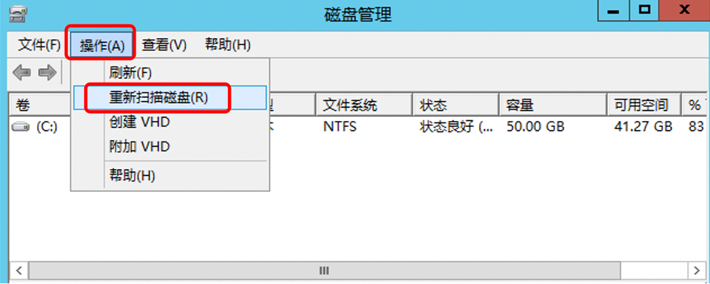
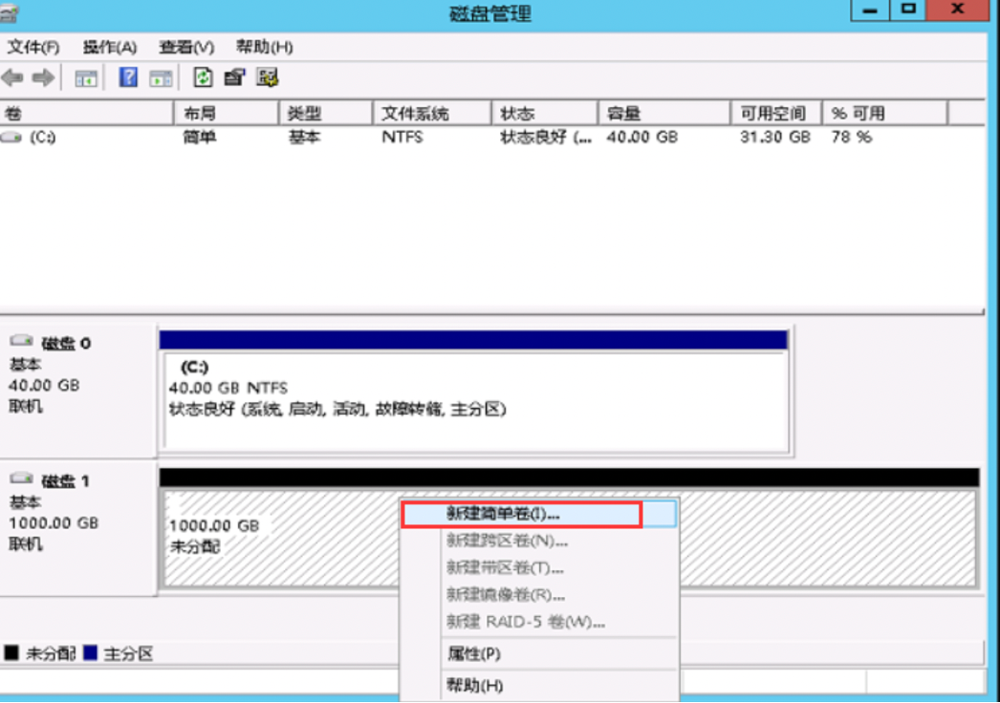
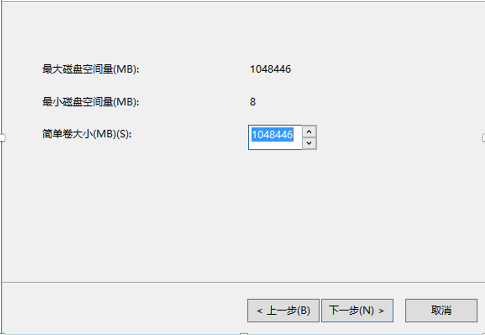
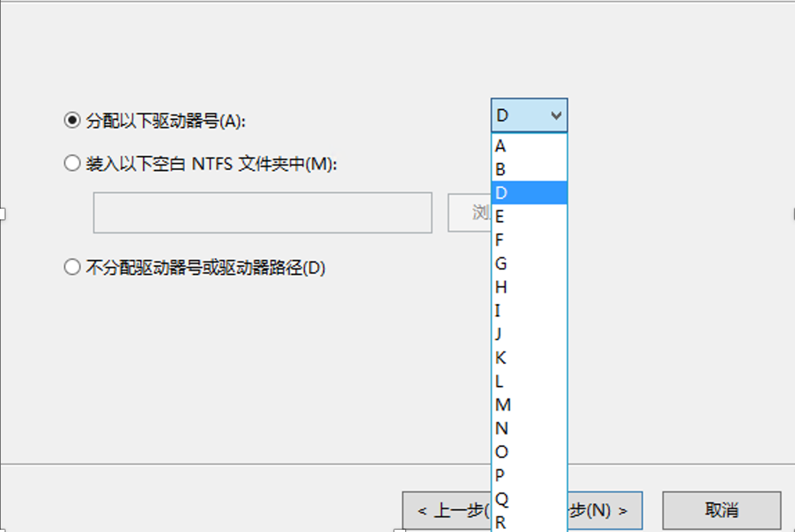
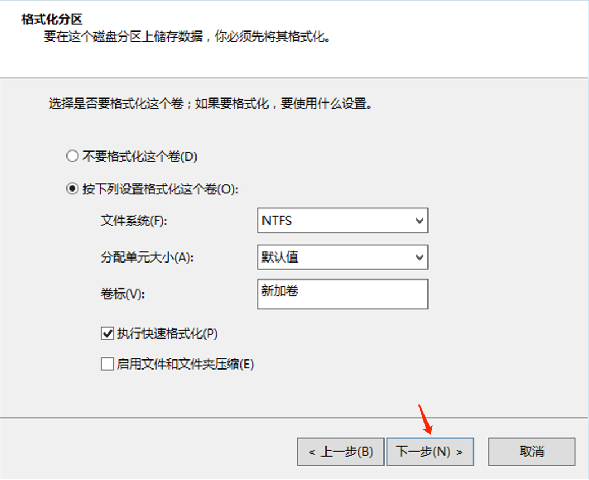

1.在Windows Server桌面，左下角开始菜单中右键点击磁盘管理

2.在磁盘管理对话框中，选择操作 > 重新扫描磁盘，查看未分配的磁盘容量

磁盘0（C盘）为系统盘，磁盘1（D盘）为数据盘

3.右键单击磁盘1未分配的空白处，并选择新建简单卷

4.对磁盘进行容量大小分配，默认是全部的空间

5.选择新建分区的驱动号

6.默认下一步，完成即可

7.创建完成后，可以看到新增的D盘。
