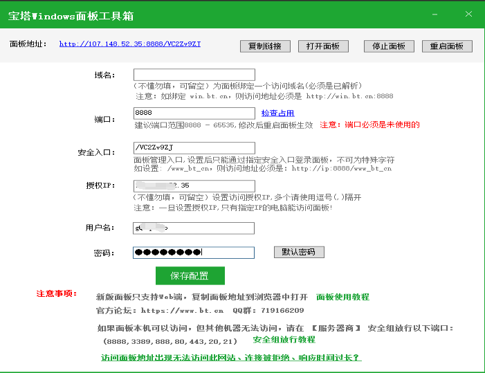

宝塔面板下载链接：[宝塔面板下载，免费全能的服务器运维软件 (bt.cn)](https://www.bt.cn/new/download.html)

Windows实例：

- 选择如下任意一种方式打开宝塔面板

- 方式一：在Windows操作系统桌面上，双击宝塔图标
- 方式二：在Windows操作系统桌面左下角，选择开始菜单> 宝塔面板

在宝塔Windows面板工具箱页面，查看宝塔服务运行信息。

您可以查看并记录宝塔面板相关信息，列入宝塔服务使用的端口、安全入口等，如下图所示。

选择如下任意一种方式查看是否可以使用localhost登录宝塔面板

- 在宝塔Windows面板工具箱页面，单击打开面板
- 打开浏览器输入localhost:<宝塔服务使用的端口>[安全入口]，然后按Enter键访问宝塔面板。

- <宝塔服务使用的端口>：即宝塔Windows面板工具箱页面的端口，以8888为例。
- [安全入口]：如果宝塔面板开启了安全入口，则浏览器的访问地址必须加入[安全入口]地址，否则访问宝塔面板时会提示“404”错误。该参数的值为宝塔Windows面板工具箱页面的安全入口，以/VC2Zv9ZJ为例。

