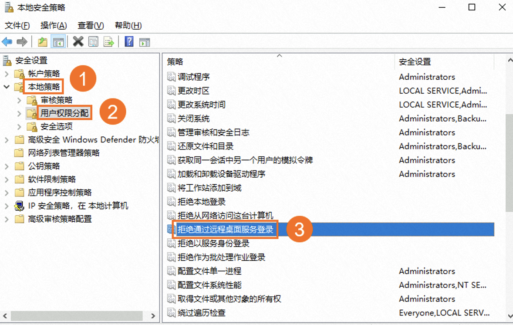
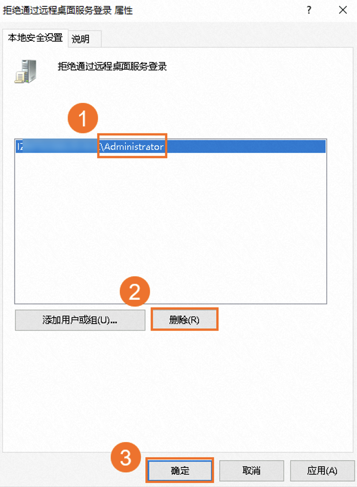

## 一.问题现象

在使用Administrator用户通过远程桌面登录实例时提示以下信息。

## 二.问题原因

Windows实例的本地安全策略中，设置了禁止Administrator用户作为远程桌面服务客户端登录。

## 三.解决方案

请参考以下步骤进行操作：

1. 通过VNC连接Windows实例。

2. 单击开始图标，打开控制面板，找到系统和安全。

3. 在控制面板页面，依次单击系统和安全 > 管理工具，然后双击打开本地安全策略。

4. 在本地安全策略页面，单击本地策略 > 用户权限分配，在右侧选项卡中双击拒绝通过远程桌面服务登录。

5. 在拒绝通过远程桌面服务登录的属性窗口，删除已添加的Administrator用户，然后单击确定。
