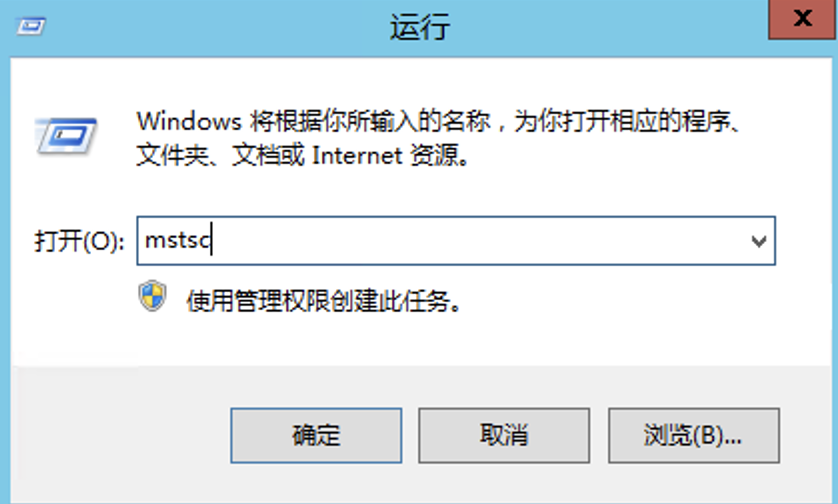
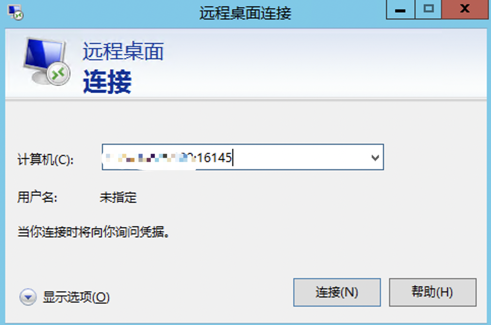

要远程登录Windows系统，您可以使用远程桌面协议（RDP）功能。以下是远程登录Windows系统的步骤：

1. 确保要远程登录的系统已启用远程桌面功能并连接到网络。

2.在本地电脑上按下快捷键【Win+R】打开运行窗口，然后输入“mstsc”命令并点击确定，打开远程桌面连接窗口。

 

3. 在远程桌面连接窗口中，输入要连接的远程系统的IP地址，如果有端口号也需要将端口号填写上

4. 单击“连接”按钮以发起连接。

5. 如果提示，输入远程系统的用户名和密码。确保您具有足够权限的凭据以登录。

6. 验证身份后，您将连接到远程Windows系统，并可以像本地登录一样与其交互。
